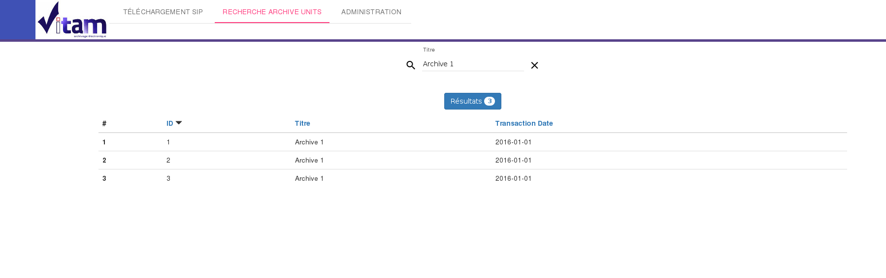

Manuel utilisateur - IHM Recherche ArchiveUnit
#######################################################

Note
Ce manuel est destiné à expliquer les fonctionnalités de recherche d'un archiveUnit dans Vitam pour les utilisateurs de l'IHM minimale. 

Pour débuter une recherche, l'utilisateur doit se rendre sur l'IHM de recherche.

Via le formulaire de recherche, l'utilisateur a la possibilité de rechercher via le champs Titre (Title dans le SEDA, la recherche sera plus complète lors de l'implémentation des futures US associées). 

La recherche s'effectue de façon stricte, c'est à dire que seul le titre comprenant strictement la chaine de caractère recherchée devra être retourné. 

Pour lancer la recherche, l'utilisateur clique sur le bouton "Rechercher" (ici, cela correspond à l'icone Loupe). 

Le résultat de la recherche est affiché sous forme de tableau. Nous retrouvons les colonnes ID, titre et date. Depuis cette liste de résultat, l'utilisateur peut consulter le détail d'un résultat en cliquant sur la ligne voulu (le détail d'un résultat sera décrit dans un autre manuel utilisateur).

L'îcone "Résultat (X)" indique le nombre de résultat trouvé lorsque l'utilisateur effectue une recherche. 