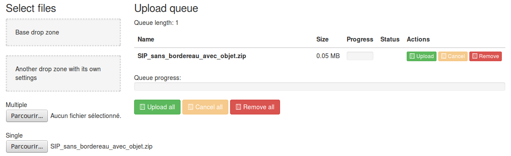

Manuel utilisateur – IHM Upload du SIP
##########################################

.. note:: Ce manuel est destiné à expliquer les fonctionnalités de transfert du SIP vers Vitam pour les utilisateurs de l’IHM minimale.

Pour débuter une entrée, l’utilisateur doit sélectionner son lot d’archives (SIP) à transférer dans Vitam. Pour cela, il doit cliquer sur le bouton « Parcourir », ce qui entraîne l’ouverture d’une nouvelle fenêtre dans laquelle il a la possibilité de sélectionner le SIP.

 .. image:: images/IHM_upload_SIP_v1.png
 .. image:: images/selection_SIP.png

Une fois le SIP sélectionné, il apparaît dans la file d’attente des transferts.
Le nombre d’élément SIP dans la file d’attente s’incrémente en fonction du nombre de SIP sélectionné.

Pour lancer le transfert du SIP l’utilisateur clique sur le bouton « Upload ». Une barre de progression affiche l’avancement du transfert dans Vitam.
Le bouton « Cancel » permet à l’utilisateur d’arrêter le processus de transfert en cours. 

 .. image:: images/WIP_transfert.png

Le résultat du transfert s’affiche dans la colonne « Statut » : OK / KO.
Les SIP transférés, quel que soit leur statut, restent affichés tant que l’utilisateur n’a pas décidé de les retirer de la file d’attente via le bouton « Remove ».