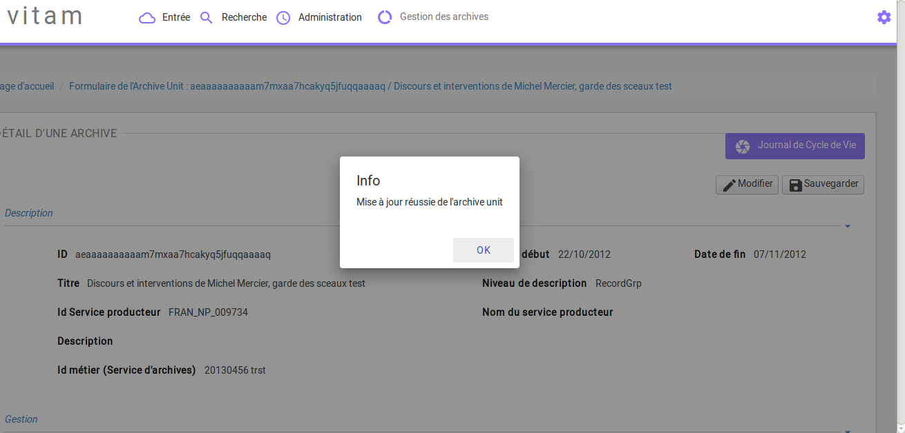
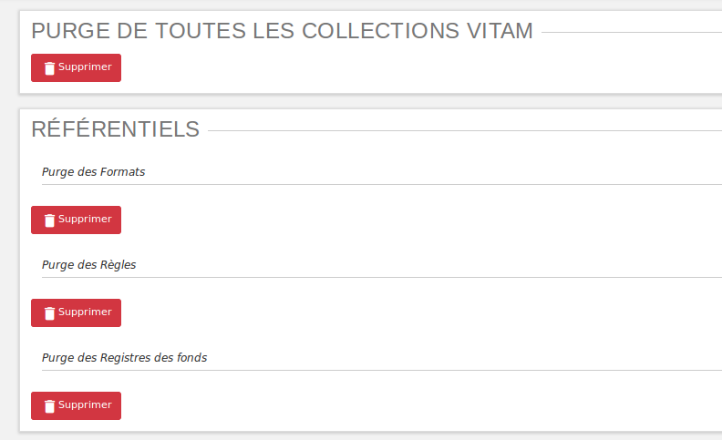
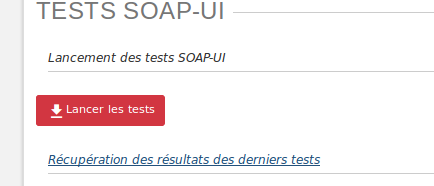
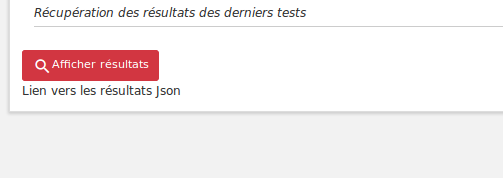
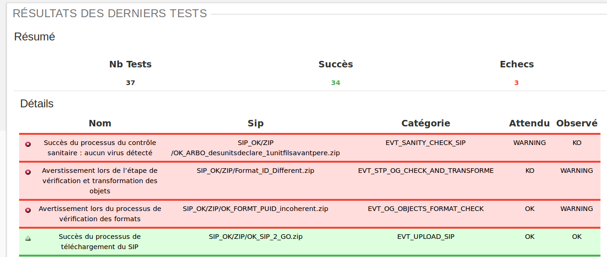
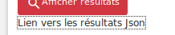
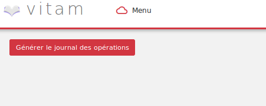
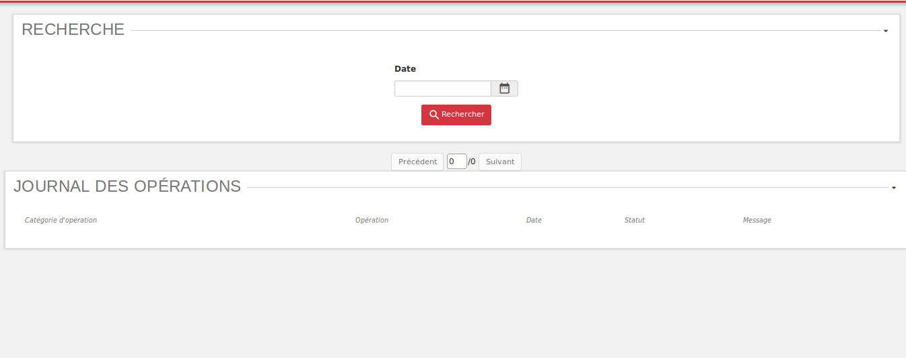
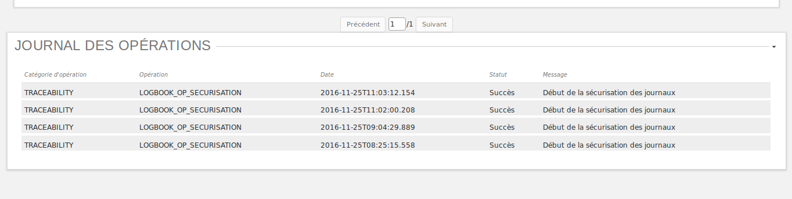
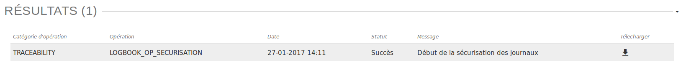

Recette
#######

Principes généraux
==================

L'accès à l'IHM de recette s'effectue par un chemin différent. Par défaut, son adresse est :

**addresse_de_votre_serveur/ihm-recette/#!/login**

Par soucis de distinction visuelle avec l'interface de démo, la couleur dominante de cette IHM est le rouge.

Avertissement
-------------

L'IHM de recette est développée à des fins de tests uniquement.

**Elle n'a aucunement vocation à être utilisée en production**

Elle contient des interfaces utilisateurs permettant de :

  * administrer les collections MongoDB (référentiels, journaux, objets...)
  * lancer des tests automatisés via SOAP UI
  * sécuriser manuellement les journaux des opérations
  * consulter les journaux de sécurisation

Navigation
----------

Par défaut, suite à sa connexion l'utilisateur accède à la page d'administration des collections.

Le menu de navigation contient les entrées suivantes :

  * Administration des collections
  * Test SOAP-UI
  * Transfert
  * Sécurisation d'un journal des opérations
  * Rechercher un journal sécurisé

.. image:: images/RECETTE_navigation.png

Administration des collections
==============================

L'IHM de recette permet de supprimer certains ou tous les référentiels / journaux / objets dans le but de recetter VITAM ou de faire des tests variés pour éprouver la stabilité du système.

Actions de suppression
----------------------

Chaque bouton "supprimer" est situé sous le titre de son action.
Lors du clic sur un des boutons "supprimer", une fenêtre modale (popin) apparait et demande de confirmer l'action de suppression.
Deux choix sont proposés:

- Un clic sur "Annuler", annule la demande de suppression, la fenêtre modale se ferme et rien ne se passe
- Un clic sur "Vider", valide la demande de suppression, la fenêtre modale se ferme et la suppression est effectuée

Une fois la suppression effectuée, une message de confirmation s'affiche dans une fenêtre modale.

Purge de toutes les collections VITAM
--------------------------------------

Tous les référentiels, tous les journaux ainsi que tous les objets et unités archivitiques sont supprimés de VITAM.
Suite à cette opération, chaque IHM correspondante est vide de contenu et plus aucune archive n'est présente dans VITAM.

Purge des référentiels
-----------------------

**Référentiel des formats**

Le référentiel des formats VITAM est supprimé. L'IHM du référentiel de formats est vide de contenu. Sans référentiel de formats, aucun SIP ne pourra être importé dans le SAE.

**Référentiel des règles de gestion**

Le référentiel des règles de gestion VITAM est supprimé. L'IHM des règles de gestion est vide de contenu. Sans référentiel des règles de gestion, aucun SIP ne pourra être importé dans le SAE.

**Registre des fonds**

Le référentiel du registre des fonds VITAM est supprimé. L'IHM du registre des fonds est vide de contenu.

Purge des journaux
------------------

**Journal du Cycle de Vie** (Unité archivistique)

Tous les journaux du cycle de vie des unités archivistiques sont supprimés de VITAM. L'IHM de chaque "Journal de Cycle de Vie" d'une unité archivistique est vide de contenu.

**Journal du Cycle de Vie** (objets)

Tous les journaux du cycle de vie des objets sont supprimés de VITAM. L'IHM de chaque "Journal de Cycle du Vie" d'un objet est vide de contenu.

**Journal des Opérations**

Tous les journaux des opérations sont supprimés de VITAM. Les IHM "Journal des Opérations" et "Journal des Opérations d'entrées" sont vides de contenu.

Purge des Groupes d'Objets et Unités Archivistiques
---------------------------------------------------

**Purge des Unités Archivistiques**

Toutes les unités archivistiques sont supprimées de VITAM. L'IHM "Recherche archives" est vide de contenu.

**Purge des Groupes d'objets**

Toutes les objets sont supprimés de VITAM. L'IHM "Détail d'une unité archivistique" ne comprend plus d'objet.

Tests SOAP-UI
=============

Principes
---------

Cette interface a pour objectif de lancer des tests fonctionnels automatisés avec SOAP UI, construits via un fichier JSON.

L'équipe d'exploitation réalise le fichier json avec les archivistes, puis le place sur le serveur Vitam.

L'exécution des tests est ensuite lancée par les archivistes via l'IHM.

Cette partie présente à la fois l'IHM et les différentes configuration à réaliser par les archivistes.

.. image:: images/RECETTE_accueil_SOAPUI.png

Fichier de configuration
------------------------

Les jeux de test à exécuter sont déclarés dans le fichier *data.json*.

Chaque SIP à utiliser pour valider un cas fonctionnel sera donc déclaré dans ce fichier selon un méthode détaillée ci-après.

Structuration du fichier de configuration
-----------------------------------------

Le fichier de configuration contient un champ "params" dont la valeur est un tableau. Ce tableau contient l'ensemble des jeux de tests à exécuter, chaque ligne rerésentant un test.

::

  {"params":
    [
      {Configuration du test 1},
      {Configuration du test 2},
      {Configuration du test 3}
    ]
  }

Configuration d'un jeux de test
-------------------------------

Chaque jeux de test est composé des huits élements suivants :
  * sipName
  * expected
  * httpStatusCode
  * testName
  * category
  * action [
    * name
    * expected

**"sipName"**

La valeur contenue dans ce champ doit être une chaîne de caractères. Il contient le nom du fichier à utiliser en entrée ainsi que sa localisation dans le système de fichier.

La localisation du fichier est une URI relative par rapport à la racine des tests SOAPUI déterminée par votre exploitant.

On a donc par défaut l'arborescence suivante (le schéma suivant ne tient pas compte des autres dossiers et fichiers du repertoire SOAPUI)

::

  RACINE
    |------- data.json
    \------- test.zip

Pour un fichier *test.zip* placé dans le dossier racine, on entrera alors :

::

  "sipName":"test.zip"

Si ce fichier est placé dans un dossier *data*, enfant de *RACINE*, c'est à dire placé commme ceci :

::

  RACINE
    |------- data.json
    \------- data
              \------- test.zip

on entrera alors :

::

  "sipName":"test_arborescence/test.zip"

**"expected"**

La valeur contenue dans ce champ doit être une chaîne de caractères. Il contient le statut attendu à l'issue de l'opération d'entrée du SIP. La valeur de ce champs n'est utilisée que si les valeurs du tableau action détaillé plus bas n'est pas renseigné. Ceci permet de garder une compatibilité avec les anciens tests de non régression qui ne contenaient pas de tableau action.

Les valeurs contenus dans ces champs sont en revanche ignorées si le tableau action contient des valeurs.

Par exemple :

::

  "expected":"OK",

**"httpStatusCode"**

La valeur contenue dans ce champs est un nombre entier. Il contient le code retour HTTP attendu.

Par exemple :

::

  "httpStatusCode":200,

**"testName"**

La valeur contenue dans ce champ doit être une chaîne de caractères. Il s'agit du nom du test tel qu'il sera reporté dans le rapport final.

Par exemple :

::

  "Jeux de données possédant une arborescence complexe"

**"category"**: La valeur contenue dans ce champ doit être une chaîne de caractères.

Par exemple :

::

  "category":"Tests sur les arborescences"

**Action** : ce champs contient un tableau de n objets ayant pour but de tester des actions précises du workflow. Cet objet est structuré de la façon suivantes :

      **name** : contient le nom de l'action à tester

      **expected** : contient l'état de

voici l'exemple d'une configuration pour *un jeu de test*

*NB :* l'exemple de configuration d'un jeu de test ci-dessous a été indenté pour une meilleure compréhension. Par défaut, dans le fichier de configuration global, la configuration d'un test est placée sur une ligne seulement.

::

  {
      "sipName": "SIP_OK/ZIP/OK_SIP_2_GO.zip",
      "expected": "OK",
      "httpStatusCode": 200,
      "testName": "Test des différentes étapes OK",
      "category": "Test global",
      "actions": [
        {
          "name": "UPLOAD_SIP",
          "expected": "OK"
        },
        {
          "name": "STP_SANITY_CHECK_SIP",
          "expected": "OK"
        },
    }

Exemple de configuration
------------------------

Ci-après une configuration exemple contenant 4 jeux de tests

::

    {
        "params": [
            {
             "sipName": "SIP_OK/ZIP/OK_SIP_2_GO.zip",
             "expected": "OK",
             "httpStatusCode": 200,
             "testName": "Test des différentes étapes OK",
             "category": "Test global",
             "actions": [
                {
                "name": "UPLOAD_SIP",
                "expected": "OK"
                },
                {
                "name": "STP_SANITY_CHECK_SIP",
                "expected": "OK"
                },
                {
                "name": "CHECK_SEDA",
                "expected": "OK"
                },
                {
                "name": "CHECK_MANIFEST_DATAOBJECT_VERSION",
                "expected": "OK"
                }
                        ]
                },
            {
            "sipName": "SIP_KO/ZIP/KO_SIP_Mauvais_Format.pdf",
            "expected": "KO",
            "httpStatusCode": 200,
            "testName": "SIP au mauvais format",
            "category": "Test sur le Conteneur",
            "actions": [
                {
                "name": "UPLOAD_SIP",
                "expected": "KO"
                }
                ]
            }
        ]
    }

Configuration de test pour api external avec multi-tenant
----------------------------------------------------------

Chaque jeux de test est composé des huits élements suivants :
  * sipName / ruleName / formatName
  * testName
  * category
  * tenant
  * action [

    * name
    * endpoint
    * request
    * method
    * tenant
    * expected [

**"sipName / ruleName / formatName"**
La valeur contenue dans ce champ doit être une chaîne de caractères. Il contient le nom du fichier à utiliser en entrée
ainsi que sa localisation dans le système de fichier

La localisation du fichier est une URI relative par rapport à la racine des tests SOAPUI déterminée par votre exploitant.

On a donc par défaut l'arborescence suivante: (le schéma suivant ne tient pas compte des autres dossiers et fichiers du repertoire SOAPUI)

::

  RACINE
    |------- data.json
    \------- SIP_KO
    \------- SIP_OK
              \------- ZIP
                       \------- OK_SIP.ZIP
              \------- TAR
    \------- SIP_WARNING
    \------- formats
    \------- rules
              \------- regles_CSV.csv

Pour un fichier SIP *OK_SIP.zip* et un fichier de règle de gestion *regles_CSV.csv* placé dans le dossier racine, on entrera alors :

::

 "sipName": "SIP_OK\/ZIP\/OK_SIP.ZIP"

::

 "ruleName": "rules\/regles_CSV.csv"

**"testName"**
La valeur contenue dans ce champ doit être une chaîne de caractères. Il s’agit du nom du test tel qu’il sera reporté dans le rapport final. Par exemple:

::

 "testName": "SRC1 : chercher des unités d’archives contenant des objets dans un intervalle de dates extrêmes",

**"category"**
La valeur contenue dans ce champ doit être une chaîne de caractères. Il doit être toujours “Test API external” 

**"tenant"**
La valeur contenue dans ce champ doit être une chaîne de caractères. Il s’agit de tenant qui a téléchargé le fichier SIP/règle/format. Par exemple:

::

 "tenant" : "0"

**action**
ce champs contient un tableau de n objets ayant pour but de contrôler les réponses de l'api external. Cet objet
est structuré de la façon suivantes :

    **name** : contient le nom de l'action à tester

    **endpoint** : contient l'endpoint de l'api external

    **request** : contient la requête

    **method** : contient la méthode

    **tenant** : contient le tenant

    **expected** : est un tableau qui contient le code retour HTTP attendu (httpStatusCode) est les champs attendu dans la réponse

Par example:

::

"actions": [{
"name": "SEARCH_RULES_TENANT_0",
"endpoint" : "admin-external/v1/rules",
"request" : "{\"$query\":{\"$and\":[{\"$eq\":{\"RuleValue\":\"Dossier individuel d’agent civil\"}},{\"$eq\":{\"RuleType\":\"AppraisalRule\"}}]},\"$filter\":{},\"$projection\":{}}",
"method" : "POST",
"tenant" : "0",
"expected" : [{"httpStatusCode":200},{"RuleId": ["APP-00001"]}]},{
"name": "SEARCH_RULES_TENANT_1",
"endpoint" : "admin-external/v1/rules",
"request" : "{\"$query\":{\"$and\":[{\"$eq\":{\"RuleValue\":\"Dossier individuel d’agent civil\"}},{\"$eq\":{\"RuleType\":\"AppraisalRule\"}}]},\"$filter\":{},\"$projection\":{}}",
"method" : "POST",
"tenant" : "1",
"expected" : [{"httpStatusCode":404}]}]

Lancement des tests
-------------------

Une fois le fichier data.json, ainsi que le SIP déposés sur le serveur Vitam par l'exploitant, les tests peuvent être lancés via l'IHM en cliquant sur le bouton "lancer les tests"

Affichage du rapport
--------------------

Pour afficher le rapport, cliquer sur le bouton "afficher résultats".

Le tableau de rapport apparait alors en bas de l'écran.

Il contient les informations suivantes :

  * Nombre de tests réalisé
  * Nombre de test en succès
  * Nombre de tests en échec
  * Un taleau contenant la liste des tests

Détail des colonnes du rapport
------------------------------

Les colonnes du rapport sont les suivantes :
  * ID Opération
  * Nom du test
  * Nom du SIP
  * Catégorie
  * Action
  * Résultat attendu
  * Résultat constaté

Les lignes pour lesquelles le résultat attendu est égal au résultat constaté apparaissent sur fond vert.
Les lignes pour lesquelles le résultat attendu est différent du résultat constaté apparaissent sur fond rouge

Résultat au format JSON
-----------------------

Il est également possible d'afficher le JSON de résultat en cliquant sur le lien nommé "Lien vers les résultats Json". Le fichier apparait en plein écran et il est possile de l'enregistrer.

Sécurisation des journaux
=========================

Lancer une opération de sécurisation
------------------------------------

L'interface de lancement est accessible par le menu : Menu > Sécurisation du journal des opérations

L'interface contient simplement un bouton "Générer". Au clic sur ce bouton, le système va lancer l'opération de sécurisation des journaux. Elle prendra en compte tous les journaux du dernier créé au dernier non sécurisé.

Il est également possible d'afficher le JSON de résultat en cliquant sur le lien nommé "Lien vers les résulstats Json". Le fichier apparait en plein écran et il est possile de l'enregistrer.

Si aucun journal n'a encore été sécurisé, alors elle prendra en compte tous les journaux.

A la fin de l'opération, un message avertit du succès ou de l'échec de l'opération.

Un fichier .zip est créé et placé dans le l'offre de stockage de Vitam dans le répertoire suivant :

::

  /browse/data/storage-offer-default/0/Logbook

Il contient les fichiers suivants :

  * operation.json : liste des opérations sécurisées, la première étant l'opération "tracability"
  * merkleTree.json : contient une sérialisation json de l'arbre de merkle
  * token.tsp : timestamp de la combinaison de la racine de l'arbre de merkle, des empreintes des opérations de sécurisation antérieures : la dernière réalisée, celle du mois précédent et celle de l'année précédente.
  * computing_information.txt : reprend les différents empreintes qui ont permis de réaliser l'horodatage
  * additional_information.txt : contient le nombre d'informations sécurisées, ainsi que les dates du premier et du dernier élement

Rechercher des journaux sécurisés
---------------------------------

L'interface de consultation des journaux est accessible par le menu : Menu > Rechercher un journal sécurisé

L'interface est consituée de quatre éléments :

  * Un champ date
  * Un bouton rechercher
  * Un paginateur
  * Une zone d'affichage des résultats

**Utilisation du champs date**

Le champ date permet d'afficher les journaux de type sécurisation créés après cette date. Par exemple, si on sélectionne la date 24/11/2016, seuls les journaux de type sécurisation générés le ou après le 24/11/2016 seront affichées.

**Lancer une reherche**

Pour lancer une recherche en prenant en compte cette date, cliquer sur le bouton rechercher après l'avoir sélectionnée.

Si l'utilisateur clique sur le bouton rechercher sans sélectionner de date, alors tous les journauux disponibles s'affichent.

**Zone de résultats**

La zone de résultats peut afficher au maximum 50 journaux.

S'il y en a plus, ils sont répartis sur différentes pages et sont accessibles par le paginateur.

**Consultation du détail d'un journal**

Chaque ligne représente un journal de type sécurisation. Au clic sur cette ligne, l'IHM affiche le détail du journal dans une nouvelle fenêtre.

**Télechargement d'un journal**

Chaque ligne représentant un journal comporte un symbole de télechargement. Au clic sur ce symbole, le journal au format zip est télechargé. Le nom de ce fichier correspond à la valeur du champs FileName du dernier event du journal de l'opération.

