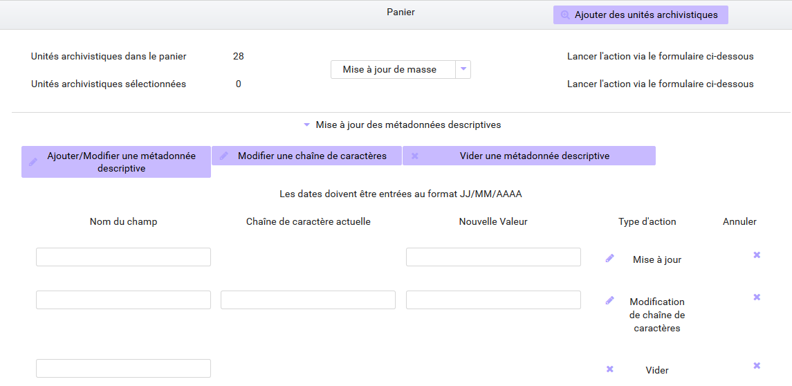
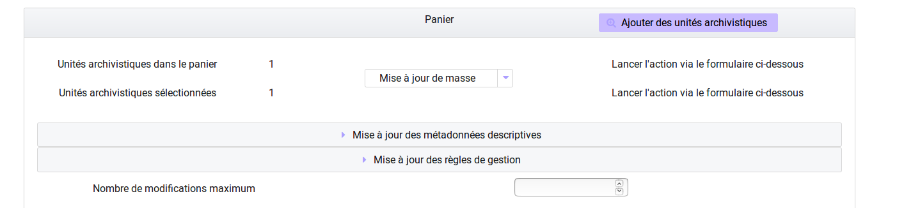
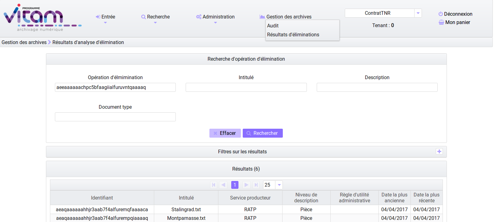
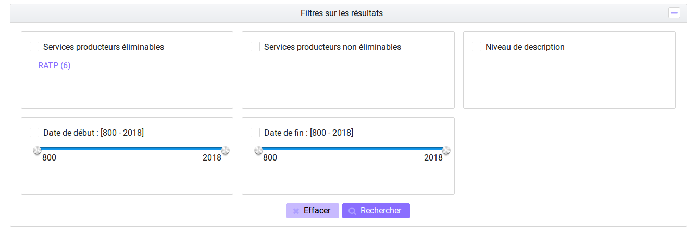

Traitements de masse
#####################

Cette partie décrit les fonctionnalités permettant d'effectuer des actions sur un grand nombre d'unités archivistiques stockées dans la solution logicielle Vitam. les traitements de masse concernent les actions de modifications et d'élimination.  Les actions de traitement de masse sont accessibles après une recherche et une sélection des unités archivistiques via le panier. 
Le panier indique le nombre total d'unités archivistiques contenues dans le panier et/ou le nombre d'unités archivistiques séléctionnées. Les traitements de masse peuvent être effectués sur la totalité ou sur une partie du panier.  
Chaque mise à jour est suivie d'une entrée dans le journal des opérations et d'un rapport. Toutes les opérations sont indiquées dans le rapport, les cas de succès et les cas d'échecs. En cas d'échec, un message d'erreur indique la raison de la non application du traitement de masse. 

Modification de métadonnées en masse
************************************

Les modifications en masse concernent les métadonnées descriptives et les métadonnées de gestion. Pour accèder à cette fonctionnalité, cliquez dans la fenêtre "Sélectionner une action", puis dans le menu "Mise à jour de masse". 

1 - Modification de métadonnées descriptives
============================================

A partir d'unités archivistiques présentes dans le panier, il est possible de modifier, ajouter et effacer les métadonnées descriptives.

Ajouter ou modifier une métadonnée : 
-------------------------------------

Grâce à cette fonctionnalité, il est possible d'apporter des modifications à un champ. En cliquant sur cette option, un formulaire apparaît dans lequel le "Nom du champ" et la "Nouvelle valeur" doivent être complétés. 
 
* Si le champ existe pour ces unités archivistiques, les valeurs contenues dans ces unités archivistiques seront remplacées par la nouvelle valeur entrée dans le champ "Nouvelle Valeur" dans le formulaire. Il s'agit en définitive d'un annule et remplace. Pour pouvoir modifier la valeur du champ il est nécessaire de remplir le nom du champ tel qu'il est formulé par le SEDA, en anglais et en respectant la casse. Un vocabulaire externe peut également être modifié. Il faut ensuite cliquer sur un des deux boutons "Lancer la mise à jour de masse sur tout le panier", ou bien "Lancer la mise à jour de masse sur la sélection".

Ex : Pour modifier un titre : "Ecole nationale des Greffes" par le titre "Discours prononcé lors de la visite de l'Ecole nationale des Greffes". 

+-------------------------+----------------------------------------------------------------------------+       
|Nom de champ             |  Nouvelle Valeur                                                           |
+-------------------------+----------------------------------------------------------------------------+   
|Title (nom du SEDA,      |  Discours prononcé lors de la visite de l'Ecole nationale des Greffes      |
|en anglais,              |                                                                            |
|en respectant la casse,  |                                                                            |
|ou vocabulaire externe)  |                                                                            |
|                         |                                                                            |
+-------------------------+-----------------------------------+----------------------------------------+ 

* Si le champ n'existe pas pour ces unités archivistiques, en indiquant dans le "Nom du champ" un champ du SEDA concernant les métadonnées descriptives ou un vocabulaire externe ainsi qu'une valeur dans la rubrique "Nouvelle Valeur", ce nouveau champ complété sera créé pour cette sélection d'unités archivistiques. 

Ex : Pour ajouter un champ Langue des descriptions,

+-------------------------+----------------------------------------------------------------------------+       
|Nom de champ             |  Nouvelle Valeur                                                           |
+-------------------------+----------------------------------------------------------------------------+   
|DescriptionLanguage      |  Français ou Fr                                                            |
|(nom du SEDA, en anglais,|                                                                            |
|en respectant la casse,  |                                                                            |
|ou vocabulaire externe)  |                                                                            |
|                         |                                                                            |
+-------------------------+-----------------------------------+----------------------------------------+ 

Modifier une chaîne de caractères : 
-----------------------------------

Grâce à cette fonctionnalité, il est possible d'apporter des modifications sur une partie d'un champ, pour le corriger ou le compléter. 

* Ex : Corriger dans un titre le mot fracture par facture : 

+--------------------------+-----------------------------------+-------------------------+       
| Nom de champ             |   Chaîne de caractère actuelle    |      Nouvelle Valeur    |
+--------------------------+-----------------------------------+-------------------------+   
|Title (nom du SEDA,       |   fracture                        |          facture        |
|en anglais,               |                                   |                         |
|en respectant la casse,   |                                   |                         |
|ou vocabulaire externe)   |                                   |                         |
|                          |                                   |                         |
+--------------------------+-----------------------------------+-------------------------+ 

Il faut indiquer ensuite si la modification concerne toutes les unités archivistiques contenues dans le panier ou une selection. 

Vider une métadonnée descriptive :
----------------------------------
Il faut cliquer sur le bouton correspondant à "Vider une métadonnée descriptive", remplir le Nom du champ dont la valeur sera effacée, dans le champ "Nom du champ". Il faut ensuite cliquer sur un des deux boutons "Lancer la mise à jour de masse sur tout le panier", ou bien "Lancer la mise à jour de masse sur la sélection". 

2 - Modification de métadonnées de gestion 
==========================================

A partir d'unités archivistiques présentes dans le panier, il est possible de modifier les règles de gestion: d'en ajouter, de les modifier, et de les supprimer.

.. image:: images/meta_gestion.png

Chaque catégorie de règle de gestion est présente, il suffit de cliquer sur les boutons "Ajouter", "Modifier" ou "Supprimer" une règle, et d'ajouter les identifiants et les valeurs à modifier, à ajouter ou à supprimer, et ensuite de cliquer sur un des deux boutons "Lancer la mise à jour de masse sur tout le panier", ou bien "Lancer la mise à jour de masse sur la sélection". 

NOTE: les identifiants des règles de gestion, doivent être contenus dans le référentiel des règles de gestion. 

Nombre d'unités archivistiques maximum concernés par les modifications en masse 
-------------------------------------------------------------------------------
Il est possible de définir un seuil maximum de modifications dans le contexte de modifications en masse. Ce champ permet donc de définir le nombre maximum d'unités archivistiques du panier qui seront modifiées. 

Si le seuil est dépassé : la modification s'effectuera mais l'opération sera déclarée en warning dans le journal des opérations. Il n'y a pas pour l'instant dans le cadre de cette release 8, de messages d'alerte ou d'indication concernant le temps de traitement de l'opération, ces fonctionnalités seront installés dans les release suivantes. Aussi nous vous recommandons de respecter les seuils par défaut, prévus pour les traitements de masse. 

.. note:: 
    **Seuil par défaut d'unités archivistiques pour les traitements de masse**.
   
      - **100 000 unités archivistiques dans la phase d'analyse** (analyse des éliminables)
      - **10 000 unités archivistiques dans la phase d'action** (modification en masse, élimination)
      

Elimination en masse
********************

Cette fonctionnalité permet de lancer des actions d'analyse et de recherche des unités archivistiques éliminables dans la solution Vitam et de procéder à leur élimination du système. 
L'élimination a pour objectif de supprimer l'accès aux UA (le cas échéant les GOT associés) et de les supprimer physiquement lorsqu'elles n'ont plus de liens.
Les actions d'élimination sont réalisables via le panier.
L'opération d'élimination en masse est une opération complexe, nécessitant différentes analyses, produisant différents temps de traitement : 

 - Analyse 1 / Unités archivistiques éliminables car la DUA est échue et le sort final déclaré est "Détruire" 
 - Analyse 2 / Unités archivistiques éliminables car il n'y a pas de conflits entre services producteurs pour détruire ces archives, la suppression d'une de ces unités archivistiques n'entraîne pas de conflits.  
 - Analyse 3 et action d'élimination / Unités archivistiques réellement éliminées car elles ne laissent pas d'unités archivistiques orphelines 

Analyse 1 / Rechercher des unités archivistiques potentiellement éliminables
============================================================================

La phase préalable à l'action d'élimination est la recherche d'archives éliminables. Dans l'onglet de recherche avancée il est possible de rechercher les unités archivistiques dont la durée d'utilité administrative est échue ou qui le sera prochainement.
Sélectionnez la durée d'utilité administrative, la date d'échéance et le sort final "Détruire", puis cliquez sur "Rechercher".
Vous pouvez appliquer à ces résultats les filtres de recherche et affiner la recherche par service producteur par exemple.
A l'obtention des résultats vous pouvez sélectionner tout ou une partie de la liste et l'ajouter au panier. 
Vous pouvez choisir d'ajouter l'unité archivistique seule, l'UA et sa descendance ou encore l'UA et son entrée.

Lorsque vous avez sélectionné les unités archivistiques, une pop-up vous informe que les UA ont bien été ajouté à votre panier.
Une fois cette opération terminée vous devez vous rendre dans votre panier.

.. image:: images/recherche_eliminables.png

Analyse 2 / Campagne d'analyse des unités archivistiques éliminables 
====================================================================

Cette phase d'analyse est destinée à identifier les unités archivistiques éliminables pour lesquelles vous devez obtenir une autorisation pour l'élimination. Dans le panier, sélectionnez les unités archivistiques qui ont été retenues par la recherche initiale ou celle que vous souhaitez traiter. Vous pouvez sélectionner la totalité du panier ou une partie.
Une fois la sélection faite, dans la rubrique "Sélectionner une action", cliquez sur Elimination.
Pour que l'analyse des unités archivistiques éliminables soit effectuée, vous devez indiquer une date d'échéance (passée ou future). Puis cliquez sur le bouton "Analyse".
A cette étape, le système va effectuer pour chaque UA une vérification des règles de gestion et d'héritage de celle-ci.  Lors de cette opération les unités archivistiques de statut "Destroy" et "Conflicts" vont être indexées en base de données. Les unités archivistiques qui sont réellement éliminables apparaissent dans l'écran d'affichage des résultats d'élimination :

 - les UA qui ont une DUA arrivée à échéance et dont le sort final est "détruire"
 - les UA pour lesquelles les services producteurs sont unanimes quant à leur élimination. 

.. image:: images/panier_elimination.png 

Accéder aux résultats de l'analyse
----------------------------------
 
Le résultat de l'analyse d'élimination est consultable dans la rubrique "Gestion des archives", "Resultats d'élimination". 

Pour accèder à cet écran, vous devez : 

 -  aller dans le journal des opérations dans le menu administration
 -  consulter le journal des opérations
 -  récupérer le GUID de l'opération ELIMINATION
 -  puis aller dans la rubrique "Gestion des archives" et sélectionnez l'entrée "Résultats d'élimination".

En complétant l'entrée "Opération d'élimination" avec le GUID de l'opération et en cliquant sur rechercher vous accèder à une liste d'unités archivistiques éliminables.
Votre opération d'analyse est indexée et enregistrée dans le système. Vous pouvez ainsi filter vos résultats en fonction des services producteurs éliminables et ceux qui ne le sont pas. 

Analyse 3 et action  / Elimination des unités archivistiques éliminables 
========================================================================

Cette action peut être effectuée après la phase de recherche ou d'analyse, mais elle peut également être utilisée indépendamment. En effet, vous pouvez décider de supprimer un lot d'unités archivistiques présents dans votre panier. 
Lors de cette opération, le système Vitam va effectuer une analyse analogue que celle décrite ci dessus dans la phase 2, mais ne va pas indexer les résultats concernant l'élimination sur les unités archivistiques en base de données. 
Lors de cette phase le système va s'assurer que l'élimination n'entraine pas de cas d'orphelinage. A l'issue de ces phases d'analyses si l'unité archivistique est réellement éliminable, elle va être supprimée du système.  Pour procéder à cette phase d'analyse et d'action d'élimination, vous devez : 
 
 - Sélectionner des unités archivistiques dans votre panier
 - Cliquer dans le menu déroulant sur l'action "Elimination"
 - Entrer la date du jour ou une date échue
 - Sélectionner le mode "Action"
 - Spécifier si l'action a lieu sur la selection ou le panier dans sa totalité. Au clic, une fenêtre modale vous confirme que l'action d'élimination est en cours.  

 .. image:: images/analyse_action_elimination.png

 .. image:: images/pop_action_elimination.png

Résultats de l'opération d'élimination

--------------------------------------

Le résultat de l'opération d'élimination est consultable dans le rapport de l'opération. Pour cela vous devez :

 - Aller dans le journal des opérations dans le menu administration
 - Consulter le journal des opérations
 - Cliquez sur l'opération élimination
 - Sélectionner le rapport dans informations complémentaires
 - Télécharger le rapport

Le rapport d'élimination spécifie :

 - les unités archivistiques conservées (GLOBAL_STATUS_KEEP) car elles ont des enfants (NOT_DESTROYABLE_HAS_CHILD_UNIT)
 - celles qui sont en conflits et qui ne peuvent être éliminées du système sans le concours d'une intervention du métier (GLOBAL_STATUS_CONFLICT)
 - celles qui ont été éliminées (GLOBAL_STATUS_DESTROY)

