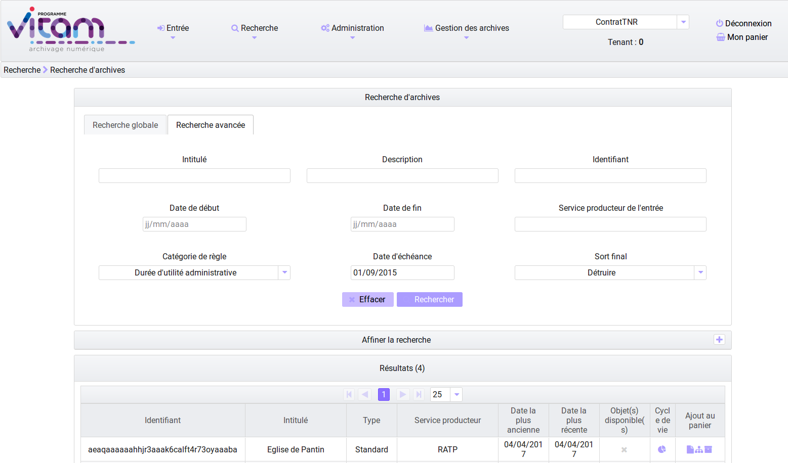
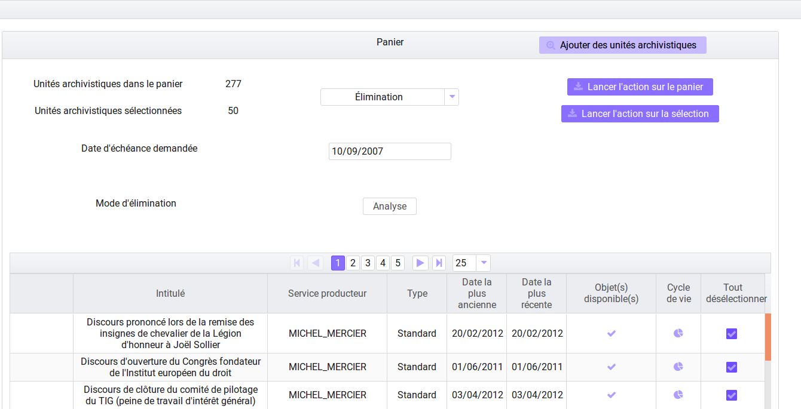

Traitements de masse
#####################

Cette partie décrit les fonctionnalités permettant d'effectuer des actions sur un grand nombre d'unités archivistiques stockées dans la solution logicielle Vitam. Cette fonctionnalité nécessite d'avoir les droits requis pour pouvoir intervenir sur les métadonnées. Les actions de traitement de masse sont accessibles via le panier et peuvent être effectuées sur la totalité du panier ou une sélection (cf Chapitre 2.12 sur utilisation du panier).

Chaque traitement de masse donne lieu à une entrée dans le journal des opérations. En vous rendant dans l'onglet "Administration" rubrique "Opération" puis "Journal des opérations" vous pouvez suivre le détail de l'opération. Vous pouvez également consulter le rapport en cliquant sur "Informations supplémentaires", puis "rapport". Le rapport du traitement détaille les cas de succès, d'avertissement et d'échec.

Mise à jour de métadonnées en masse
####################################

Les modifications en masse portent sur les métadonnées descriptives et les métadonnées de gestion. Cette fonctionnalité est accessible dans le panier. 
Pour effectuer des modifications en masse, sélectionnez des unités archivistiques en les mettant dans le panier, puis à partir de celui-ci, cliquez dans la fenêtre "Sélectionner une action", puis "Mise à jour de masse". Au clic sur cette option, deux blocs apparaissent et permettent de mettre à jour les métadonnées descriptives ou les métadonnées des règles de gestion. 

.. image :: images/panier_mise_jour_masse.png

Modification de métadonnées descriptives
========================================

Il est possible de modifier, ajouter et effacer les métadonnées descriptives d'unités archivistiques présentes dans le panier. Pour cela il faut déplier le bloc "Mise à jour des métadonnées descriptives" en cliquant sur la flèche. Trois sous-menus sont proposés :

 - ajouter / modifier une métadonnée descriptive 
 - modifier une chaîne de caractère 
 - vider une métadonnée descriptive 
							

Ajouter ou modifier une métadonnée
----------------------------------

Grâce à cette fonctionnalité, il est possible d'apporter des modifications à un champ. En cliquant sur cette option, un formulaire apparaît dans lequel le "Nom du champ" et la "Nouvelle valeur" doivent être complétés. Pour pouvoir modifier la valeur du champ, il est nécessaire de remplir le nom du champ tel qu'il est formulé par le SEDA, en anglais et en respectant la casse ou tel qu'il est défini dans l'ontologie (pour les vocabulaires externes). Il faut ensuite cliquer sur un des deux boutons "Lancer la mise à jour de masse sur tout le panier", ou bien "Lancer la mise à jour de masse sur la sélection".
 
* Si le champ existe pour ces unités archivistiques, les valeurs contenues dans les champs seront remplacées par la nouvelle valeur entrée dans le formulaire. Il s'agit en définitive d'un annule et remplace. 

Ex : Pour modifier un titre : "Ecole nationale des Greffes" par le titre "Discours prononcé lors de la visite de l'Ecole nationale des Greffes". 

+-------------------------+----------------------------------------------------------------------------+       
|Nom de champ             |  Nouvelle Valeur                                                           |
+-------------------------+----------------------------------------------------------------------------+   
|Title (nom du SEDA,      |  Discours prononcé lors de la visite de l'Ecole nationale des Greffes      |
|en anglais,              |                                                                            |
|en respectant la casse,  |                                                                            |
|ou vocabulaire externe)  |                                                                            |
|                         |                                                                            |
+-------------------------+-----------------------------------+----------------------------------------+ 

* Si le champ n'existe pas pour ces unités archivistiques un nouveau champ complété sera créé pour ces unités archivistiques. 

Ex : Pour ajouter un champ Langue des descriptions,

+-------------------------+----------------------------------------------------------------------------+       
|Nom de champ             |  Nouvelle Valeur                                                           |
+-------------------------+----------------------------------------------------------------------------+   
|DescriptionLanguage      |  Français ou Fr                                                            |
|(nom du SEDA, en anglais,|                                                                            |
|en respectant la casse,  |                                                                            |
|ou vocabulaire externe)  |                                                                            |
|                         |                                                                            |
+-------------------------+-----------------------------------+----------------------------------------+ 

Modifier une chaîne de caractères
----------------------------------

Grâce à cette fonctionnalité, il est possible d'apporter des modifications sur une partie d'un champ, pour le corriger ou le compléter. Pour pouvoir modifier la valeur du champ, il est nécessaire de remplir le nom du champ tel qu'il est formulé par le SEDA, en anglais et en respectant la casse. Il faut ensuite cliquer sur un des deux boutons "Lancer la mise à jour de masse sur tout le panier", ou bien "Lancer la mise à jour de masse sur la sélection".
 

* Ex : Corriger dans un titre le mot fracture par facture : 

+--------------------------+-----------------------------------+-------------------------+       
| Nom de champ             |   Chaîne de caractère actuelle    |      Nouvelle Valeur    |
+--------------------------+-----------------------------------+-------------------------+   
|Title (nom du SEDA,       |   fracture                        |          facture        |
|en anglais,               |                                   |                         |
|en respectant la casse,   |                                   |                         |
|ou vocabulaire externe)   |                                   |                         |
|                          |                                   |                         |
+--------------------------+-----------------------------------+-------------------------+ 

Vider une métadonnée descriptive 
---------------------------------

Il faut cliquer sur le bouton correspondant à "Vider une métadonnée descriptive", remplir le nom du champ dont la valeur sera effacée, dans le champ "Nom du champ", en indiquant le nom du champ tel qu'il est formulé par le SEDA, en anglais et en respectant la casse. Il faut ensuite cliquer sur un des deux boutons "Lancer la mise à jour de masse sur tout le panier", ou bien "Lancer la mise à jour de masse sur la sélection". 

.. image :: images/meta_descriptives.png

Modification de métadonnées de gestion 
======================================

Il est possible de modifier les règles de gestion des unités archivistiques en les sélectionnant et en les déposant dans le panier. Les modifications de métadonnées de gestion permettent : d'ajouter de nouvelles règles, de les modifier et de les supprimer. Dans la rubrique "Mise à jour de masse" cliquez sur le bloc "Mise à jour des règles de gestion".  Au clic, des sous-menus sont proposés par catégorie de règles. 

.. note :: Il est nécessaire de disposer de droits spécifiques dans le contrat d'accès pour intervenir sur les règles de gestion

Associer un profil d'unité archivistique
----------------------------------------

Pour associer un profil d'unité archivistique à un lot d'unités archivistiques, il suffit d'indiquer l'identifiant de celui-ci, présent dans le référentiel des profil d'unité archivistique. ex : AUP-000001. En cliquant sur le bouton supprimer le profil d'unité archivistique associé aux unités archivistiques concernées par la modification en masse, est supprimé.

.. image :: images/DetailAUP.png
  	

Eléments communs relatifs à l'ajout, la modification et la suppression de règles de gestion
---------------------------------------------------------------------------------------------

Pour accéder à ces fonctionnalités l'utilisateur doit sélectionner une catégorie en cliquant sur le pictogramme "+", puis cliquer sur le bloc correspondant : Ajouter une règle, modifier une règle, supprimer une règle en masse sur un lot d'archives. Pour que les modifications soient effectives, l'utilisateur doit indiquer si l'action concerne une sélection du panier ou sa totalité, en cliquant sur les boutons correspondants. Lorsque l'action est prise en compte, une fenêtre de dialogue vous informe que les modifications des règles de gestion sont en cours. En vous rendant dans l'onglet "Administration" rubrique "Opération" puis "Journal des opérations" vous pouvez suivre le détail de l'opération. Vous pouvez également consulter le rapport en cliquant sur "Informations supplémentaires", puis "rapport". Le rapport ne rend compte que des opérations en KO ou Warning. 

.. note :: le traitement de masse a pour objectif de traiter des ensembles d'une certaine volumétrie, il n'est pas recommandé d'un point de vue fonctionnel de procéder à différents traitements en même temps, afin d'éviter les conflits potentiels. D'autre part d'un point de vue technique un seul statut (OK, WARNING, KO) est disponible par unités archivistiques lors des traitements de masse.

L'ajout, la modification et la suppression de métadonnées de règles de gestion sont disponibles dans les différentes catégories : 

.. image :: images/ajout_modif_suppression.png 
    	:scale: 50

|

.. note :: les identifiants des règles de gestion indiqués doivent appartenir à la bonne catégorie de règles et doivent être contenus dans le référentiel des règles de gestion. 

- Délai de communicabilité / Règle d’accès /  ACC
- Durée d’utilité administrative (DUA) / Durée de rétention - conservation / APP
- Règle de diffusion /  DIS
- Règle de réutilisation / REU
- Durée d’utilité courante / STO  
- Durée de classification / CLASS

.. image :: images/MJ_metadonneesGestion.png 

Catégories disposant de propriétés spécifiques
----------------------------------------------	

Les règles relatives à la durée d’utilité administrative et la durée d’utilité courante disposent de propriétés spécifiques. Pour ces deux catégories de règles, il est nécessaire d'indiquer un sort final, les valeurs acceptées sont spécifiques et apparaissent dans une liste déroulante pour chacune des catégories. Il est possible de modifier les propriétés d'une catégorie de règles en sélectionnant directement le sort final et l'appliquer à cette catégorie.

- Durée d’utilité administrative (DUA) / Durée de rétention - conservation / APP. Le sort final des unités archivistiques est conserver ou détruire.

.. image :: images/Detail_DUA.png
	
- Durée d’utilité courante / STO. Le sort final des unités archivistiques est copier, accès restreint ou transférer.

.. image :: images/Detail_DUC.png

- Durée de classification / CLASS

	- Niveau de la classification : les valeurs acceptables pour ce champ sont soit Confidentiel Défense soit Secret Défense (celui-ci doit être défini dans le fichier de configuration de la plateforme).

	- Propriétaire de la classification : champ libre 
	- Champ de diffusion : champ libre 
	- Date de réévaluation : champ libre 

.. note :: En cliquant sur le bouton supprimer, la valeur contenue dans les unités archivistiques concernées par la modification en masse, est supprimée.

.. image :: images/Detail_Classification.png

Modification des propriétés d'héritage
---------------------------------------

Pour chaque catégorie de règles, il est possible d'en modifier l'héritage.

Le statut relatif au blocage de l'héritage des règles de gestion est indiqué en cochant la case concernée : 

- Aucune modification (situation par défaut l'héritage est activé) 

.. image :: images/AucuneModif.png
	:scale: 50

- Bloquer l'héritage (le blocage est activé)

.. image :: images/Detail_bloquer.png
	:scale: 50

- Hériter des parents (lever le blocage de l'héritage)

.. image :: images/herite_parents.png
	:scale: 50

Il est nécessaire de spécifier par la suite la, ou les règles concernées. Les identifiants des règles de gestion indiqués doivent appartenir à la bonne catégorie de règles et doivent être contenus dans le référentiel des règles de gestion. Pour que ces informations soient prises en compte il est nécessaire d'appuyer sur la touche entrée après l'ajout de chaque identifiant. Comme precisé ci-dessus les modifications seront effectives après avoir lancé l'action sur tout, ou partie du panier.

.. image :: images/bloquer_heritage.png
	:scale: 50

- Pour annuler le blocage des règles, la coche doit être désélectionnée, il faut ensuite spécifier l'identifiant des règles et enfin valider sa demande en sélectionnant le périmètre d'action : tout ou partie du panier. 

.. image :: images/annuler_blocage_heritage.png
	:scale: 50

Ajouter une règle de gestion 
============================

Pour ajouter une règle de gestion, il est nécessaire de sélectionner une catégorie en cliquant sur le pictogramme "+", puis de cliquer sur le bloc "Ajouter une règle".
Lors de l'ajout d'une nouvelle règle, il est nécessaire de compléter deux champs "Nouvel identifiant" et "Date de début". 
Pour les règles relatives à la durée d’utilité administrative et durée d’utilité courante il est nécessaire de renseigner un champ supplémentaire concernant le sort final des unités archivistiques, celui-ci est à choisir parmi une liste déroulante spécifique à chacune des catégories. 

Ex: pour la catégorie délai de communicabilité, ajout de la règle ACC-00002, date de début le 02/06/2018.  

Modifier une règle de gestion 
=============================

Pour modifier une règle de gestion, il est nécessaire de sélectionner une catégorie en cliquant sur le pictogramme "+", puis de cliquer sur le bloc "Modifier une règle".
Lors de la modification d'une règle existante, il est nécessaire de compléter l'"Identifiant d'origine", le "Nouvel identifiant" et la "Date de début". 

- Modifier l'identifiant d'une règle sans changer la date de début contenu dans chacune des unités archivistiques 

+--------------------------+-----------------------------------+-------------------------+       
| Identifiant d'origine    |       Nouvel identifiant          |      Date de début   	 |
+--------------------------+-----------------------------------+-------------------------+   
|    ACC-00002 		   |        ACC-00033                  |      champ vide         |
|                          |                                   |                         |
+--------------------------+-----------------------------------+-------------------------+ 
 
- Modifier l'identifiant d'une règle et la date de début 

+--------------------------+-----------------------------------+-------------------------+       
| Identifiant d'origine    |       Nouvel identifiant          |      Date de début   	 |
+--------------------------+-----------------------------------+-------------------------+   
|   ACC-00002 		   |       ACC-00033                   |      04/04/2017         |
|                          |                                   |                         |
+--------------------------+-----------------------------------+-------------------------+ 

Supprimer une règle de gestion 
==============================

Pour supprimer une règle de gestion, il est nécessaire de sélectionner une catégorie en cliquant sur le pictogramme "+", puis de cliquer sur le bloc "Supprimer une règle".
Entrez ensuite l'identifiant de la règle à supprimer dans le champ "nouvel identifiant" et validez la demande en lançant l'action sur tout ou partie du panier. 

.. image :: images/modification_rg_masse.png

Nombre d'unités archivistiques maximum concernés par les modifications en masse 
===============================================================================

Il est possible de définir un seuil maximum de modifications dans le contexte de modifications en masse, ce seuil détermine le nombre maximum d'unités archivistiques du panier auxquel le traitements de masse sera appliqué.

Si le seuil est dépassé : la modification n'est pas réalisé et le traitement est en KO. 

.. image :: images/seuil_depasse_modif_masse.png

.. note:: 
    **Seuil par défaut : 10 000 unités archivistiques pour les modifications en masse**.
      

Elimination en masse
#####################

Cette fonctionnalité permet de lancer des actions d'évaluation des unités archivistiques éliminables dans la solution Vitam et de procéder à leur élimination du système. 
Les actions d'élimination sont réalisables sur les unités archivistiques présentes dans le panier.
L'opération d'élimination en masse est une opération complexe, nécessitant différentes analyses, produisant différents temps de traitement : 

 - Analyse 1 : Unités archivistiques éliminables car la DUA est échue et le sort final déclaré est "Détruire" 
 - Analyse 2 : Unités archivistiques éliminables car il n'y a pas de conflits entre services producteurs pour détruire ces archives, la suppression d'une de ces unités archivistiques n'entraîne pas de conflits.  
 - Analyse 3 et action d'élimination : Unités archivistiques réellement éliminées car elles ne laissent pas d'unités archivistiques orphelines 

.. note ::
    **Seuil par défaut : 100 000 unités archivistiques pour l'évaluation des unités archivistiques éliminables - 10 000 unités archivistiques pour l'élimination des unités archivistiques éliminables**

Comme indiqué précedemment, il est possible de définir un seuil maximum de modifications dans le contexte d'élimination, ce seuil détermine le nombre maximum d'unités archivistiques du panier auxquel le traitements de masse sera appliqué.

Si le seuil est dépassé : la modification n'est pas réalisé et le traitement est en KO. 

.. image :: images/seuil_depasse_traitement_de_masse.png

Analyse 1 / Rechercher des unités archivistiques potentiellement éliminables
============================================================================

La solution logicielle permet de rechercher des archives éliminables. Dans l'onglet de recherche avancée il est possible de rechercher les unités archivistiques dont la durée d'utilité administrative est échue ou le sera prochainement.
Pour cela il faut sélectionner dans la catégorie de règle la durée d'utilité administrative, la date d'échéance et le sort final "Détruire", puis cliquer sur "Rechercher".
On peut appliquer à ces résultats des filtres de recherche et affiner la recherche par service producteur par exemple.
L'utilisateur peut ensuite placer au panier l'unité archivistique seule, l'unité archivistique et sa descendance ou encore l'unité archivistique et son entrée. (cf.chapitre panier)

Analyse 2 / Evaluation des unités archivistiques éliminables 
============================================================

Cette phase d'analyse est destinée à évaluer les unités archivistiques pour connaître leur statut au regard de l'élimination et décider de la mise en oeuvre de leur sort final et préparer les demandes d'autorisation ( processus externe à la solution logicielle Vitam). L'évaluation se lance à partir du panier sur la totalité du panier ou une sélection. 
Dans la rubrique "Sélectionner une action", l'utilisateur choisit "Elimination" puis sélectionne le mode "Analyse" et indique une date d'échéance qui peut être passée ou à venir. La solution logicielle va indexer en base de données les archives éliminables. (cf modèle de données Collection Unit)

Accéder aux résultats de l'analyse
----------------------------------
 
Le résultat de l'analyse d'élimination est consultable dans la rubrique "Gestion des archives", "Résultats d'élimination". 

.. image :: images/resultats_analyse_elimination.png

Pour accéder à cet écran, l'utilisateur doit : 

-  aller dans le journal des opérations dans le menu administration
-  consulter le journal des opérations
-  récupérer le GUID de l'opération ELIMINATION
-  puis aller dans le menu "Gestion des archives" et sélectionner le sous-menu "Résultats d'élimination".

En complétant le champ "Opération d'élimination" avec le GUID de l'opération et en cliquant sur Rechercher l'utilisateur accède à une liste d'unités archivistiques éliminables. 

Seules les archives dont les règles de gestion prévoient l'élimination à échéance de la date donnée comme critère par l'analyse sont affichées. Les unités archivistiques dont la règle prévoit la conservation ou dont la règle n'est pas encore échue ne figurent pas sur cette page.
Les unités archivistiques affichées peuvent avoir comme statut : 

- Destroy (unités archivistiques arrivées à échéance de leur durée administrative et dont tous les services ayant des droits sur elles demandent l'élimination)
- Conflicts (unités archivistiques dont le sort final applicable ne peut être déterminé par la solution logicielle). Pour ce statut il est possible d'avoir des informations étendues qui explicitent la raison du conflit : 
	
	- KEEP_ACCESS_SP (l’unité archivistique n’est pas éliminable car l’accès est conservé pour un service producteur autre que le service producteur principal)
	- ACCESS_LINK_INCONSISTENCY (l’unité archivistique n’est pas éliminable car sa suppression occasionnerait une incohérence dans le fonds d’archives)

L'utilisateur peut filtrer les résultats en fonction des services producteurs éliminables et ceux qui ne le sont pas, en fonction du statut global des unités archivistiques, en fonction du niveau de description, par dates et en fonction des informations étendues d'élimination. 

.. image :: images/statut_global_elimination.png

Les résultats filtrés ou non par l'analyse peuvent être traités directement dans un panier 

.. image :: images/traiter_resultat_dans_panier.png

Analyse 3 et action  / Elimination des unités archivistiques éliminables 
========================================================================

Cette action peut être effectuée après la phase de recherche ou d'analyse, mais elle peut également être lancée indépendamment. En effet, l'utilisateur peut décider de supprimer un lot d'unités archivistiques présent dans le panier sans passer par une analyse préalable. 
Lors de cette opération, le système Vitam va effectuer une analyse analogue à celle décrite ci dessus dans la phase 2, mais ne va pas indexer les résultats concernant l'élimination sur les unités archivistiques en base de données. 
Lors de cette phase, le système va s'assurer que l'élimination n'entraine pas de cas d'orphelinage. A l'issue de ces phases d'analyses si l'unité archivistique est réellement éliminable, elle va être supprimée du système.  Pour procéder à cette phase d'analyse et d'action d'élimination, l'utilisateur doit : 
 
 - Sélectionner des unités archivistiques dans le panier
 - Cliquer dans le menu déroulant sur l'action "Elimination"
 - Entrer la date du jour ou une date échue
 - Sélectionner le mode "Action"
 - Spécifier si l'action a lieu sur la sélection ou le panier dans sa totalité. Au clic, une fenêtre modale confirme que l'action d'élimination est en cours.  

.. image :: images/analyse_action_elimination.png

.. image :: images/pop_action_elimination.png

Résultats de l'opération d'élimination
--------------------------------------

Le résultat de l'opération d'élimination est consultable dans le rapport de l'opération. Pour cela l'utilisateur doit :

 - Aller dans le journal des opérations dans le menu administration
 - Consulter le journal des opérations
 - Cliquer sur l'opération élimination
 - Sélectionner le rapport dans informations complémentaires
 - Télécharger le rapport

Le rapport d'élimination spécifie :

Pour les unités archivistiques : 
 - GLOBAL_STATUS_KEEP (la durée d'utilité administrative n'est pas échue et le sort final spécifié est à conserver) 
 - GLOBAL_STATUS_CONFLICT (les unités archivistiques pour lesquelles les services producteurs ne sont pas unanimes quant à leur élimination. A la différence de la phase d'évaluation, lors de cette action il n'y a pas d'indexation dans la base de données mais des informations additionnelles sur les raisons de la non élimination)
 - DELETED les unités archivistiques ont été éliminées 
 - NON_DESTROYABLE_HAS_CHILD_UNITS les unités archivistiques n'ont pas été éliminée car leur suppression provoquerait des cas d'orphelinage. 

Pour les GOT : 
 - DELETED les groupes d'objets ont été supprimés. 
 - PARTIAL_DETACHMENT les groupes d'objets ont été détachés des unités archivistiques concernées par l'élimination. Dans le cas d'un GOT partagé par deux unités archivistiques dont une seule est éliminée

