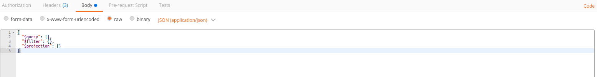
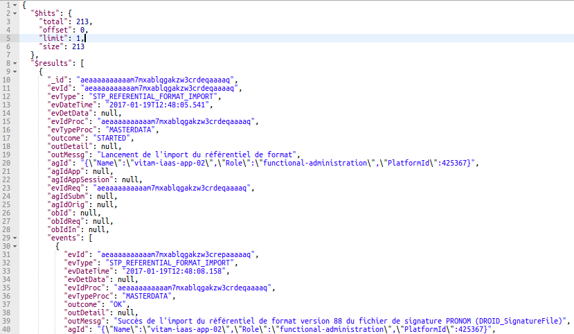
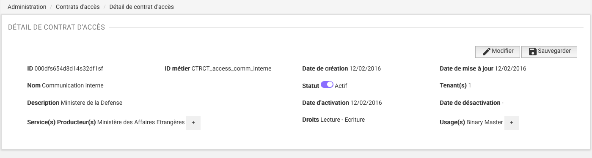
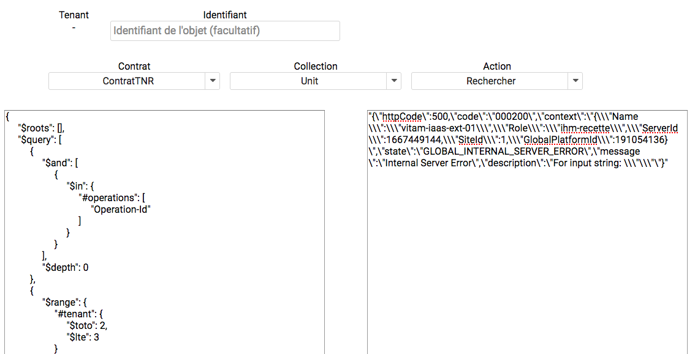
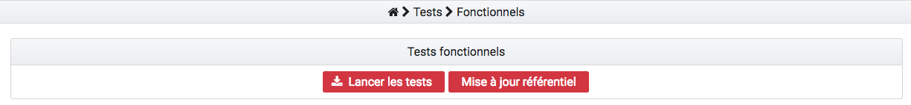
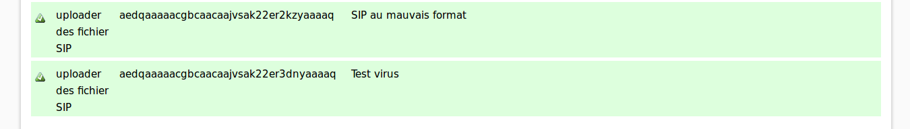

Outils de tests
###############

Divers outils ont été mis en place afin de vérifier chaque aspect de la solution logicielle VITAM :

  * Les tests manuels disposent d'une grande amplitude d'action

  * Les tests automatiques permettent de vérifier de manière régulière qu'une régression n'est pas survenue et que tout fonctionne correctement (chapitre 4).

Plusieurs documents complémentaires sont à disposition :
 - La documentation des Tests de Non Régression (TNR) se trouve dans : doc/fr/configuration-tnr/configuration.rst
 - Le manuel d'intégration applicative qui a vocation à présenter la manière d'interroger le DSL est présent dans ce même document  doc/fr/configuration-tnr/configuration.rst
 - Le tableau du cahier des tests manuels se trouvent dans l'outil Jalios

**Administration des collections**

L'administration des collections est accessible dans l'IHM recette via le menu éponyme. Cela permet de purger les référentiels, les journaux et les objets par collection (au sens MongoDB) ou pour la totalité des collections (sauf le référentiel des formats) présentent sur cette IHM. Il n'est cependant pas possible actuellement de purger les référentiels non affichés sur l'IHM recette (contexte ou profil, par exemple).

Tests Manuels
###############

Les tests manuels peuvent être effectués :
 * A l'aide du cahier de tests manuels
 * Via Postman, qui permet de lancer des tests sur l'API
 * Via l'IHM recette, qui permet de lancer des requêtes DSL

Cahier de tests manuels
------------------------

 Le cahier de test se présente sous forme de tableur. Il répertorie méticuleusement chaque cas de test possible.

 Le tableau contient :

  - Le titre explicite du cas de test
  - L'itération à laquelle le test se raccroche
  - La nature du test (TNR ou Manuel)
  - Numéro du bug associé, s'il existe
  - La liste des User Stories qui traitent ce cas de test
  - Nom de l'activité, nom associé code Story Map
  - Le Code Story Map, c'est-à-dire le code attribué à ce sujet (entrée, accès, stockage, etc.)
  - Le Use Case ou déroulement du test étape par étape
  - Le ou les jeux de tests associés

Postman
---------

Postman est un plugin disponible via Google Chrome et peut être utilisé pour tester les services API. Il s’agit en réalité d’un client HTTP puissant pour tester les services Web. Suite à l'installation d'un certificat, propre à la solution logicielle Vitam, des requêtes DSL peuvent être lancées en GET ou POST.

.. image:: images/POSTMAN_requete.png

Les résultats seront ensuite retournés sous format JSON.

Requêtes DSL
---------------

Il est possible de lancer des requêtes DSL via l'IHM de recette depuis le menu "Requêtes DSL", sans besoin de certificat. Cela permet de tester de manière simple et rapide des requêtes DSL.

Il s'agit d'un formulaire permettant de gérer plusieurs variables, telles que le tenant, le contrat d'accès, la collection, l'action testée et un identifiant. La requête est ensuite placée dans un champ texte.

Il est possible de vérifier sa validité avant de la lancer. Les résultats sont ensuite retournés sous format JSON.

.. image:: images/RECETTE_requetesdsl_boutons.png

Tests Automatisés
####################

Cucumber
---------

Cucumber est un outil de tests fonctionnels, il est accessible via l'IHM de recette dans le menu "Tests fonctionnels". Ces tests sont effectués via des ordres écrit avec des phrases simples, ce qui offre une grande variété de combinaisons.

Il existe une liste de contextes et de fonctions disponibles. Il s'agit ensuite de les associer et les manipuler afin de créer son propre test.

Les résultats sont retournés sous forme de tableau

.. image:: images/RECETTE_detail_tests.png

Tests de stockage
------------------

Ces tests permettent de vérifier qu'un objet est bien stocké plusieurs fois sur la plateforme afin d'assurer sa pérennité.

Ce test vérifie :

 - Le tenant sur lequel est stocké l'objet
 - Le nom de l'objet stocké
 - La strategie de stockage
 - La liste des stratégies où est stocké l'objet
 - La présence de l'objet dans ces stratégies

Séquencement de tests
---------------------

Un fichier contient une liste des TNR qui seront lancés de manières séquencées afin de réaliser et tester un scénario complet.
