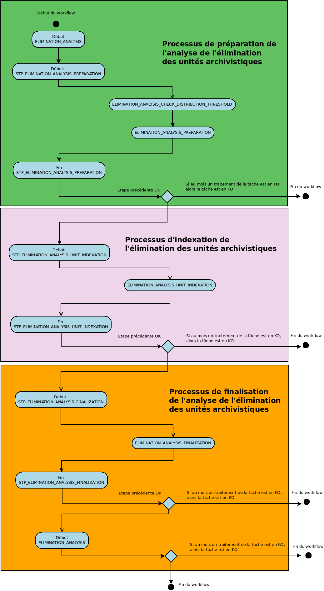
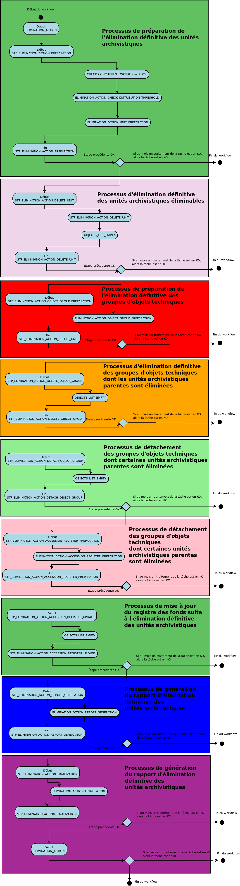

Introduction
============

L'élimination est un traitement de masse permettant d'évaluer dans un lot conséquent d'unités archivistiques, celles qui sont éliminables (la durée d'utilité adminstrative est échue et le sort final déclaré est "Détruire") et de procéder à leur élimination du système. 

Ces deux étapes ne sont pas liées, l'action d'élimination peut être exécutée directement depuis le panier. La phase d'analyse peut servir à déterminer une liste d'unités archivistiques potentiellement éliminables.

Workflow d'analyse de l'élimination des unités archivistiques
#############################################################

Lors de la phase d'analyse, le système va effectuer pour chaque unité archivistique une vérification de ses règles de gestion, qu'elles soient portées par l'unité ou héritée et indexer les résultats de ce calcul. Il calcule un statut global de l'unité archivistique et l'indexe pour les statuts DESTROY et CONFLICT 

Processus de préparation de l'analyse de l'élimination des unités archivistiques (STP_ELIMINATION_ANALYSIS_PREPARATION)
=======================================================================================================================

Analyse de l'élimination des unités archivistiques ELIMINATION_ANALYSIS_PREPARATION
-----------------------------------------------------------------------------------

+ **Règle** :Analyse de l'élimination des unités archivistiques

* **Type** : bloquant

* **Statuts** :

  + OK : la préparation de l'analyse de l'unité archivistique a bien été effectuée (ELIMINATION_ANALYSIS_PREPARATION.OK = Succès de la préparation de l'analyse de l'élimination des unités archivistiques)

  + KO : la préparation de l'analyse de l'unité archivistique n'a pas été effectuée (ELIMINATION_ANALYSIS_PREPARATION.KO = Échec de la préparation de l'analyse de l'élimination des unités archivistiques)

  + FATAL : une erreur technique est survenue lors de la préparation de l'analyse de l'unité archivistique (ELIMINATION_ANALYSIS_PREPARATION.FATAL = Erreur technique lors de la préparation de l'analyse de l'élimination des unités archivistiques)

Vérification des seuils de l'analyse de l'élimination des unités archivistiques ELIMINATION_ANALYSIS_CHECK_DISTRIBUTION_THRESHOLD
---------------------------------------------------------------------------------------------------------------------------------

+ **Règle** : Vérification des seuils de l'élimination définitive des unités archivistiques

* **Type** : bloquant

* **Statuts** :

  + OK : la vérification des seuils de l'analyse de l'élimination des unités archivistiques a bien été effectuée (ELIMINATION_ANALYSIS_CHECK_DISTRIBUTION_THRESHOLD.OK = Succès de la vérification des seuils de l'analyse de l'élimination des unités archivistiques)

  + KO : la vérification des seuils de l'analyse de l'élimination des unités archivistiques n'a pas été effectuée (ELIMINATION_ANALYSIS_CHECK_DISTRIBUTION_THRESHOLD.KO = Échec de la vérification des seuils de l'analyse de l'élimination des unités archivistiques)

  + FATAL : une erreur technique est survenue lors de la vérification des seuils de l'analyse de l'élimination des unités archivistiques (ELIMINATION_ANALYSIS_CHECK_DISTRIBUTION_THRESHOLD.FATAL = Erreur technique lors de la vérification des seuils de l'analyse de l'élimination des unités archivistiques)

Préparation de l'analyse de l'élimination des unités archivistiques ELIMINATION_ANALYSIS_PREPARATION
----------------------------------------------------------------------------------------------------

+ **Règle** : Préparation de l'analyse de l'élimination des unités archivistiques

* **Type** : bloquant

* **Statuts** :

  + OK : la préparation de l'analyse de l'élimination de l'unité archivistique a bien été effectuée (ELIMINATION_ANALYSIS_PREPARATION.OK = Succès de la préparation de l'analyse de l'élimination des unités archivistiques)

  + KO : la préparation de l'analyse de l'élimination de l'unité archivistique n'a pas été effectuée (ELIMINATION_ANALYSIS_PREPARATION.KO = Échec de la préparation de l'analyse de l'élimination des unités archivistiques)

  + FATAL : une erreur technique est survenue lors de la préparation de l'analyse de l'élimination de l'unité archivistique (ELIMINATION_ANALYSIS_PREPARATION.FATAL = Erreur technique lors de la préparation de l'analyse de l'élimination des unités archivistiques)

Processus d'indexation de l'élimination des unités archivistiques (STP_ELIMINATION_ANALYSIS_UNIT_INDEXATION)
============================================================================================================

Indexation de l''analyse d''élimination des unités archivistiques ELIMINATION_ANALYSIS_UNIT_INDEXATION
------------------------------------------------------------------------------------------------------

+ **Règle** : Indexation des unités archivistiques qui répondent aux critères d'éliminabilité (règle de gestion APP dont la date de fin est antèrieure à la date données par l'analyse)

* **Type** : bloquant

* **Statuts** :

  + OK : l'indexation des unités archivistiques a bien été effectuée (ELIMINATION_ANALYSIS_UNIT_INDEXATION.OK = Succès de l'indexation de l'élimination des unités archivistiques)

  + KO : l'indexation des unités archivistiques n'a pas été effectuée (ELIMINATION_ANALYSIS_UNIT_INDEXATION.KO = Échec lors de l'indexation de l'élimination des unités archivistiques)

  + FATAL : une erreur technique est survenue lors de l'indexation des unités archivistiques (ELIMINATION_ANALYSIS_UNIT_INDEXATION.FATAL = Erreur technique lors de l'indexation de l'élimination des unités archivistiques)

Processus de finalisation de l'analyse de l'élimination des unités archivistiques (STP_ELIMINATION_ANALYSIS_FINALIZATION)
=========================================================================================================================

Finalisation de l'analyse de l'élimination des unités archivistiques ELIMINATION_ANALYSIS_FINALIZATION
--------------------------------------------------------------------------------------------------------

+ **Règle** : Finalisation de l'analyse de l'élimination des unités archivistiques

* **Type** : bloquant

* **Statuts** :

  + OK : la finalisation de l'analyse des unités archivistiques a bien été effectuée (ELIMINATION_ANALYSIS_FINALIZATION.OK = Succès de la finalisation de l'analyse de l'élimination des unités archivistiques)

  + KO : la finalisation de l'analyse des unités archivistiques n'a pas été effectuée (ELIMINATION_ANALYSIS_FINALIZATION.KO = Échec lors de la finalisation de l'analyse de l'élimination des unités archivistiques)

  + FATAL : une erreur technique est survenue lors de l'analyse de l'élimination des unités archivistiques (ELIMINATION_ANALYSIS_FINALIZATION.FATAL = Erreur technique lors de la finalisation de l'analyse de l'élimination des unités archivistiques)

Structure de workflow d'analyse de l'élimination des unités archivistiques
==========================================================================

Workflow d'élimination définitive des unités archivistiques
###########################################################

Le processus d'élimination comprend deux phases, une première d'analyse consistant à s'assurer du statut global des unités archivistiques et que l'élimination des unités archivistiques de statut "DESTROY" ne produit pas de cas d'orphelinage. La seconde comprenant la phase d'action proprement dite. 

Analyse des éliminables et action d'élimination (ELIMINATION_ACTION)
====================================================================

Vérification des processus concurrents (CHECK_CONCURRENT_WORKFLOW_LOCK)
-----------------------------------------------------------------------

+ **Règle** : Vérification des processus concurrents

* **Type** : bloquant

* **Statuts** :

  + OK : la vérification des processus concurrents a bien été effectuée (CHECK_CONCURRENT_WORKFLOW_LOCK.OK = Succès de la vérification des processus concurrents)

  + KO : la vérification des processus concurrents n'a pas été effectuée  (CHECK_CONCURRENT_WORKFLOW_LOCK.KO = Echec de la vérification des processus concurrents)

  + WARNING : avertissement lors de la vérification des processus concurrents (CHECK_CONCURRENT_WORKFLOW_LOCK.WARNING = Avertissement lors de la vérification des processus concurrents)

  + FATAL : une erreur technique est survenue lors de la vérification des processus concurrents (CHECK_CONCURRENT_WORKFLOW_LOCK.FATAL = Erreur technique lors de la vérification des processus concurrents)

Vérification des seuils de l'élimination définitive des unités archivistiques ELIMINATION_ACTION_CHECK_DISTRIBUTION_THRESHOLD
-----------------------------------------------------------------------------------------------------------------------------

+ **Règle** : Vérification des seuils de traitement des unités archivistiques par rapport à la liste des unités archivistiques à traiter

* **Type** :  bloquant

* **Statuts** :

  + OK : la vérification des seuils de l'élimination définitive des unités archivistiques a bien été effectuée (ELIMINATION_ACTION_CHECK_DISTRIBUTION_THRESHOLD.OK = Succès de la vérification des seuils de l'élimination définitive des unités archivistiques)

  + KO : la vérification des seuils de l'élimination définitive des unités archivistiques n'a pas été effectuée (ELIMINATION_ACTION_CHECK_DISTRIBUTION_THRESHOLD.KO = Echec de la vérification des seuils de l'élimination définitive des unités archivistiques)

  + WARNING : la vérification des seuils de l'élimination définitive des unités archivistiques est en warning (ELIMINATION_ACTION_CHECK_DISTRIBUTION_THRESHOLD.WARNING = Avertissement lors de la vérification des seuils de l'élimination définitive des unités archivistiques)

  + FATAL : une erreur technique est survenue lors de la vérification des seuils de l'élimination définitive des unités archivistiques (ELIMINATION_ACTION_CHECK_DISTRIBUTION_THRESHOLD.FATAL = Erreur technique lors de la vérification des seuils de l'élimination définitive des unités archivistiques)

Préparation de l'élimination définitive des unités archivistiques ELIMINATION_ACTION_UNIT_PREPARATION
-----------------------------------------------------------------------------------------------------

+ **Règle** : Préparation de l'élimination définitive des unités archivistiques (Vérification du statut global d'élimination et vérification d'orphelinage)
 
* **Type** : bloquant

* **Statuts** :

  + OK : la préparation de l'élimination définitive des unités archivistiques a bien été effectuée (ELIMINATION_ACTION_UNIT_PREPARATION.OK = Succès de la préparation de l'élimination définitive des unités archivistiques)

  + KO : la préparation de l'élimination définitive des unités archivistiques n'a pas été effectuée (ELIMINATION_ACTION_UNIT_PREPARATION.KO = Echec de la préparation de l'élimination définitive des unités archivistiques)

  + WARNING : la préparation de l'élimination définitive des unités archivistiques est en warning (ELIMINATION_ACTION_UNIT_PREPARATION.WARNING = Avertissement lors de la préparation de l'élimination définitive des unités archivistiques)
  
  + FATAL : une erreur technique est survenue lors de la préparation de l'élimination définitive des unités archivistiques (ELIMINATION_ACTION_UNIT_PREPARATION.FATAL = Erreur technique lors de la préparation de l'élimination définitive des unités archivistiques)

Processus d'élimination définitive des unités archivistiques éliminables (STP_ELIMINATION_ACTION_DELETE_UNIT)
=============================================================================================================

Élimination définitive des unités archivistiques éliminables ELIMINATION_ACTION_DELETE_UNIT
-------------------------------------------------------------------------------------------

+ **Règle** : Élimination définitive des unités archivistiques éliminables 
 
* **Type** : bloquant

* **Statuts** :

  + OK : l'élimination définitive des unités archivistiques éliminables a bien été effectuée (ELIMINATION_ACTION_DELETE_UNIT.OK = Succès de l'élimination définitive des unités archivistiques éliminables)

  + KO : l'élimination définitive définitive des unités archivistiques éliminables n'a pas été effectuée (ELIMINATION_ACTION_DELETE_UNIT.KO = Echec de l'élimination définitive définitive des unités archivistiques éliminables)

  + WARNING : Avertissement lors de l'élimination définitive des unités archivistiques éliminables (STP_ELIMINATION_ACTION_DELETE_UNIT.WARNING = Avertissement lors de l'élimination définitive des unités archivistiques éliminables)

  + FATAL : une erreur technique est survenue lors de l'élimination définitive des unités archivistiques éliminables (STP_ELIMINATION_ACTION_DELETE_UNIT.FATAL= Erreur technique lors de l'élimination définitive des unités archivistiques éliminables

Établissement de la liste des objets  OBJECTS_LIST_EMPTY
--------------------------------------------------------

+ **Règle** : établissement de la liste des objets, visible seulement lorsqu'il n'y a pas d'objet 

* **Statuts** :

  + WARNING : Le processus d'établissement de la liste des objets est en warning (OBJECTS_LIST_EMPTY.WARNING = Avertissement lors de l'établissement de la liste des objets : il n'y a pas d'objet pour cette étape)

Processus de préparation de l'élimination définitive des groupes d'objets techniques (STP_ELIMINATION_ACTION_OBJECT_GROUP_PREPARATION)
======================================================================================================================================

Préparation de l'élimination définitive des groupes d'objets techniques ELIMINATION_ACTION_OBJECT_GROUP_PREPARATION
-------------------------------------------------------------------------------------------------------------------

* **Règle** : Processus de préparation de l'élimination définitive des groupes d'objets techniques

* **Type** : bloquant

* **Statuts** :

  + OK : la préparation de l'élimination définitive des groupes d'objets techniques a bien été effectuée (ELIMINATION_ACTION_OBJECT_GROUP_PREPARATION.OK = Succès de la préparation de l'élimination définitive des groupes d'objets techniques)

  + KO : la préparation de l'élimination définitive des groupes d'objets techniques n'a pas été effectuée (ELIMINATION_ACTION_OBJECT_GROUP_PREPARATION.KO = Echec de la préparation de l'élimination définitive des groupes d'objets techniques)

  + WARNING : la préparation de l'élimination définitive des groupes d'objets techniques est en warning (ELIMINATION_ACTION_OBJECT_GROUP_PREPARATION.WARNING = Avertissement lors de la préparation de l'élimination définitive des groupes d'objets techniques)

  + FATAL : une erreur technique est survenue lors de la préparation de l'élimination définitive des groupes d'objets techniques (ELIMINATION_ACTION_OBJECT_GROUP_PREPARATION.FATAL = Erreur technique lors de la préparation de l'élimination définitive des groupes d'objets techniques

Processus d'élimination définitive des groupes d'objets techniques dont les unités archivistiques parentes sont éliminées (STP_ELIMINATION_ACTION_DELETE_OBJECT_GROUP)
======================================================================================================================================================================

Élimination définitive des groupes d'objets techniques dont toutes les unités archivistiques parentes sont éliminées ELIMINATION_ACTION_DELETE_OBJECT_GROUP
-----------------------------------------------------------------------------------------------------------------------------------------------------------

+ **Règle** : Élimination définitive des groupes d'objets techniques dont toutes les unités archivistiques parentes sont éliminées

* **Type** : bloquant

* **Statuts** :

  + OK : L'élimination définitive des groupes d'objets techniques dont les unités archivistiques parentes sont éliminées a bien été effectuée (ELIMINATION_ACTION_DELETE_OBJECT_GROUP.OK = Succès de l'élimination définitive des groupes d'objets techniques dont les unités archivistiques parentes sont éliminées)

  + KO : L'élimination définitive des groupes d'objets techniques dont les unités archivistiques parentes sont éliminées n'a pas été effectuée (ELIMINATION_ACTION_DELETE_OBJECT_GROUP.KO = Echec de l'élimination définitive des groupes d'objets techniques dont les unités archivistiques parentes sont éliminées)

  + WARNING : Avertissement lors de l'élimination définitive des groupes d'objets techniques dont les unités archivistiques parentes sont éliminées (ELIMINATION_ACTION_DELETE_OBJECT_GROUP.WARNING = Avertissement lors de'lélimination définitive des groupes d'objets techniques dont les unités archivistiques parentes sont éliminées)

  + FATAL : Une erreur technique est survenue lors de l'élimination définitive des groupes d'objets techniques dont les unités archivistiques parentes sont éliminées (ELIMINATION_ACTION_DELETE_OBJECT_GROUP.FATAL = Erreur technique lors de l'élimination définitive des groupes d'objets techniques dont les unités archivistiques parentes sont éliminées)

Établissement de la liste des objets  OBJECTS_LIST_EMPTY
---------------------------------------------------------

* **Règle** : établissement de la liste des objets, visible seulement lorsqu'il n'y a pas d'objet 

* **Statuts** :

  + WARNING : Le processus d'établissement de la liste des objets est en warning (OBJECTS_LIST_EMPTY.WARNING = Avertissement lors de l'établissement de la liste des objets : il n'y a pas d'objet pour cette étape)

Processus de détachement des groupes d'objets techniques dont certaines unités archivistiques parentes sont éliminées (STP_ELIMINATION_ACTION_DETACH_OBJECT_GROUP)
==================================================================================================================================================================

Détachement des groupes d'objets techniques dont certaines unités archivistiques parentes sont éliminées ELIMINATION_ACTION_DETACH_OBJECT_GROUP
-----------------------------------------------------------------------------------------------------------------------------------------------

+ **Règle** : Détachement des groupes d'objets techniques dont certaines unités archivistiques parentes sont éliminées

* **Type** : bloquant

* **Statuts** :

  + OK : Le détachement des groupes d'objets techniques dont certaines unités archivistiques parentes sont éliminées a bien été effectuée (ELIMINATION_ACTION_DETACH_OBJECT_GROUP.OK = Succès du détachement des groupes d'objets techniques dont certaines unités archivistiques parentes sont éliminées)

  + KO : Le détachement des groupes d'objets techniques dont certaines unités archivistiques parentes sont éliminées n'a pas été effectuée (ELIMINATION_ACTION_DETACH_OBJECT_GROUP.KO = Echec du détachement des groupes d'objets techniques dont certaines unités archivistiques parentes sont éliminées)

  + WARNING : Avertissement lors du détachement des groupes d'objets techniques dont certaines unités archivistiques parentes sont éliminées (ELIMINATION_ACTION_DETACH_OBJECT_GROUP.WARNING = Avertissement lors du processus de détachement des groupes d'objets techniques dont certaines unités archivistiques parentes sont éliminées) 

  + FATAL : Une erreur technique est survenue lors du détachement des groupes d'objets techniques dont certaines unités archivistiques parentes sont éliminées (ELIMINATION_ACTION_DETACH_OBJECT_GROUP.FATAL = Erreur technique lors du processus de détachement des groupes d'objets techniques dont certaines unités archivistiques parentes sont éliminées)

Établissement de la liste des objets  OBJECTS_LIST_EMPTY
---------------------------------------------------------

+ **Règle** : établissement de la liste des objets, visible seulement lorsqu'il n'y a pas d'objet 

* **Statuts** :

  + WARNING : Le processus d'établissement de la liste des objets est en warning (OBJECTS_LIST_EMPTY.WARNING = Avertissement lors de l'établissement de la liste des objets : il n'y a pas d'objet pour cette étape)

Processus de mise à jour du registre des fonds suite à l'élimination définitive des unités archivistiques (STP_ELIMINATION_ACTION_ACCESSION_REGISTER_PREPARATION)
=================================================================================================================================================================

Mise à jour du registre des fonds suite à l'élimination définitive des unités archivistiques ELIMINATION_ACTION_ACCESSION_REGISTER_PREPARATION
----------------------------------------------------------------------------------------------------------------------------------------------

+ **Règle** : Préparation de la mise à jour du registre des fonds suite à l'élimination définitive des unités archivistiques

* **Type** : bloquant

* **Statuts** :

  + OK : la préparation du registre des fonds suite à l'élimination définitive des unités archivistiques a bien été effectuée (ELIMINATION_ACTION_ACCESSION_REGISTER_PREPARATION.OK = Succès de la préparation du registre des fonds suite à l'élimination définitive des unités archivistiques)

  + KO :la préparation du registre des fonds suite à l'élimination définitive des unités archivistiques n'a pas été effectuée (ELIMINATION_ACTION_ACCESSION_REGISTER_PREPARATION.KO = Echec de la préparation du registre des fonds suite à l'élimination définitive des unités archivistiques)

  + WARNING :la préparation du registre des fonds suite à l'élimination définitive des unités archivistiques est en warning (ELIMINATION_ACTION_ACCESSION_REGISTER_PREPARATION.WARNING = Avertissement lors de la préparation du registre des fonds suite à l'élimination définitive des unités archivistiques)

  + FATAL : une erreur technique est survenue lors de la préparation du registre des fonds suite à l'élimination définitive des unités archivistiques (ELIMINATION_ACTION_ACCESSION_REGISTER_PREPARATION.FATAL = Erreur technique lors de la préparation du registre des fonds suite à l'élimination définitive des unités archivistiques)

Processus de mise à jour du registre des fonds suite à l'élimination définitive des unités archivistiques (STP_ELIMINATION_ACTION_ACCESSION_REGISTER_UPDATE)
============================================================================================================================================================

Mise à jour du registre des fonds suite à l'élimination définitive des unités archivistiques ELIMINATION_ACTION_ACCESSION_REGISTER_UPDATE
-----------------------------------------------------------------------------------------------------------------------------------------

+ **Règle** : Mise à jour du registre des fonds suite à l'élimination définitive des unités archivistiques

* **Type** : bloquant

* **Statuts** :

  + OK : la mise à jour du registre des fonds suite à l'élimination définitive des unités archivistiques a bien été effectuée (ELIMINATION_ACTION_ACCESSION_REGISTER_UPDATE.OK = Succès de la mise à jour du registre des fonds suite à l'élimination définitive des unités archivistiques)

  + KO : la mise à jour du registre des fonds suite à l'élimination définitive des unités archivistiques n'a pas été effectuée (ELIMINATION_ACTION_ACCESSION_REGISTER_UPDATE.KO = Echec de la mise à jour du registre des fonds suite à l'élimination définitive des unités archivistiques)

  + WARNING : Avertissement lors de la mise à jour du registre des fonds suite à l'élimination définitive des unités archivistiques (ELIMINATION_ACTION_ACCESSION_REGISTER_UPDATE.WARNING = Avertissement lors de la mise à jour du registre des fonds suite à l'élimination définitive des unités archivistiques)

  + FATAL : une erreur technique est survenue lors de la mise à jour du registre des fonds suite à l'élimination définitive des unités archivistiques (ELIMINATION_ACTION_ACCESSION_REGISTER_UPDATE.FATAL = Erreur technique lors de la mise à jour du registre des fonds suite à l'élimination définitive des unités archivistiques)

ÉÉtablissement de la liste des objets  OBJECTS_LIST_EMPTY
---------------------------------------------------------

+ **Règle** : établissement de la liste des objets, visible seulement lorsqu'il n'y a pas d'objet 

* **Statuts** :

  + WARNING : le processus d'établissement de la liste des objets est en warning (OBJECTS_LIST_EMPTY.WARNING = Avertissement lors de l'établissement de la liste des objets : il n'y a pas d'objet pour cette étape)

Processus de génération du rapport d'élimination définitive des unités archivistiques (STP_ELIMINATION_ACTION_REPORT_GENERATION)
================================================================================================================================

Génération du rapport d'élimination définitive des unités archivistiques ELIMINATION_ACTION_REPORT_GENERATION
-------------------------------------------------------------------------------------------------------------

+ **Règle** : génération du rapport d'élimination définitive des unités archivistiques

* **Type** : bloquant

* **Statuts** :

  + OK : la génération du rapport d'élimination définitive des unités archivistiques a bien été effectuée (ELIMINATION_ACTION_REPORT_GENERATION.OK = Succès de la génération du rapport d'élimination définitive des unités archivistiques)

  + KO : la génération du rapport d'élimination définitive des unités archivistiques n'a pas été effectuée (ELIMINATION_ACTION_REPORT_GENERATION.KO = Echec de la génération du rapport d'élimination définitive des unités archivistiques)

  + WARNING : la génération du rapport d'élimination définitive des unités archivistiques est en warning (ELIMINATION_ACTION_REPORT_GENERATION.WARNING = Avertissement lors de la génération du rapport d'élimination définitive des unités archivistiques)

  + FATAL : une erreur technique est survenue lors de la génération du rapport d'élimination définitive des unités archivistiques (ELIMINATION_ACTION_REPORT_GENERATION.FATAL = Erreur technique lors de la génération du rapport d'élimination définitive des unités archivistiques)

Processus de finalisation de l'élimination définitive des unités archivistiques (STP_ELIMINATION_ACTION_FINALIZATION)
=====================================================================================================================

Finalisation de l'élimination définitive des unités archivistiques ELIMINATION_ACTION_FINALIZATION
---------------------------------------------------------------------------------------------------

+ **Règle** : élimination définitive des unités archivistiques

* **Type** : bloquant

* **Statuts** :

  + OK : La finalisation de l'élimination définitive des unités archivistiques a bien été effectuée (ELIMINATION_ACTION_FINALIZATION.OK = Succès de la finalisation de l'élimination définitive des unités archivistiques)

  + KO : La finalisation de l'élimination définitive des unités archivistiques n'a pas été effectuée (ELIMINATION_ACTION_FINALIZATION.KO = Echec de la finalisation de l'élimination définitive des unités archivistiques)

  + WARNING : La finalisation de l'élimination définitive des unités archivistiques est en warning (ELIMINATION_ACTION_FINALIZATION.WARNING = Avertissement lors de la finalisation de l'élimination définitive des unités archivistiques)

  + FATAL : Une erreur technique est survenue lors de la finalisation de l'élimination définitive des unités archivistiques (ELIMINATION_ACTION_FINALIZATION.FATAL = Erreur technique lors de la finalisation de l'élimination définitive des unités archivistiques)

Structure du workflow d'analyse des éliminables et action d'élimination 
=======================================================================

Rapport d'élimination
######################

Le rapport d’élimination est un fichier JSON généré par la solution logicielle Vitam lorsqu’une opération d’élimination se termine. Cette section décrit la manière dont ce rapport est structuré.

Exemple de JSON : rapport d'élimination
=======================================

.. code-block:: json
  
  {
  "units": [
    {
      "id": "id_unit_1",
      "originatingAgency": "sp1",
      "opi": "opi1",
      "status": "DELETED",
      "objectGroupId": "id_got_1"
    },
    {
      "id": "id_unit_2",
      "originatingAgency": "sp2",
      "opi": "opi2",
      "status": "GLOBAL_STATUS_KEEP",
      "objectGroupId": "id_got_2"
    },
    {
      "id": "id_unit_3",
      "originatingAgency": "sp3",
      "opi": "opi3",
      "status": "NON_DESTROYABLE_HAS_CHILD_UNITS",
      "objectGroupId": "id_got_3"
    },
    {
      "id": "id_unit_4",
      "originatingAgency": "sp4",
      "opi": "opi4",
      "status": "GLOBAL_STATUS_KEEP",
      "objectGroupId": "id_got_2"
    },
      {
      "id": "id_unit_5",
      "originatingAgency": "sp5",
      "opi": "opi5",
      "status": "DELETED",
      "objectGroupId": "id_got_5"
    },
  ],
  "objectGroups": [
    {
      "id": "id_got_1",
      "originatingAgency": "sp1",
      "opi": "opi1",
      "objectIds": [
        "id_got_1_object_1",
        "id_got_1_object_2"
      ],
      "status": "DELETED"
    },
    {
      "id": "id_got_5",
      "originatingAgency": "sp5",
      "opi": "opi5",
      "status": "PARTIAL_DETACHMENT",
      "deletedParentUnitIds": [
        "id_unit_5" "status"
      ]
    }
  ]
  }

Détails du rapport
==================

- **Première partie : les unités archivistiques** 

  + "id": identifiant de l'unité archivistique
  + "originatingAgency" : service producteur
  + "opi" : identifiant de l'opération d'entrée
  + "status" : statut au regard de l'action d'élimination :
	
	  - GLOBAL_STATUS_KEEP : unité archivistique non éliminables au regard des règles de gestion. 
	  - GLOBAL_STATUS_CONFLICT : unité archivistique portant des règles contradictoires. 
        - NOT_DESTROYABLE_HAS_CHILD_UNIT : unité non supprimable car elle a des enfants et sa suppression entrînerait une incohérence dans le graph.
        - DELETED : l'unité a effectivment été supprimée

  + "objectIds": identifiant du GOT rattaché à l'unité archivistique

- **Deuxième partie : les GOT** 

  + "id": identifiant du GOT
  + "originatingAgency" : service producteur
  + "opi" : identifiant de l'opération d'entrée
  + "objectIds": identifiant des objets du GOT
  + "status" : statut au regard de l'action d'élimination :

        - DELETED : le Got a été supprimé
        - PARTIAL_DETACHEMENT : le GOT est détaché de la ou des unités archivistiques effectivement supprimés et conserve un ou plusieurs autres parents. 