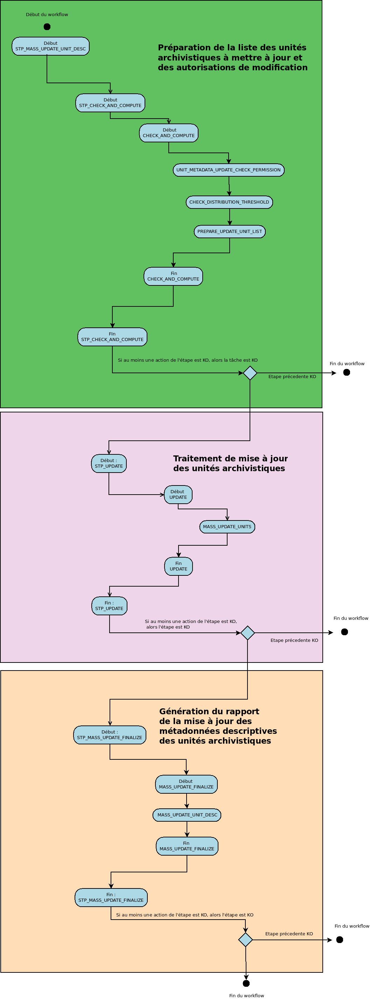
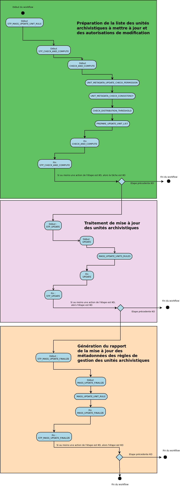

workflow de mise à jour de masse des unités archivistiques
###########################################################

Introduction
============

Cette section décrit le processus permettant d'effectuer des actions sur un grand nombre d'unités archivistiques stockées dans la solution logicielle Vitam. Cette fonctionnalité nécessite d'avoir les droits requis pour pouvoir intervenir sur les métadonnées. Les autorisations de modifications en masse portent soit sur les métadonnées descriptives soit sur les métadonnées de gestion. 

Chaque traitement de masse donne lieu à une entrée dans le journal des opérations. lorsque le traitement génère un rapport, celui-ci est disponible dans le journal des opérations et détaille les cas de succès et les cas d'échec en explicitant la raison de la non application du traitement de masse. 

Processus de mise à jour en masse des métadonnées descriptives des unités archivistiques MASS_UPDATE_UNIT_DESC
================================================================================================================

+ **Règle** : Processus de mise à jour des métadonnées descriptives de masse 

+ **Type** : bloquant

+ **Statuts** :

  + OK : le processus de mise à jour de l'unité archivistique a bien été effectuée (MASS_UPDATE_UNIT_DESC.STARTED.OK = Succès du début du processus de mise à jour en masse des métadonnées descriptives des unités archivistiques)

  + KO : le processus de mise à jour de l'unité archivistique n'a pas été effectuée en raison d'une erreur (MASS_UPDATE_UNIT_DESC.STARTED.KO = Échec du début du processus de mise à jour en masse des métadonnées descriptives des unités archivistiques)

  + FATAL : une erreur technique est survenue lors du processus de mise à jour en masse des métadonnées descriptives des unités archivistiques (MASS_UPDATE_UNIT_DESC.STARTED.FATAL = Erreur technique lors du début du processus de mise à jour en masse des métadonnées descriptives des unités archivistiques)

Processus de préparation de la liste des unités archivistiques à mettre à jour et des autorisations de modification STP_CHECK_AND_COMPUTE
===========================================================================================================================================

+ **Règle** : processus de préparation de la liste des unités archivistiques à mettre à jour et des autorisations de modification

+ **Type** : bloquant

+ **Statuts** :

  + OK : le processus de préparation de la liste des unités archivistiques à mettre à jour a bien été effectuée (STP_CHECK_AND_COMPUTE.OK = Succès du processus de préparation de la liste des unités archivistiques à mettre à jour et des autorisations de modification)

  + KO : le processus de préparation de la liste des unités archivistiques à mettre à jour n'a pas été effectuée en raison d'une erreur (STP_CHECK_AND_COMPUTE.KO = Échec lors du processus de préparation de la liste des unités archivistiques à mettre à jour et des autorisations de modification)

  + FATAL : une erreur technique est survenue lors du processus de préparation de la liste des unités archivistiques à mettre à jour (STP_CHECK_AND_COMPUTE.FATAL=Erreur technique lors du processus de préparation de la liste des unités archivistiques à mettre à jour et des autorisations de modification)

Vérification des droits de mise à jour des métadonnées descriptives des unités archivistiques UNIT_METADATA_UPDATE_CHECK_PERMISSION
------------------------------------------------------------------------------------------------------------------------------------

+ **Règle** : Vérification des droits de mise à jour des métadonnées descriptives des unités archivistiques

+ **Type** : bloquant

* **Statuts** :

  + OK : la vérification des droits de mise à jour des métadonnées des unités archivistiques a bien été effectué (UNIT_METADATA_UPDATE_CHECK_PERMISSION.OK = Succès de la vérification des droits de mise à jour des métadonnées des unités archivistiques)

  + KO : la vérification des droits de mise à jour des métadonnées des unités archivistiques n'a pas été effectuée en raison d'une erreur (UNIT_METADATA_UPDATE_CHECK_PERMISSION.KO = Échec de la vérification des droits de mise à jour des métadonnées des unités archivistiques)

  + FATAL : une erreur technique est survenue lors de la vérification des droits de mise à jour des métadonnées des unités archivistiques (UNIT_METADATA_UPDATE_CHECK_PERMISSION.FATAL = Erreur technique lors de la vérification des droits de mise à jour des métadonnées des unités archivistiques)

Vérification des seuils de limitation de traitement des unités archivistiques CHECK_DISTRIBUTION_THRESHOLD
-----------------------------------------------------------------------------------------------------------

+ **Règle** : Vérification des seuils de limitation de traitement des unités archivistiques

+ **Type** : bloquant

* **Statuts** :

  + OK : la vérification des seuils de limitation de traitement des unités archivistiques a bien été effectué (CHECK_DISTRIBUTION_THRESHOLD.OK = Succès lors de la vérification des seuils de limitation de traitement des unités archivistiques)

  + KO : la vérification des seuils de limitation de traitement des unités archivistiques n'a pas été effectuée en raison d'une erreur (CHECK_DISTRIBUTION_THRESHOLD.KO = Échec lors de la vérification des seuils de limitation de traitement des unités archivistiques)

  + FATAL : une erreur technique est survenue lors de la vérification des seuils de limitation de traitement des unités archivistiques (CHECK_DISTRIBUTION_THRESHOLD.FATAL = Erreur technique lors de la vérification des seuils de limitation de traitement des unités archivistiques)

Préparation de la liste des unités archivistiques à mettre à jour PREPARE_UPDATE_UNIT_LIST
-------------------------------------------------------------------------------------------

+ **Règle** : Préparation de la liste des unités archivistiques à mettre à jour

+ **Type** : bloquant

* **Statuts** :

  + OK : la préparation de la liste des unités archivistiques à mettre à jour a bien été effectué (PREPARE_UPDATE_UNIT_LIST.OK = Succès de la préparation de la liste des unités archivistiques à mettre à jour)

  + KO : la préparation de la liste des unités archivistiques à mettre à jour n'a pas été effectuée en raison d'une erreur (PREPARE_UPDATE_UNIT_LIST.KO = Échec de la préparation de la liste des unités archivistiques à mettre à jour)

  + FATAL : une erreur technique est survenue lors de la préparation de la liste des unités archivistiques à mettre à jour (PREPARE_UPDATE_UNIT_LIST.FATAL = Erreur technique lors de la préparation de la liste des unités archivistiques à mettre à jour)

Processus de traitement de mise à jour des unités archivistiques STP_UPDATE
============================================================================

Préparation de la liste des unités archivistiques à mettre à jour MASS_UPDATE_UNIT
-----------------------------------------------------------------------------------

+ **Règle** : mise à jour des unités archivistiques

+ **Type** : bloquant

* **Statuts** :

  + OK : la mise à jour des unités archivistiques a bien été effectué (MASS_UPDATE_UNITS.OK = Succès lors de la mise à jour des unités archivistiques)

  + KO : la mise à jour des unités archivistiques n'a pas été effectuée en raison d'une erreur (MASS_UPDATE_UNITS.KO = Échec lors de la mise à jour des unités archivistiques)

  + FATAL : une erreur technique est survenue lors de la mise à jour des unités archivistiques (MASS_UPDATE_UNITS.FATAL = Erreur technique lors de la mise à jour des unités archivistiques)

Processus de génération du rapport de mise à jour des métadonnées descriptives des unités archivistiques STP_MASS_UPDATE_FINALIZE
===================================================================================================================================

+ **Règle** : processus de génération du rapport de mise à jour des métadonnées descriptives des unités archivistiques 

+ **Type** : bloquant

* **Statuts** :

  + OK : le processus de traitement de mise à jour des unités archivistiques à mettre à jour a bien été effectué (STP_UPDATE.OK=Succès du processus de traitement de mise à jour des unités archivistiques)

  + KO : le processus de traitement de mise à jour des unités archivistiques à mettre à jour n'a pas été effectuée en raison d'une erreur (STP_UPDATE.KO=Échec du processus de traitement de mise à jour des unités archivistiques)

  + FATAL : une erreur technique est survenue lors du processus de traitement de mise à jour des unités archivistiques à mettre à jour (STP_UPDATE.FATAL=Erreur technique lors du processus de traitement de mise à jour des unités archivistiques)

Processus de mise à jour en masse des métadonnées descriptives des unités archivistiques MASS_UPDATE_UNIT_DESC
================================================================================================================

+ **Règle** : Processus de mise à jour des métadonnées descriptives de masse 

+ **Type** : bloquant

+ **Statuts** :

  + OK : le processus de mise à jour de l'unité archivistique a bien été effectuée (MASS_UPDATE_UNIT_DESC.OK = Succès du processus de mise à jour en masse des métadonnées descriptives des unités archivistiques)

  + KO : le processus de mise à jour de l'unité archivistique n'a pas été effectuée en raison d'une erreur (MASS_UPDATE_UNIT_DESC.KO = Échec du processus de mise à jour en masse des métadonnées descriptives des unités archivistiques)

  + FATAL : une erreur technique est survenue lors du processus de mise à jour en masse des métadonnées descriptives des unités archivistiques (MASS_UPDATE_UNIT_DESC.FATAL = Erreur technique lors du processus de mise à jour en masse des métadonnées descriptives des unités archivistiques)

Structure de workflow de mise à jour en masse des métadonnées descriptives des unités archivistiques
=====================================================================================================

Processus de mise à jour en masse des métadonnées de gestion des unités archivistiques MASS_UPDATE_UNIT_RULE
================================================================================================================

+ **Règle** : Processus de mise à jour de masse des métadonnées de gestion

+ **Type** : bloquant

+ **Statuts** :

  + OK : le processus de mise à jour de l'unité archivistique a bien été effectuée (MASS_UPDATE_UNIT_RULES.STARTED.OK = Succès du début du processus de mise à jour en masse des métadonnées de gestion des unités archivistiques)

  + KO : le processus de mise à jour de l'unité archivistique n'a pas été effectuée en raison d'une erreur (MASS_UPDATE_UNIT_RULES.STARTED.KO = Échec du début du processus de mise à jour en masse des métadonnées de gestion des unités archivistiques)

  + FATAL : une erreur technique est survenue lors du processus de mise à jour en masse des métadonnées descriptives des unités archivistiques (MASS_UPDATE_UNIT_RULES.STARTED.FATAL = Erreur technique lors du début du processus de mise à jour en masse des métadonnées de gestion des unités archivistiques)

Processus de préparation de la liste des unités archivistiques à mettre à jour et des autorisations de modification STP_CHECK_AND_COMPUTE
===========================================================================================================================================

+ **Règle** : processus de préparation de la liste des unités archivistiques à mettre à jour et des autorisations de modification

+ **Type** : bloquant

+ **Statuts** :

  + OK : le processus de préparation de la liste des unités archivistiques à mettre à jour a bien été effectuée (STP_CHECK_AND_COMPUTE.OK = Succès du processus de préparation de la liste des unités archivistiques à mettre à jour et des autorisations de modification)

  + KO : le processus de préparation de la liste des unités archivistiques à mettre à jour n'a pas été effectuée en raison d'une erreur (STP_CHECK_AND_COMPUTE.KO = Échec lors du processus de préparation de la liste des unités archivistiques à mettre à jour et des autorisations de modification)

  + FATAL : une erreur technique est survenue lors du processus de préparation de la liste des unités archivistiques à mettre à jour (STP_CHECK_AND_COMPUTE.FATAL=Erreur technique lors du processus de préparation de la liste des unités archivistiques à mettre à jour et des autorisations de modification)

Vérification des droits de mise à jour des métadonnées descriptives des unités archivistiques UNIT_METADATA_UPDATE_CHECK_PERMISSION
------------------------------------------------------------------------------------------------------------------------------------

+ **Règle** : Vérification des droits de mise à jour des métadonnées descriptives des unités archivistiques

+ **Type** : bloquant

* **Statuts** :

  + OK : la vérification des droits de mise à jour des métadonnées des unités archivistiques a bien été effectué (UNIT_METADATA_UPDATE_CHECK_PERMISSION.OK = Succès de la vérification des droits de mise à jour des métadonnées des unités archivistiques)

  + KO : la vérification des droits de mise à jour des métadonnées des unités archivistiques n'a pas été effectuée en raison d'une erreur (UNIT_METADATA_UPDATE_CHECK_PERMISSION.KO = Échec de la vérification des droits de mise à jour des métadonnées des unités archivistiques)

  + FATAL : une erreur technique est survenue lors de la vérification des droits de mise à jour des métadonnées des unités archivistiques (UNIT_METADATA_UPDATE_CHECK_PERMISSION.FATAL = Erreur technique lors de la vérification des droits de mise à jour des métadonnées des unités archivistiques)

Vérification des identifiants de règles de gestion demandées lors de la mise à jour des unités archivistiques CHECK_RULES_ID
-----------------------------------------------------------------------------------------------------------------------

+ **Règle** : Vérification des identifiants de règles de gestion demandées à la mise à jour des unités archivistiques 

+ **Type** : bloquant

* **Statuts** :

  + OK : la vérification des seuils de limitation de traitement des unités archivistiques a bien été effectué (CHECK_RULES_ID.OK = Succès de la vérification des identifiants de règles de gestion demandées lors de la mise à jour des unités archivistiques)

  + KO : la vérification des seuils de limitation de traitement des unités archivistiques n'a pas été effectuée en raison d'une erreur (CHECK_RULES_ID.KO = Échec de la vérification des identifiants de règles de gestion demandées lors de la mise à jour des unités archivistiques)

  + FATAL : une erreur technique est survenue lors de la vérification des seuils de limitation de traitement des unités archivistiques (CHECK_RULES_ID.FATAL = Erreur technique lors de la vérification des identifiants de règles de gestion demandées lors de la mise à jour des unités archivistiques)

Vérification des seuils de limitation de traitement des unités archivistiques CHECK_DISTRIBUTION_THRESHOLD
-----------------------------------------------------------------------------------------------------------

+ **Règle** : Vérification des seuils de limitation de traitement des unités archivistiques

+ **Type** : bloquant

* **Statuts** :

  + OK : la vérification des seuils de limitation de traitement des unités archivistiques a bien été effectué (CHECK_DISTRIBUTION_THRESHOLD.OK = Succès lors de la vérification des seuils de limitation de traitement des unités archivistiques)

  + KO : la vérification des seuils de limitation de traitement des unités archivistiques n'a pas été effectuée en raison d'une erreur (CHECK_DISTRIBUTION_THRESHOLD.KO = Échec lors de la vérification des seuils de limitation de traitement des unités archivistiques)

  + FATAL : une erreur technique est survenue lors de la vérification des seuils de limitation de traitement des unités archivistiques (CHECK_DISTRIBUTION_THRESHOLD.FATAL = Erreur technique lors de la vérification des seuils de limitation de traitement des unités archivistiques)

Préparation de la liste des unités archivistiques à mettre à jour PREPARE_UPDATE_UNIT_LIST
-------------------------------------------------------------------------------------------

+ **Règle** : Préparation de la liste des unités archivistiques à mettre à jour

+ **Type** : bloquant

* **Statuts** :

  + OK : la préparation de la liste des unités archivistiques à mettre à jour a bien été effectué (PREPARE_UPDATE_UNIT_LIST.OK = Succès de la préparation de la liste des unités archivistiques à mettre à jour)

  + KO : la préparation de la liste des unités archivistiques à mettre à jour n'a pas été effectuée en raison d'une erreur (PREPARE_UPDATE_UNIT_LIST.KO = Échec de la préparation de la liste des unités archivistiques à mettre à jour)

  + FATAL : une erreur technique est survenue lors de la préparation de la liste des unités archivistiques à mettre à jour (PREPARE_UPDATE_UNIT_LIST.FATAL = Erreur technique lors de la préparation de la liste des unités archivistiques à mettre à jour)

Processus de traitement de mise à jour des unités archivistiques STP_UPDATE
============================================================================

Préparation de la liste des unités archivistiques à mettre à jour MASS_UPDATE_UNIT_RULES
-----------------------------------------------------------------------------------------

+ **Règle** : mise à jour des règles de gestion des unités archivistiques

+ **Type** : bloquant

* **Statuts** :

  + OK : la mise à jour des règles de gestion des unités archivistiques a bien été effectué (MASS_UPDATE_UNITS_RULES.OK = Succès lors de la mise à jour des règles de gestion des unités archivistiques)

  + KO : la mise à jour des règles de gestion des unités archivistiques n'a pas été effectuée en raison d'une erreur (MASS_UPDATE_UNITS_RULES.KO = Échec lors de la mise à jour des règles de gestion des unités archivistiques)

  + FATAL : une erreur technique est survenue lors de la mise à jour des règles de gestion des unités archivistiques (MASS_UPDATE_UNITS_RULES.FATAL = Erreur technique lors de la mise à jour des règles de gestion des unités archivistiques)

Processus de génération du rapport de mise à jour des métadonnées descriptives des unités archivistiques STP_MASS_UPDATE_FINALIZE
==================================================================================================================================

+ **Règle** : processus de génération du rapport de mise à jour des métadonnées descriptives des unités archivistiques 

+ **Type** : bloquant

* **Statuts** :

  + OK : le processus de traitement de mise à jour des unités archivistiques à mettre à jour a bien été effectué (STP_UPDATE.OK=Succès du processus de traitement de mise à jour des unités archivistiques)

  + KO : le processus de traitement de mise à jour des unités archivistiques à mettre à jour n'a pas été effectuée en raison d'une erreur (STP_UPDATE.KO=Échec du processus de traitement de mise à jour des unités archivistiques)

  + FATAL : une erreur technique est survenue lors du processus de traitement de mise à jour des unités archivistiques à mettre à jour (STP_UPDATE.FATAL=Erreur technique lors du processus de traitement de mise à jour des unités archivistiques)

Processus de mise à jour en masse des métadonnées des règles de gestion des unités archivistiques MASS_UPDATE_UNIT_RULE
========================================================================================================================

+ **Règle** : Processus de mise à jour des métadonnées des règles de gestion des unités archivistiques de masse 

+ **Type** : bloquant

+ **Statuts** :

  + OK : le processus de mise à jour des métadonnées des règles de gestion des unités archivistiques a bien été effectuée (MASS_UPDATE_UNIT_RULE.OK = Succès lors de la mise à jour des métadonnées de gestion des unités archivistiques)

  + KO : le processus de mise à jour des métadonnées des règles de gestion des unités archivistiques n'a pas été effectuée en raison d'une erreur (MASS_UPDATE_UNIT_RULE.KO = Échec lors de la mise à jour des métadonnées de gestion des unités archivistiques)

  + FATAL : une erreur technique est survenue lors du processus de la mise à jour des métadonnées des règles de gestion des unités archivistiques (MASS_UPDATE_UNIT_RULE.FATAL = Erreur technique lors de la mise à jour des métadonnées de gestion des unités archivistiques)

Structure de workflow de mise à jour en masse des métadonnées de gestion des unités archivistiques
===================================================================================================

