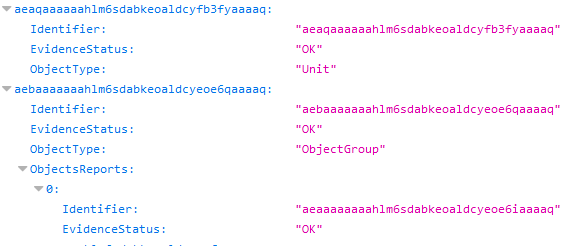

Rapport d'audit de cohérence
############################

Le rapport d'audit de cohérence est un fichier JSON généré par la solution logicielle Vitam lorsqu'une opération d'audit se termine. Cette section décrit la manière dont ce rapport est structuré.

Exemple de JSON : rapport d'audit
=================================

Détails du rapport
===================

Chaque section du rapport correspond au résultat de l'audit de cohérence pour chaque objet ou groupe d'objet ou unité archivistique audité. On y trouve les informations suivantes : 

- "Identifier": Identifiant de l'objet ou groupe d'objet ou unité archivistique audité. 
- "EvidenceStatus": Résultat de l'audit : OK si toutes les signatures des fichiers sécurisés, des offres de stockage, de la base de données sont présentes et identiques. Le résultat est KO si au moins une des signatures est absente, ou bien si une des 3 est différente. 
- "ObjectType": type de l'objet audit : objet ou groupe d'objet ou unité archivistique. 

Note: pour les audits exécutés sur des groupes d'objets, le rapport comporte aussi une section "ObjectReports" qui donne les informations de chaque audit réalisé sur les bojets du groupe. On y retrouve aussi les identifiants ( dans le champ "Identifier" ), le résultat ( dans le champ "EvidenceStatus" ). 

Note: le rapport est disponible via le journal des opérations, lorsqu'on sélectionne l'option "rapport" dans les informations supplémentaires. 

