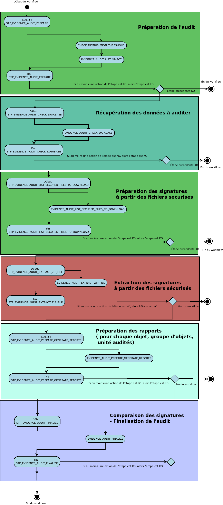

Workflow de l'audit de cohérence des fichiers
#############################################

Introduction
============

Cette section décrit le processus (workflow) d'audit de cohérence des fichiers mis en place dans la solution logicielle Vitam.

Celui-ci est défini dans le fichier "EvidenceAuditWorkflow.json” (situé ici : sources/processing/processing-management/src/main/resources/workflows).

Processus d'audit de cohérence des fichiers (vision métier)
===========================================================

Le processus d'audit de cohérence permet de vérifier la cohérence entre les signatures calculées pour chaque objet, en comparant celle présente dans le journal sécurisé, avec celle présente dans la base de donnée, et celle de l'offre de stockage.

L'audit s'applique au niveau des unités archivistiques, des objets, et des groupes d'objets. 

Processus de préparation de l'audit (STP_EVIDENCE_AUDIT_PREPARE)
================================================================

Création de la liste à auditer EVIDENCE_AUDIT_LIST_OBJECT (EvidenceAuditPrepare.java)
-------------------------------------------------------------------------------------

* **Règle** : Création de la liste à auditer
* **Type** : bloquant
* **Statuts** :
	* OK : la liste a été créée avec succès (EVIDENCE_AUDIT_LIST_OBJECT.OK=Création de la liste à auditer)
	* KO : Echec de la création de la liste à auditer (EVIDENCE_AUDIT_LIST_OBJECT.KO=Echec lors de la création de la liste à auditer)
	* FATAL : Une erreur technique est survenue lors de la création de la liste (EVIDENCE_AUDIT_LIST_OBJECT.FTAL=Erreur fatale lors de la création de la liste à auditer)

Processus de récupération des données de la base (STP_EVIDENCE_AUDIT_CHECK_DATABASE)
====================================================================================

Récupération des données dans la base de donnée EVIDENCE_AUDIT_CHECK_DATABASE (EvidenceAuditDatabaseCheck.java)
---------------------------------------------------------------------------------------------------------------

* **Règle** : Tâche consistant à récupérer les informations nécéssaires à l'audit dans la base de données.
* **Type** : bloquant
* **Statuts** :
	* OK : La récupération des données dans la base de données est un succès (EVIDENCE_AUDIT_CHECK_DATABASE.OK=Succès de la récupération des données dans la base de données)
	* KO : La récupération des données dans la base de donnée est un échec (EVIDENCE_AUDIT_CHECK_DATABASE.KO=Echec de la récupération des données dans la base de données)
	* FATAL : Une erreur technique est survenue dans la récupération des données dans la base de données (EVIDENCE_AUDIT_CHECK_DATABASE.FATAL=Erreur fatale lors de la récupération des données dans la base de données)
        * WARNING : Avertissement lors de la récupération des données dans la base de données (EEVIDENCE_AUDIT_CHECK_DATABASE.WARNING=Avertissement lors de la récupération des données dans la base de données)

Processus de préparation des signatures à partir des fichiers sécurisés (STP_EVIDENCE_AUDIT_LIST_SECURED_FILES_TO_DOWNLOAD)
===========================================================================================================================

Préparation de la liste des signatures dans les fichiers sécurisés EVIDENCE_AUDIT_LIST_SECURED_FILES_TO_DOWNLOAD (EvidenceAuditListSecuredFiles.java)
-----------------------------------------------------------------------------------------------------------------------------------------------------

* **Règle** : Tâche consistant à préparer la liste des signatures des objets, groupes d'objets ou unités archivistiques archivées, dans les fichiers sécurisés. 
* **Type** : bloquant
* **Statuts** :

	* OK : La préparation de la liste des signatures dans les fichiers sécurisés est un succès (EVIDENCE_AUDIT_LIST_SECURED_FILES_TO_DOWNLOAD.OK=Succès de la préparation de la liste des signatures dans les fichiers sécurisés)
	* KO : La préparation de la liste des signatures dans les fichiers sécurisés est un échec (EVIDENCE_AUDIT_LIST_SECURED_FILES_TO_DOWNLOAD.KO=Echec de la préparation de la liste des signatures dans les fichiers sécurisés)
	* WARNING : Avertissement lors de la préparation de la liste des signatures (EVIDENCE_AUDIT_LIST_SECURED_FILES_TO_DOWNLOAD.WARNING=Avertissement lors de la préparation de la liste des signatures dans les fichiers sécurisés)
	* FATAL : une erreur technique est survenue lors de la préparation de la liste des signatures dans les fichiers sécurisés (EVIDENCE_AUDIT_LIST_SECURED_FILES_TO_DOWNLOAD.FATAL=Erreur fatale lors de la préparation de la liste des signatures dans les fichiers sécurisés)

Processus d'extraction des signatures à partir des fichiers sécurisés (STP_EVIDENCE_AUDIT_EXTRACT_ZIP_FILE)
===========================================================================================================

Extraction des signatures à partir des fichiers sécurisés EVIDENCE_AUDIT_EXTRACT_ZIP_FILE (EvidenceAuditExtractFromZip.java)
----------------------------------------------------------------------------------------------------------------------------

* **Règle** : Tâche consistant à extraire les signatures des objets, groupes d'objets ou unités archivistiques archivées, dans les fichiers sécurisés. 
* **Type** : bloquant
* **Statuts** :

	* OK : L'extraction des signatures à partir des fichiers sécurisés est un succès (EVIDENCE_AUDIT_EXTRACT_ZIP_FILE.OK=Succès de l'extraction des signatures à partir des fichiers sécurisés)
	* KO : L'extraction des signatures à partir des fichiers sécurisés est un échec (EVIDENCE_AUDIT_EXTRACT_ZIP_FILE.KO=Echec de l'extraction des signatures à partir des fichiers sécurisés)
	* WARNING : Avertissement lors de l'extraction des signatures à partir des fichiers sécurisés (STP_EVIDENCE_AUDIT_EXTRACT_ZIP_FILE.WARNING=Avertissement lors de l'extraction des signatures à partir des fichiers sécurisés )
	* FATAL : Une erreur technique est survenue lors de l'extraction des signatures à partir des fichiers sécurisés (EVIDENCE_AUDIT_EXTRACT_ZIP_FILE.FATAL=Erreur fatale lors de l'extraction des signatures à partir des fichiers sécurisés)

Processus de préparation des rapports pour chaque objet, groupe d'objets ou unité audité (STP_EVIDENCE_AUDIT_PREPARE_GENERATE_REPORTS)
======================================================================================================================================

Création du rapport pour chaque unité archivistique ou objet ou groupe d'objets EVIDENCE_AUDIT_PREPARE_GENERATE_REPORTS (EvidenceAuditGenerateReports.java)
-----------------------------------------------------------------------------------------------------------------------------------------------------------

* **Règle** : Tâche consistant à créer le rapport pour chaque unité archivistique, objet ou groupe d'objets audité
* **Type** : bloquant
* **Statuts** :
	* OK : La création du rapport pour chaque unité archivistique ou objet ou groupe d'objets est un succès (EVIDENCE_AUDIT_PREPARE_GENERATE_REPORTS.OK=Succès de la création du rapport pour chaque unité archivistique ou objet ou groupe d'objets)
	* KO : La création du rapport pour chaque unité archivistique ou objet ou groupe d'objets est un échec (EVIDENCE_AUDIT_PREPARE_GENERATE_REPORTS.KO=Echec de la création du rapport pour chaque unité archivistique ou objet ou groupe d'objets)
	* FATAL : une erreur technique est survenue de la création du rapport pour chaque unité archivistique ou objet ou groupe d'objets (EVIDENCE_AUDIT_PREPARE_GENERATE_REPORTS.FATAL=Erreur fatale lors de la création du rapport pour chaque unité archivistique ou objet ou groupe d'objets)
	* WARNING : Avertissement lors de la création du rapport pour chaque unité archivistique ou objet ou groupe d'objets (EVIDENCE_AUDIT_PREPARE_GENERATE_REPORTS.WARNING=Avertissement lors de la création du rapport pour chaque unité archivistique ou objet ou groupe d'objets)

Processus de finalisation de l'audit et généretion du rapport final (STP_EVIDENCE_AUDIT_FINALIZE)
=================================================================================================

Création du rapport de l'audit de cohérence EVIDENCE_AUDIT_FINALIZE (EvidenceAuditFinalize.java)
------------------------------------------------------------------------------------------------

* **Règle** : Tâche consistant à créer le rapport permettant de comparer les signatures extraites des fichiers sécurisés avec les données de la base de données et de l'offre de stockage. 
* **Type** : bloquant
* **Statuts** :
	* OK : La création du rapport d'audit de cohérence est un succès (EVIDENCE_AUDIT_FINALIZE.OK=Succès de la création du rapport de l'audit de cohérence)
	* KO : La création du rapport d'audit de cohérence est un échec (EVIDENCE_AUDIT_FINALIZE.KO=Echec de la création du rapport de l'audit de cohérence)
	* FATAL : une erreur technique est survenue lors de la création du rapport d'audit de cohérence) (EVIDENCE_AUDIT_FINALIZE.FATAL=Erreur fatale lors de la création du rapport d'audit de cohérence)

