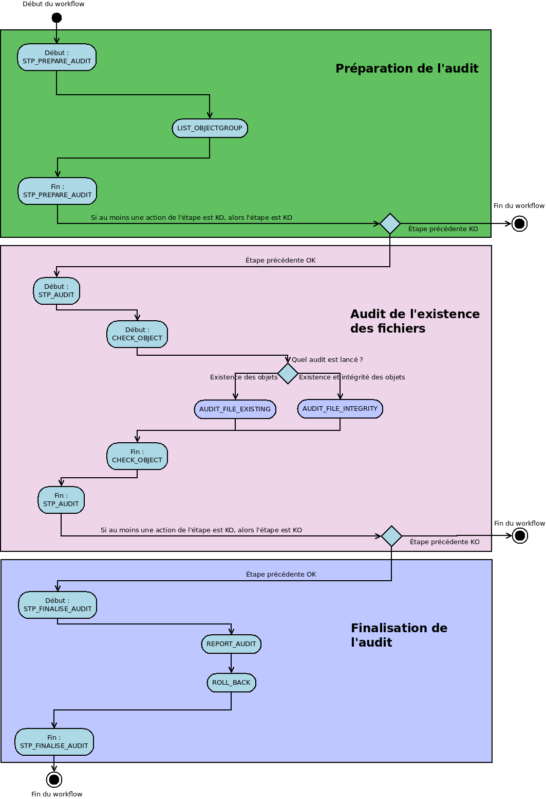

Workflow de l'audit de l'existence des fichiers
###############################################

Introduction
============

Cette section décrit le processus (workflow) d'audit de l'existence des fichiers mis en place dans la solution logicielle Vitam.

Celui-ci est défini dans le fichier "DefaultAuditWorkflow.json” (situé ici : sources/processing/processing-management/src/main/resources/workflows).

Processus d'audit d'existence des fichiers (vision métier)
=======================================================================

Le processus d'audit prend comme point d'entrée un l'identifiant d'un tenant ou l'identifiant d'un service producteur.

Pour chaque objet du tenant choisi ou chaque objet appartenant au service producteur, l'audit va vérifier :
- Que la liste des offres de stockage définies dans le groupe d'objets est bien la même que celle définie dans la stratégie de stockage
- Que toutes les fichiers correspondant aux objets existent sur les offres déclarées, dans un nombre de copie spécifiée via la stratégie de stockage

Dans une première étape technique, il prépare la liste des groupes d'objets à auditer afin de paralléliser la tâche.
Dans un second temps, il effectue la vérification elle même.
Enfin, il sécurise les journaux de cycle de vie qui ont été modifiés.

Préparation de l'audit (STP_PREPARE_AUDIT)
==========================================

Création de la liste des groupes d'objets (LIST_OBJECTGROUP_ID)
------------------------------------------------------------------------------

* Règle : Création de la liste des groupes d'objets à auditer
* Type : bloquant
* Statuts :
	* OK : la liste a été créée avec succès (LIST_OBJECTGROUP_ID.OK=Succès de la création de la liste des groupes d''objets à auditer)
	* FATAL : Une erreur technique est survenue lors de la création de la liste (LIST_OBJECTGROUP_ID.FATAL=Erreur fatale lors de la création de la liste des groupes d''objets à auditer)

Audit (STP_AUDIT)
===================================================

Audit de l'existence des fichiers (AUDIT_FILE_EXISTING)
-------------------------------------------------------

* Règle : Vérification que, pour chaque groupe d'objets audités :
	* La stratégie de stockage du groupe d'objets est conforme à celle du moteur de stockage
	* Les fichiers correspondant aux objets, déclarés dans le groupe d'objet, existent bien sous le même nom dans les offres de stockage
* Type : bloquant
* Statuts :
	* OK : tous les fichiers de tous les groupes d'objet audités existent bien sur les offres de stockage (AUDIT_FILE_EXISTING.OK=Succès de l'audit de l'existence de fichiers )
	* KO : au moins un fichier n'existe pas pour au moins un objet, mais cet objet possède au moins une copie restante (AUDIT_FILE_EXISTING.KO=Echec de l'audit de l'existence de fichiers)
	* KO : tous les fichiers d'au moins un objet n'existent pas (AUDIT_FILE_EXISTING.KO=Echec de l'audit de l'existence de fichiers)
	* Warning : il n'y a aucun objet à auditer (cas par exemple d'un producteur sans objets) (AUDIT_FILE_EXISTING.WARNING=Avertissement lors de l'audit de l'existence de fichiers)
	* FATAL : erreur technique lors de l'audit de l'existence des fichiers (AUDIT_FILE_EXISTING.FATAL=Erreur fatale lors de l'audit de l'existence de fichiers)

Sécurisation des journaux des cycles de vie des groupes d'objets (COMMIT_LIFE_CYCLE_OBJECT_GROUP)
--------------------------------------------------------------------------------------------------------

Sécurisation en base des journaux du cycle de vie des groupes d'objets qui ont été modifiés durant l'audit et uniquement ceux qui ont été modifiés. Pour le reste cette étape est strictement la même que celle décrite dans le processus d'entrée (section "Workflow d'entrée")

