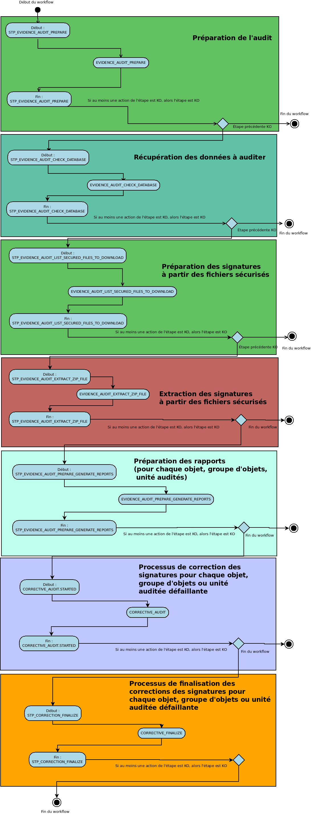

Workflow de l'audit correctif 
##############################

Introduction
============

Cette section décrit le processus (workflow) de l'audit correctif des fichiers mis en place dans la solution logicielle Vitam. Cette opération peut être effectuée suite à l'audit de cohérence. Cette action est effectuée via API. Cependant, dans un souci de démonstration et à titre d'écran expérimental un lancement de l'audit correctif peut-être effectué à partir de l'IHM recette (cf 2.4 Test Audit correctif)

Processus d'audit correctif des fichiers (vision métier)
=========================================================

Cette action a pour but de corriger des objets défaillants. Cette correction fait suite à l'audit de cohérence. L'audit correctif veut résoudre une situation anormale : l'empreinte des fichiers ne correspond plus à l'empreinte enregistrée en base et sur les espaces de stockage. Afin de corriger et de rectifier ces erreurs, l'audit correctif va supprimer la copie défaillante (si cela est possible) et restaurer à partir de la stratégie de stockage une copie saine (copie dont l'empreinte est OK). Les premières parties du workflow de correction de l'audit suivent les mêmes étapes que l'audit de cohérence, le traitement de correction et de récupération des données dans les offres de stockage ou la base de données intervient dans la seconde partie du workflow.

Processus de préparation d'audit (STP_EVIDENCE_AUDIT_PREPARE)
=============================================================

Création de la liste à auditer EVIDENCE_AUDIT_LIST_OBJECT (EvidenceAuditPrepare.java)
-------------------------------------------------------------------------------------

* **Règle** : Création de la liste à auditer
* **Type** : bloquant
* **Statuts** :
	- OK : la liste a été créée avec succès (EVIDENCE_AUDIT_LIST_OBJECT.OK=Création de la liste à auditer)
	- KO : Echec de la création de la liste à auditer (EVIDENCE_AUDIT_LIST_OBJECT.KO=Echec lors de la création de la liste à auditer)
	- FATAL : Une erreur technique est survenue lors de la création de la liste (EVIDENCE_AUDIT_LIST_OBJECT.FTAL=Erreur technique lors de la création de la liste à auditer)

Processus de récupération des données de la base (STP_EVIDENCE_AUDIT_CHECK_DATABASE)
====================================================================================

Récupération des données dans la base de donnée EVIDENCE_AUDIT_CHECK_DATABASE (EvidenceAuditDatabaseCheck.java)
---------------------------------------------------------------------------------------------------------------

* **Règle** : Tâche consistant à récupérer les informations nécéssaires à l'audit dans la base de données.
* **Type** : bloquant
* **Statuts** :

	- OK : La récupération des données dans la base de données est un succès (EVIDENCE_AUDIT_CHECK_DATABASE.OK=Succès de la récupération des données dans la base de données)
	- KO : La récupération des données dans la base de donnée est un échec (EVIDENCE_AUDIT_CHECK_DATABASE.KO=Echec de la récupération des données dans la base de données)
	- FATAL : Une erreur technique est survenue dans la récupération des données dans la base de données (EVIDENCE_AUDIT_CHECK_DATABASE.FATAL=Erreur technique lors de la récupération des données dans la base de données)
	- WARNING : Avertissement lors de la récupération des données dans la base de données (EEVIDENCE_AUDIT_CHECK_DATABASE.WARNING=Avertissement lors de la récupération des données dans la base de données)

Processus de préparation des signatures à partir des fichiers sécurisés (STP_EVIDENCE_AUDIT_LIST_SECURED_FILES_TO_DOWNLOAD)
===========================================================================================================================

Préparation de la liste des signatures dans les fichiers sécurisés EVIDENCE_AUDIT_LIST_SECURED_FILES_TO_DOWNLOAD (EvidenceAuditListSecuredFiles.java)
-----------------------------------------------------------------------------------------------------------------------------------------------------

* **Règle** : Tâche consistant à préparer la liste des signatures des objets, groupes d'objets ou unités archivistiques archivées, dans les fichiers sécurisés. 
* **Type** : bloquant
* **Statuts** :

	- OK : La préparation de la liste des signatures dans les fichiers sécurisés est un succès (EVIDENCE_AUDIT_LIST_SECURED_FILES_TO_DOWNLOAD.OK=Succès de la préparation de la liste des signatures dans les fichiers sécurisés)
	- KO : La préparation de la liste des signatures dans les fichiers sécurisés est un échec (EVIDENCE_AUDIT_LIST_SECURED_FILES_TO_DOWNLOAD.KO=Echec de la préparation de la liste des signatures dans les fichiers sécurisés)
	- WARNING : Avertissement lors de la préparation de la liste des signatures (EVIDENCE_AUDIT_LIST_SECURED_FILES_TO_DOWNLOAD.WARNING=Avertissement lors de la préparation de la liste des signatures dans les fichiers sécurisés)
	- FATAL : une erreur technique est survenue lors de la préparation de la liste des signatures dans les fichiers sécurisés (EVIDENCE_AUDIT_LIST_SECURED_FILES_TO_DOWNLOAD.FATAL=Erreur technique lors de la préparation de la liste des signatures dans les fichiers sécurisés)

Processus d'extraction des signatures à partir des fichiers sécurisés (STP_EVIDENCE_AUDIT_EXTRACT_ZIP_FILE)
===========================================================================================================

Extraction des signatures à partir des fichiers sécurisés EVIDENCE_AUDIT_EXTRACT_ZIP_FILE (EvidenceAuditExtractFromZip.java)
----------------------------------------------------------------------------------------------------------------------------

* **Règle** : Tâche consistant à extraire les signatures des objets, groupes d'objets ou unités archivistiques archivées, dans les fichiers sécurisés. 
* **Type** : bloquant
* **Statuts** :

	- OK : L'extraction des signatures à partir des fichiers sécurisés est un succès (EVIDENCE_AUDIT_EXTRACT_ZIP_FILE.OK=Succès de l'extraction des signatures à partir des fichiers sécurisés)
	- KO : L'extraction des signatures à partir des fichiers sécurisés est un échec (EVIDENCE_AUDIT_EXTRACT_ZIP_FILE.KO=Echec de l'extraction des signatures à partir des fichiers sécurisés)
	- WARNING : Avertissement lors de l'extraction des signatures à partir des fichiers sécurisés (STP_EVIDENCE_AUDIT_EXTRACT_ZIP_FILE.WARNING=Avertissement lors de l'extraction des signatures à partir des fichiers sécurisés )
	- FATAL : Une erreur technique est survenue lors de l'extraction des signatures à partir des fichiers sécurisés (EVIDENCE_AUDIT_EXTRACT_ZIP_FILE.FATAL=Erreur technique lors de l'extraction des signatures à partir des fichiers sécurisés)

Processus de préparation des rapports pour chaque objet, groupe d'objets ou unité audité (STP_EVIDENCE_AUDIT_PREPARE_GENERATE_REPORTS)
======================================================================================================================================

Création du rapport pour chaque unité archivistique ou objet ou groupe d'objets EVIDENCE_AUDIT_PREPARE_GENERATE_REPORTS (EvidenceAuditGenerateReports.java)
-----------------------------------------------------------------------------------------------------------------------------------------------------------

* **Règle** : Tâche consistant à créer le rapport pour chaque unité archivistique, objet ou groupe d'objets audité
* **Type** : bloquant
* **Statuts** :
	- OK : La création du rapport pour chaque unité archivistique ou objet ou groupe d'objets est un succès (EVIDENCE_AUDIT_PREPARE_GENERATE_REPORTS.OK=Succès de la création du rapport pour chaque unité archivistique ou objet ou groupe d'objets)
	- KO : La création du rapport pour chaque unité archivistique ou objet ou groupe d'objets est un échec (EVIDENCE_AUDIT_PREPARE_GENERATE_REPORTS.KO=Echec de la création du rapport pour chaque unité archivistique ou objet ou groupe d'objets)
	- FATAL : une erreur technique est survenue de la création du rapport pour chaque unité archivistique ou objet ou groupe d'objets (EVIDENCE_AUDIT_PREPARE_GENERATE_REPORTS.FATAL=Erreur technique lors de la création du rapport pour chaque unité archivistique ou objet ou groupe d'objets)
	- WARNING : Avertissement lors de la création du rapport pour chaque unité archivistique ou objet ou groupe d'objets (EVIDENCE_AUDIT_PREPARE_GENERATE_REPORTS.WARNING=Avertissement lors de la création du rapport pour chaque unité archivistique ou objet ou groupe d'objets)

Processus de correction des signatures pour chaque objet, groupe d'objets ou unité auditée défaillante (CORRECTIVE_AUDIT.STARTED)
==================================================================================================================================

Correction des signatures pour chaque objet, groupe d'objets ou unité auditée, défaillante (CORRECTIVE_AUDIT)
---------------------------------------------------------------------------------------------------------------

* **Règle** : Tâche consistant à récupérer les données du/des fichiers corrompus auprès de la base de données ou d'une offre de stockage valide.
* **Type** : bloquant
* **Statuts** : 

	- OK : La correction des signatures de chaque unité archivistique ou objet ou groupe d'objets corrompue a bien été effectuée (CORRECTIVE_AUDIT.OK=Succès de la correction des signatures de chaque unité archivistique ou objet ou groupe d'objets corrompue)
	- KO : La correction des signatures de chaque unité archivistique ou objet ou groupe d'objets corrompue n'a pas été effectuée (CORRECTIVE_AUDIT.KO=Échec de la correction des signatures de chaque unité archivistique ou objet ou groupe d'objets corrompue) 		
	- FATAL : une erreur technique est survenue lors de la correction des signatures de chaque unité archivistique ou objet ou groupe d'objets corrompu (CORRECTIVE_AUDIT.FATAL=Erreur technique lors de la correction des signatures de chaque unité archivistique ou objet ou groupe d'objets corrompue) 
	- WARNING : Avertissement lors de la correction des signatures de chaque unité archivistique ou objet ou groupe d'objets corrompu (CORRECTIVE_AUDIT.WARNING=Avertissement lors de la correction des signatures de chaque unité archivistique ou objet ou groupe d'objets corrompue)

Processus de finalisation des corrections des signatures pour chaque objet, groupe d'objets ou unité auditée défaillante (STP_CORRECTION_FINALIZE)
===================================================================================================================================================

Finalisation des corrections des signatures pour chaque objet, groupe d'objets ou unité auditée, défaillante (CORRECTION_FINALIZE)
----------------------------------------------------------------------------------------------------------------------------------

* **Règle** : Tâche consistant à finaliser la correction des signatures sur les données du/des fichiers corrompus auprès de la base de données ou d'une offre de stockage valide.
* **Type** : bloquant
* **Statuts** : 

	- OK : La finalisation des corrections des signatures de chaque unité archivistique ou objet ou groupe d'objets corrompue a bien été effectuée (CORRECTIVE_AUDIT.OK=Succès de la correction des signatures de chaque unité archivistique ou objet ou groupe d'objets corrompue)
	- KO : La finalisation des signatures de chaque unité archivistique ou objet ou groupe d'objets corrompue n'a pas été effectuée (CORRECTIVE_AUDIT.KO=Échec de la correction des signatures de chaque unité archivistique ou objet ou groupe d'objets corrompue) 		
	- FATAL : une erreur technique est survenue lors de la finalisation de la correction des signatures de chaque unité archivistique ou objet ou groupe d'objets corrompu (CORRECTIVE_AUDIT.FATAL=Erreur technique lors de la finalisation de la correction des signatures de chaque unité archivistique ou objet ou groupe d'objets corrompue) 
	- WARNING : Avertissement lors de la finalisation de la correction des signatures de chaque unité archivistique ou objet ou groupe d'objets corrompu (CORRECTIVE_AUDIT.WARNING=Avertissement lors de la finalisation de la correction des signatures de chaque unité archivistique ou objet ou groupe d'objets corrompue)

Structure du workflow de correction d'audit
============================================

