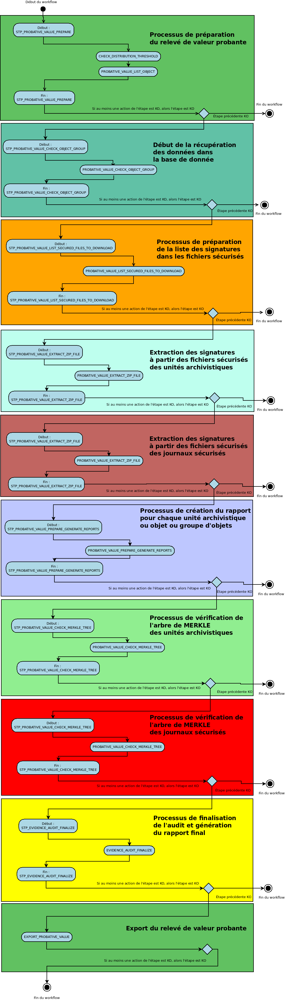

Workflow de relevé de valeur probante
#######################################

Introduction
============

Cette section décrit le processus (workflow) de relevé de valeur probante. 
L’objectif est de rendre prouvable toute opération effectuée sur toute unité archivistique ou tout
objet qui lui est associé. Ce relevé de valeur probante réunit les éléments permettant de fournir à un auditeur externe une présomption de confiance dans ce qui lui est communiqué.

Processus de préparation du relevé de valeur probante (STP_PROBATIVE_VALUE_PREPARE)
===================================================================================

Vérification des seuils de limitation de traitement des unités archivistiques CHECK_DISTRIBUTION_THRESHOLD
-----------------------------------------------------------------------------------------------------------

+ **Règle** : Vérification des seuils de limitation de traitement des unités archivistiques

+ **Type** : bloquant

* **Statuts** :

  + OK : la vérification des seuils de limitation de traitement des unités archivistiques a bien été effectuée (CHECK_DISTRIBUTION_THRESHOLD.OK = Succès de la vérification des seuils de limitation de traitement des unités archivistiques)

  + KO : la vérification des seuils de limitation de traitement des unités archivistiques n'a pas été effectuée en raison d'une erreur (CHECK_DISTRIBUTION_THRESHOLD.KO = Échec de la vérification des seuils de limitation de traitement des unités archivistiques)

  + FATAL : une erreur technique est survenue lors de la vérification des seuils de limitation de traitement des unités archivistiques (CHECK_DISTRIBUTION_THRESHOLD.FATAL = Erreur technique lors de la vérification des seuils de limitation de traitement des unités archivistiques)

Création de la liste des objects du relevé de valeur probante (PROBATIVE_VALUE_LIST_OBJECT)  
-------------------------------------------------------------------------------------------

* **Type** : bloquant
* **Statuts** :

	- OK : La création de la liste a bien été effectué (PROBATIVE_VALUE_LIST_OBJECT.OK = Succès de la création de la liste des objets du relevé de valeur probante)
	- KO : La création de la liste n'a pas été effectué (PROBATIVE_VALUE_LIST_OBJECT.KO = Echec lors de la création de la liste des objets du relevé de valeur probante)
	- FATAL : Une erreur technique est survenue lors de la création de la liste (PROBATIVE_VALUE_OBJECT.FATAL = Une Erreur technique est survenue lors de la création de la liste des objets du relevé de valeur probante)

Début de la récupération des données dans la base de donnée (STP_PROBATIVE_VALUE_CHECK_OBJECT_GROUP)
====================================================================================================

Récupération des données dans la base de donnée (PROBATIVE_VALUE_CHECK_OBJECT_GROUP)
------------------------------------------------------------------------------------

* **Type** : bloquant
* **Statuts** :

	- OK : La récupération des données dans la base de données est un succès (PROBATIVE_VALUE_CHECK_OBJECT_GROUP.OK = Succès de la récupération des données dans la base de donnée) 
	- KO : La récupération des données dans la base de donnée est un échec (PROBATIVE_VALUE_CHECK_OBJECT_GROUP.KO = Echec de la récupération des données dans la base de donnée)
	- WARNING : Avertissement lors de la récupération des données dans la base de donnée (PROBATIVE_VALUE_CHECK_OBJECT_GROUP.WARNING = Avertissement lors la récupération des données dans la base de donnée)
	- FATAL : Une erreur technique est survenue lors de la récupération des données dans la base de données (PROBATIVE_VALUE_CHECK_OBJECT_GROUP.FATAL = Erreur technique lors de la récupération des données dans la base de donnée

Processus de préparation de la liste des signatures dans les fichiers sécurisés (STP_PROBATIVE_VALUE_LIST_SECURED_FILES_TO_DOWNLOAD)
====================================================================================================================================

Préparation de la liste des signatures dans les fichiers sécurisés (PROBATIVE_VALUE_LIST_SECURED_FILES_TO_DOWNLOAD)
-------------------------------------------------------------------------------------------------------------------

* **Type** : bloquant
* **Statuts** :

	- OK : La préparation de la liste des signatures dans les fichiers sécurisés est un succès (PROBATIVE_VALUE_LIST_SECURED_FILES_TO_DOWNLOAD.OK = Succès de la préparation de la liste des signatures dans les fichiers sécurisés) 
	- KO : La préparation de la liste des signatures dans les fichiers sécurisés est un échec (PROBATIVE_VALUE_LIST_SECURED_FILES_TO_DOWNLOAD.KO = Echec de la préparation de la liste des signatures dans les fichiers sécurisés)
	- WARNING : Avertissement lors de la préparation de la liste des signatures dans les fichiers sécurisés (PROBATIVE_VALUE_LIST_SECURED_FILES_TO_DOWNLOAD.WARNING = Avertissement lors de la préparation de la liste des signatures dans les fichiers sécurisés)
	- FATAL : Une erreur technique est survenue lors de la préparation de la liste des signatures dans les fichiers sécurisés (PROBATIVE_VALUE_LIST_SECURED_FILES_TO_DOWNLOAD.FATAL = Erreur fatale lors de la préparation de la liste des signatures dans les fichiers sécurisés)

Extraction des signatures à partir des fichiers sécurisés des unités archivistiques (STP_PROBATIVE_VALUE_EXTRACT_ZIP_FILE)
==========================================================================================================================

Extraction des signatures à partir des fichiers sécurisés des unités archivistiques (PROBATIVE_VALUE_EXTRACT_ZIP_FILE)
----------------------------------------------------------------------------------------------------------------------

* **Type** : bloquant
* **Statuts** :

	- OK : L'extraction des signatures à partir des fichiers sécurisés des unités archivistiques a bien été effectué (PROBATIVE_VALUE_EXTRACT_ZIP_FILE.OK = Succès de l'extraction des signatures à partir des fichiers sécurisés)
	- KO : L'extraction des signatures à partir des fichiers sécurisés des unités archivistiques n'a pas été effectué (PROBATIVE_VALUE_EXTRACT_ZIP_FILE.KO = Echec de l'extraction des signatures à partir des fichiers sécurisés)
	- WARNING :  Avertissement lors de l'extraction des signatures à partir des fichiers sécurisés (PROBATIVE_VALUE_EXTRACT_ZIP_FILE.WARNING = Avertissement lors de l'extraction des signatures à partir des fichiers sécurisés)
	- FATAL : Une erreur technique est survenue lors de la préparation de l'extraction des signatures à partir des fichiers sécurisés des unités archivistiques (PROBATIVE_VALUE_EXTRACT_ZIP_FILE.FATAL=Erreur technique lors de la préparation de l'extraction des signatures à partir des fichiers sécurisés)

Extraction des signatures à partir des fichiers sécurisés des journaux sécurisés (STP_PROBATIVE_VALUE_EXTRACT_ZIP_FILE)
=======================================================================================================================

Extraction des signatures à partir des fichiers sécurisés des journaux sécurisés (PROBATIVE_VALUE_EXTRACT_ZIP_FILE)
-------------------------------------------------------------------------------------------------------------------

* **Type** : bloquant
* **Statuts** :

	- OK : L'extraction des signatures à partir des fichiers sécurisés des journaux sécurisés a bien été effectué (PROBATIVE_VALUE_EXTRACT_ZIP_FILE.OK = Extraction des signatures à partir des fichiers sécurisés)
	- KO : L'extraction des signatures à partir des fichiers sécurisés des journaux sécurisésn'a pas été effectué (PROBATIVE_VALUE_EXTRACT_ZIP_FILE.KO = Echec de l'extraction des signatures à partir des fichiers sécurisés)
	- WARNING :  Avertissement lors de l'extraction des signatures à partir des fichiers sécurisés (PROBATIVE_VALUE_EXTRACT_ZIP_FILE.WARNING = Avertissement lors de l'extraction des signatures à partir des fichiers sécurisés)
	- FATAL : Une erreur technique est survenue lors de la préparation de l'extraction des signatures des journaux sécurisés à partir des fichiers sécurisés (PROBATIVE_VALUE_EXTRACT_ZIP_FILE.FATAL = Erreur technique lors de la préparation de l'extraction des signatures à partir des fichiers sécurisés)

Processus de création du rapport pour chaque unité archivistique ou objet ou groupe d'objets (STP_PROBATIVE_VALUE_PREPARE_GENERATE_REPORTS)
===========================================================================================================================================

Création du rapport pour chaque unité archivistique ou objet ou groupe d'objets (PROBATIVE_VALUE_PREPARE_GENERATE_REPORTS)
--------------------------------------------------------------------------------------------------------------------------

* **Type** : bloquant
* **Statuts** :

	- OK : La création du rapport pour chaque unité archivistique ou objet ou groupe d'objets a bien été effectué (PROBATIVE_VALUE_PREPARE_GENERATE_REPORTS.OK = Succès de la création du rapport pour chaque unité archivistique ou objet ou groupe d'objets) 
	- KO :  La création du rapport pour chaque unité archivistique ou objet ou groupe d'objets n'a pas été effectué (PROBATIVE_VALUE_PREPARE_GENERATE_REPORTS.KO = Echec de la création du rapport pour chaque unité archivistique ou objet ou groupe d'objets)
	- WARNING : Avertissement lors de  la création du rapport pour chaque unité archivistique ou objet ou groupe d'objets (PROBATIVE_VALUE_PREPARE_GENERATE_REPORTS.WARNING = Avertissement lors de  la création du rapport pour chaque unité archivistique ou objet ou groupe d'objets )
	- FATAL : Une erreur technique est survenue lors de la création du rapport pour chaque unité archivistique ou objet ou groupe d'objets (PROBATIVE_VALUE_PREPARE_GENERATE_REPORTS.FATAL = une erreur technique est survenue de la création du rapport pour chaque unité archivistique ou objet ou groupe d'objets)

Processus de vérification de l'arbre de MERKLE des unités archivistiques (STP_PROBATIVE_VALUE_CHECK_MERKLE_TREE)
================================================================================================================

Vérification de l'arbre de MERKLE des unités archivistiques PROBATIVE_VALUE_CHECK_MERKLE_TREE 
----------------------------------------------------------------------------------------------

* **Type** : bloquant
* **Statuts** :

	- OK : La vérification de l'arbre de MERKLE des unités archivistiques a bien été effectué (PROBATIVE_VALUE_CHECK_MERKLE_TREE.OK = Succès de la vérification de l'arbre de MERKLE)
	- KO : La vérification de l'arbre de MERKLE des unités archivistiques n'a pas été effectué (PROBATIVE_VALUE_CHECK_MERKLE_TREE.KO = Échec de la vérification de l'arbre de MERKLE)
	- WARNING : Avertissement lors de la vérification de l'arbre de MERKLE (PROBATIVE_VALUE_CHECK_MERKLE_TREE.WARNING = Avertissement lors de la vérification de l'arbre de MERKLE)
	- FATAL : une erreur technique est survenue lors de la vérification de l'arbre de MERKLE des unités archivistiques (PROBATIVE_VALUE_CHECK_MERKLE_TREE.FATAL = Erreur technique lors de la vérification de l'arbre de MERKLE)

Processus de vérification de l'arbre de MERKLE des journaux sécurisés (STP_PROBATIVE_VALUE_CHECK_MERKLE_TREE)
=============================================================================================================

Vérification de l'arbre de MERKLE des unités archivistiques des journaux sécurisés PROBATIVE_VALUE_CHECK_MERKLE_TREE 
---------------------------------------------------------------------------------------------------------------------

* **Type** : bloquant
* **Statuts** :

	- OK : La vérification de l'arbre de MERKLE des journaux sécurisés a bien été effectué (PROBATIVE_VALUE_CHECK_MERKLE_TREE.OK = Succès de la vérification de l'arbre de MERKLE)
	- KO : La vérification de l'arbre de MERKLE des journaux sécurisés n'a pas été effectué (PROBATIVE_VALUE_CHECK_MERKLE_TREE.KO = Échec de la vérification de l'arbre de MERKLE)
	- WARNING : Avertissement lors de la vérification de l'arbre de MERKLE (PROBATIVE_VALUE_CHECK_MERKLE_TREE.WARNING = Avertissement lors de la vérification de l'arbre de MERKLE)
	- FATAL : une erreur technique est survenue lors de la vérification de l'arbre de MERKLE des journaux sécurisés (PROBATIVE_VALUE_CHECK_MERKLE_TREE.FATAL = Erreur technique lors de la vérification de l'arbre de MERKLE)

Processus de finalisation de l'audit et génération du rapport final (STP_EVIDENCE_AUDIT_FINALIZE)
=================================================================================================

Création du rapport de l'audit de cohérence EVIDENCE_AUDIT_FINALIZE
-------------------------------------------------------------------

* **Règle** : Tâche consistant à créer le rapport permettant de comparer les signatures extraites des fichiers sécurisés avec les données de la base de données et de l'offre de stockage. 
* **Type** : bloquant
* **Statuts** :

	- OK : La création du rapport d'audit de cohérence a bien été effectué (EVIDENCE_AUDIT_FINALIZE.OK = Succès de la création du rapport de l'audit de cohérence)
	- KO : La création du rapport d'audit de cohérence n'a pas été effectué (EVIDENCE_AUDIT_FINALIZE.KO = Echec de la création du rapport de l'audit de cohérence)
	- FATAL : une erreur technique est survenue lors de la création du rapport d'audit de cohérence (EVIDENCE_AUDIT_FINALIZE.FATAL = Erreur technique lors de la création du rapport d'audit de cohérence)

Structure de workflow du relevé de valeur probante 
===================================================

Rapport du relevé de valeur probante 
#####################################

Le relevé de valeur probante est un fichier JSON généré par la solution logicielle Vitam. Le relevé de valeur probante réunit les éléments permettant de fournir à un auditeur externe une présomption de confiance dans ce qui lui est communiqué. 

Exemple de JSON : rapport de valeur probante
==============================================

.. code::

    {
    "ReportVersion": 1,
    "OperationInfo": {
        "request": {
            "dslQuery": {
                "$query": [
                    {
                        "$or": [
                            {
                                "$in": {
                                    "#id": [
                                        "aeaqaaaaamhfbxyzab2tsalgpwzlrcqaaacq"
                                    ]
                                }
                            },
                            {
                                "$in": {
                                    "#allunitups": []
                                }
                            }
                        ]
                    }
                ],
                "$filter": {},
                "$projection": {}
            },
            "usage": [
                "BinaryMaster"
            ],
            "version": "LAST"
        },
        "OperationId": "aeeaaaaaaohfbxyzaaiicalgtk4qd2qaaaaq",
        "OperationControlEnDate": "2018-10-22T07:41:50.301",
        "Tenant": 3
    },
    "ObjectsCheckReport": [
        {
            "Usages": [
                {
                    "UsageName": "BinaryMaster",
                    "BinaryVersion": "1",
                    "FirstStorageDate": "2018-10-16T16:26:00.582",
                    "BinaryId": "aeaaaaaaaahfbxyzab2tsalgpwzlq5aaaaaq",
                    "ObjectGroupId": "aebaaaaaamhfbxyzab2tsalgpwzlq5iaaaaq",
                    "MessageDigest": "86c0bc701ef6b5dd21b080bc5bb2af38097baa6237275da83a52f092c9eae3e4e4b0247391620bd732fe824d18bd3bb6c37e62ec73a8cf3585c6a799399861b1",
                    "Algorithm": "SHA-512",
                    "BinaryCreationOpId": "aeeaaaaaaohfbxyzaayaialgpwzlitaaaaaq",
                    "SecuredOperationId": "aecaaaaaaohlfylyabzj6algpxjpovyaaaaq",
                    "SecureOperationIdForOpId": "aecaaaaaaohlfylyabzj6algpxjpokyaaaaq",
                    "Checks": [
                        {
                            "Name": "checkLogbookSecureInfoForOpi",
                            "Status": "OK"
                        },
                        {
                            "Name": "CheckObjectHash",
                            "Status": "OK"
                        },
                        {
                            "Name": "checkLfcStorageEvent",
                            "Status": "OK"
                        },
                        {
                            "Name": "checkLogbookStorageEventContract",
                            "Status": "OK"
                        },
                        {
                            "Name": "Checking secured info from logbook",
                            "Status": "OK"
                        },
                        {
                            "Name": "Check Secure object  Hash And LFC Events",
                            "Status": "OK"
                        }
                    ]
                }
            ]
        }
    ],
    "Operations Reports": [
        {
            "EvTypeProc": "TRACEABILITY",
            "Id": "aecaaaaaaohlfylyabzj6algpxjpovyaaaaq",
            "OperationCheckStatus": "OK",
            "Details": "merkleJsonRootHash is : '7M+vrLf0rmxy/YVzcPDfA92NYe9qcjJmhS9MZVS3K9YeRGkMV8ywB6KXwrHK5xHUabnPv1AibBEhaw22I85kWg==', merkleDataRootHash is :'7M+vrLf0rmxy/YVzcPDfA92NYe9qcjJmhS9MZVS3K9YeRGkMV8ywB6KXwrHK5xHUabnPv1AibBEhaw22I85kWg==', merkleLogbookRootHash is '7M+vrLf0rmxy/YVzcPDfA92NYe9qcjJmhS9MZVS3K9YeRGkMV8ywB6KXwrHK5xHUabnPv1AibBEhaw22I85kWg==' "
        },
        {
            "EvTypeProc": "TRACEABILITY",
            "Id": "aecaaaaaaohlfylyabzj6algpxjpokyaaaaq",
            "OperationCheckStatus": "OK",
            "Details": "merkleJsonRootHash is : 'hHPxdcODJoYfGOxjFMu9XX+CB2pKgzRsKzDRA3PzMVyx2RFugnYS1Pc6PStYr+++1S7ehMP4DkHO365QbOsz/A==', merkleDataRootHash is :'hHPxdcODJoYfGOxjFMu9XX+CB2pKgzRsKzDRA3PzMVyx2RFugnYS1Pc6PStYr+++1S7ehMP4DkHO365QbOsz/A==', merkleLogbookRootHash is 'hHPxdcODJoYfGOxjFMu9XX+CB2pKgzRsKzDRA3PzMVyx2RFugnYS1Pc6PStYr+++1S7ehMP4DkHO365QbOsz/A==' "
        },
        {
            "id": "aeeaaaaaaohfbxyzaayaialgpwzlitaaaaaq",
            "EvTypeProc": "INGEST",
            "EvIdAppSession": "IC-000001",
            "agIdApp": "CT-000001",
            "OperationCheckStatus": "OK"
        }
    ]

Détails du rapport
===================

La première partie du rapport fait état de la requête initiale. La requête pour constituer un relevé de valeur probante comprend : la requête DSL, l'usage et la version à prendre en compte pour le ou les unités archivistiques ou objets.  

- "ReportVersion": le numéro de version de rapport
- "OperationInfo": bloc qui contient les informations de l'opération en question 
- "request" :  requête DSL
- "usage": un tableau qui peut contenir les différents usages présent dans la solution : BinaryMaster, PhysicalMaster, Dissemination...
- "version": "LAST" = la version des usages à prendre en considération pour le relevé de valeur probante. Par defaut la valeur est "LAST".

La deuxième partie est constituée par le contexte du relevé : l'id de l'opération, la date de fin de l'opération et le tenant sur lequel le relevé a été demandé. 

- "OperationId": identifiant de l'opération 
- "OperationControlEnDate": date de fin de l'opération 
- "Tenant": tenant sur lequel l'opération a été lancée

La troisième partie rend compte des opérations sur les groupes d'objets concernés. 

- "ObjectsCheckReport": tableau rendant compte des différentes opérations pour les groupes d'objets concernés 
	- "Usages": tableau concernant chaque usage 
	- "UsageName": type d'usage "BinaryMaster", "PhysicalMaster"
	- "BinaryVersion": numéro de version de l'usage considéré
	- "FirstStorageDate": date de stockage 
	- "BinaryId": identifiant du binary 
	- "ObjectGroupId": identifiant du groupe d'objets 
	- "MessageDigest": empreinte de l’objet dans le bordereau de transfert. Chaîne de caractères, reprenant le champ « MessageDigest » du message ArchiveTransfer.
	- "Algorithm": hash de l'objet 
	- "BinaryCreationOpId": journal de la création du binaire de l'opération relatant le binary existant dans la solution 
	- "SecuredOperationId": identifiant de l'opération de sécurisation 
	- "SecureOperationIdForOpId": sécurisation de l'opération de sécurisation 
 

- "Checks": tableau retraçant les contrôles sur les logbook en question, conformité à la sécurisation et l'arbre de Merkle
	
	- "Name": nom du logbook concerné "checkLogbookSecureInfoForOpi"
	- "Status": statut du contrôle            
                     
        - "Name": "CheckObjectHash",  vérification du hash de l'objet 
	- "Status": statut du contrôle
                    
	- "Name": "checkLfcStorageEvent", vérification de la sécurisation des évenements à la date de la dernière sauvegarde 
        - "Status": statut du contrôle
        
- "Operations Reports": tableaux rassemblant les différents journaux des opérations logbook, liste des opérations et vérification des logbook en question 
       
	- "EvTypeProc": "TRACEABILITY" nom de l'opération 
        - "Id": identifiant de l'opération  
        - "OperationCheckStatus": le résultat du contrôle de l'opération 
        - "Details": message de vérification de l'opération en question par rapport à la sécurisation  

	**Dans le cas d'un Ingest**
		
	- "EvIdAppSession": mention du contrat d'entrée utilisé lors de l'ingest
        - "agIdApp": mention du contexte utilisé lors de l'ingest

