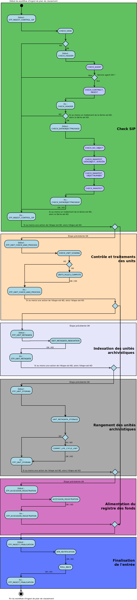

Workflow d'entrée d'un plan de classement
#########################################

Introduction
============

Cette section décrit le processus d'entrée d'un plan de classement dans la solution logicielle Vitam. La structure d'un plan de classement diffère de celle d'un SIP par l'absence d'objet et de vérification par rapport à un profil d'archivage. Il s'agit plus simplement d'une arborescence représentée par des unités archivistiques. Ce processus partage donc certaines étapes avec celui du transfert d'un SIP classique, en ignore certaines et rajoute des tâches additionnelles.

Le workflow actuel mis en place dans la solution logicielle Vitam est défini dans le fichier "DefaultFilingSchemeWorkflow.json". Ce fichier est disponible dans : sources/processing/processing-management/src/main/resources/workflows.

Processus d'entrée d'un plan de classement (vision métier)
==========================================================

Le processus d'entrée d'un plan est identique au workflow d'entrée d'un SIP. Il débute lors du lancement du téléchargement d'un plan de classement dans la solution logicielle Vitam. Toutes les étapes et traitements sont journalisées dans le journal des opérations.

Les étapes et traitements associées ci-dessous décrivent le processus d'entrée d'un plan (clé et description de la clé associée dans le journal des opérations), non encore abordées dans la description de l'entrée d'un SIP.

Traitement additionnel dans la tâche CHECK_DATAOBJECTPACKAGE
------------------------------------------------------------

* Vérification de la non existence d'objets (CHECK_NO_OBJECT)

  + **Règle** : vérification qu'il n'y a pas d'objet numérique dans le bordereau de transfert du plan

  + **Statuts** :

	 - OK : aucun objet numérique n'est présent dans le bordereau de transfert (CHECK_DATAOBJECTPACKAGE.CHECK_NO_OBJECT.OK=Succès de la vérification de l'absence d'objet)

   - KO : des objets numériques sont présent dans le bordereau de transfert (CHECK_DATAOBJECTPACKAGE.CHECK_NO_OBJECT.KO=Échec de la vérification de l'absence d'objet : objet(s) trouvé(s))

   - FATAL : une erreur technique est survenue lors de la vérification de la non existence d'objet numérique (CHECK_DATAOBJECTPACKAGE.CHECK_NO_OBJECT.FATAL=Erreur fatale lors de la vérification de l'absence d'objet)

D'une façon synthétique, le workflow est décrit de cette façon :

