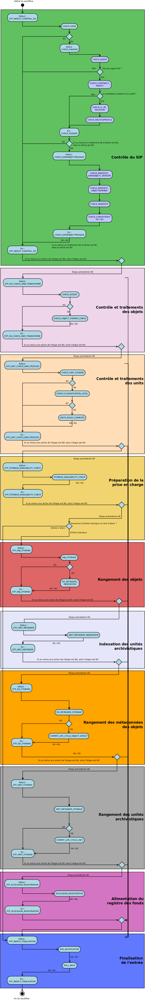

Workflow d'entrée
#################

Introduction
============

Cette section décrit le processus (workflow) d'entrée, utilisé lors du transfert d'un Submission Information Package (SIP) dans la solution logicielle Vitam. Ce workflow se décompose en deux grandes catégories : le processus d'entrée externe dit "ingest externe" et le processus d'entrée interne dit "ingest interne". Le premier prend en charge le SIP et effectue des contrôles techniques préalables, tandis que le second débute dès le premier traitement métier.

Toutes les étapes traitements sont journalisées dans le journal des opérations.
Ces derniers associées ci-dessous décrivent le processus d'entrée (clé et description de la clé associée dans le journal des opérations) tel qu'implémenté dans la version actuelle de la solution logicielle Vitam.

Le processus d'entrée externe comprend l'étape : STP_SANITY_CHECK_SIP (Contrôle sanitaire du SIP). Les autres étapes font partie du processus d'entrée interne.

Processus des contrôles préalables à l'entrée (STP_SANITY_CHECK_SIP)
====================================================================

Contrôle sanitaire du SIP (SANITY_CHECK_SIP)
~~~~~~~~~~~~~~~~~~~~~~~~~~~~~~~~~~~~~~~~~~~~~~

+ **Règle** : Vérification de l'absence de virus dans le SIP

+ **Type** : bloquant

+ **Statuts** :

  - OK : aucun virus n'est détecté dans le SIP (SANITY_CHECK_SIP.OK = Succès du processus des contrôles préalables à l'entrée)

  - KO : un ou plusieurs virus ont été détectés dans le SIP (SANITY_CHECK_SIP.KO = Échec du processus des contrôles préalables à l'entrée)

  - FATAL : une erreur technique est survenue lors de la vérification de la présence de virus dans le SIP (SANITY_CHECK_SIP.FATAL = Erreur fatale lors du processus des contrôles préalables à l'entrée)

Contrôle du format du conteneur du SIP (CHECK_CONTAINER)
~~~~~~~~~~~~~~~~~~~~~~~~~~~~~~~~~~~~~~~~~~~~~~~~~~~~~~~~

+ **Règle** : Vérification du format du SIP via un outil d'identification de format qui se base sur le référentiel des formats qu'il intègre

+ **Formats acceptés** : .zip, .tar, .tar.gz, .tar.bz2 et tar.gz2

+ **Type** : bloquant

+ **Statuts** :

  - OK : le conteneur du SIP est au bon format (CHECK_CONTAINER.OK = Succès du contrôle du format du conteneur du SIP)

  - KO : le conteneur du SIP n'est pas au bon format (CHECK_CONTAINER.KO = Échec du contrôle du format du conteneur du SIP)

  - FATAL : une erreur technique est survenue lors de la vérification du format du conteneur du SIP, liée à l'outil d'identification des formats (CHECK_CONTAINER.FATAL = Erreur fatale lors du contrôle du format du conteneur du SIP)

Processus de réception du SIP dans Vitam (STP_UPLOAD_SIP)
=========================================================

* **Règle** : Vérification de la bonne réception du SIP dans l'espace de travail interne ("workspace")

* **Type** : bloquant

* **Statuts** :

  + OK : le SIP a été réceptionné sur l'espace de travail interne (STP_UPLOAD_SIP.OK = Succès du processus de réception du SIP)

  + KO : le SIP n'a pas été réceptionné sur l'espace de travail interne (STP_UPLOAD_SIP.KO = Échec du processus de réception du SIP)

  + FATAL : une erreur technique est survenue lors de la réception du SIP dans la solution logicielle Vitam, par exemple une indisponibilité du serveur (STP_UPLOAD_SIP.FATAL = Erreur fatale lors du processus de réception du SIP)

Processus de  contrôle du SIP (STP_INGEST_CONTROL_SIP)
======================================================

Préparation des informations de stockage (PREPARE_STORAGE_INFO)
~~~~~~~~~~~~~~~~~~~~~~~~~~~~~~~~~~~~~~~~~~~~~~~~~~~~~~~~~~~~~~~

+ **Règle** : Récupération des informations liées aux offres de stockage à partir de la stratégie

+ **Type** : bloquant

+ **Statuts** :

  - OK : Succès de la préparation des informations de stockage (PREPARE_STORAGE_INFO.OK = Succès de la préparation des informations de stockage)
  - KO : Echec de la préparation des informations de stockage (PREPARE_STORAGE_INFO.KO = Echec de la préparation des informations de stockage)
  - FATAL :Erreur technique est survenue lors de la préparation des informations de stockage (PREPARE_STORAGE_INFO.FATAL = Erreur fatale lors de la préparation des informations de stockage)

Vérification globale du SIP (CHECK_SEDA - CheckSedaActionHandler.java)
~~~~~~~~~~~~~~~~~~~~~~~~~~~~~~~~~~~~~~~~~~~~~~~~~~~~~~~~~~~~~~~~~~~~~~~~~~~~~~~~~~~~~~~

+ **Règle** : Vérification de la cohérence physique du SIP reçu par rapport au modèle de SIP accepté

+ **Type de SIP accepté** : le bordereau de transfert, obligatoire dans le SIP, doit être nommé manifest.xml, doit être conforme au schéma xsd par défaut fourni avec le standard SEDA v. 2.0, doit satisfaire les exigences du document "Structuration des SIP" et doit posséder un répertoire unique nommé "Content"

+ **Type** : bloquant

+ **Statuts** :

  - OK : le SIP est présent, nommé manifest.xml et conforme au schéma xsd par défaut fourni avec le standard SEDA v.2.0. (CHECK_SEDA.OK = Succès de la vérification globale du SIP)
  - KO :

    - Cas 1 : le bordereau de transfert est introuvable dans le SIP ou n'est pas au format XML (CHECK_SEDA.NO_FILE.KO = Échec de la vérification globale du SIP : absence du bordereau de transfert ou bordereau de transfert au mauvais format)
    - Cas 2 : le bordereau de transfert n'est pas au format XML (CHECK_SEDA.NOT_XML_FILE.KO = Échec de la vérification globale du SIP : bordereau de transfert non conforme aux caractéristiques d'un fichier xml)
    - Cas 3 : le bordereau de transfert ne respecte pas le schéma par défaut fourni avec le standard SEDA 2.0 (CHECK_SEDA.NOT_XSD_VALID.KO = Échec de la vérification globale du SIP : bordereau de transfert non conforme au schéma SEDA 2.0)
    - Cas 4 : le SIP contient plus d'un dossier "Content" (CHECK_SEDA.CONTAINER_FORMAT.DIRECTORY.KO = Le SIP contient plus d'un dossier ou un dossier dont le nommage est invalide)
    - Cas 5 : le SIP contient plus d'un seul fichier à la racine (CHECK_SEDA.CONTAINER_FORMAT.FILE.KO = Le SIP contient plus d'un fichier à sa racine)
  - FATAL : une erreur technique est survenue lors de du contrôle de cohérence (CHECK_SEDA.FATAL = Erreur fatale lors de la vérification globale du SIP)

Vérification de l'en-tête du bordereau de transfert (CHECK_HEADER - CheckHeaderActionHandler.java)
~~~~~~~~~~~~~~~~~~~~~~~~~~~~~~~~~~~~~~~~~~~~~~~~~~~~~~~~~~~~~~~~~~~~~~~~~~~~~~~~~~~~~~~~~~~~~~~~~~

+ **Règles** : Vérification des informations générales du bordereau de transfert (nommées "header" dans le fichier "manifest.xml") et de l'existence du service producteur (OriginatingAgencyIdentifier)

+ **Type** : bloquant

+ **Statuts** :

  - OK : les informations du bordereau de transfert sont conformes et le service producteur est déclaré (CHECK_HEADER.OK = Succès de la vérification générale du bordereau de transfert)

  - KO : les informations du bordereau de transfert ne sont pas conformes ou il n'y a pas de service producteur déclaré (CHECK_HEADER.KO = Échec de la vérification générale du bordereau de transfert)

  - FATAL : une erreur technique est survenue lors des contrôles sur les informations générales du bordereau de transfert (CHECK_HEADER.FATAL = Erreur fatale lors de la vérification générale du bordereau de transfert)

La tâche check_header contient les traitements suivants :
*********************************************************

* Vérification de la présence et contrôle des services agents (CHECK_AGENT). Cette tâche est exécutée si la valeur IN de ``checkOriginatingAgency`` est true.

  + **Règle** : Vérification du service producteur ainsi que du service versant déclarés dans le SIP par rapport au référentiel des services agents présent dans la solution logicielle Vitam

  + **Type** : bloquant

  + **Statuts** :

      - OK : le service producteur et/ou le service versant déclaré dans le SIP est valide (service agent existant dans le référentiel des services agents)(CHECK_HEADER.CHECK_AGENT.OK=Succès de la vérification de la présence et du contrôle des services agents)

      - KO :

        - Cas 1 : aucun service producteur n'est déclaré dans la balise dédiée dans le bordereau de transfert (CHECK_HEADER.CHECK_AGENT.EMPTY_REQUIRED_FIELD.KO=vérification de la présence et du contrôle des services agents : champ obligatoire vide)
        - Cas 2 : le service producteur et/ou le service versant déclaré dans le SIP n'est pas connue du référentiel des services agents (CHECK_HEADER.CHECK_AGENT.UNKNOWN.KO=vérification de la présence et du contrôle des services agents : services agents inconnus du référentiel des services agents)
        - Cas 3 : la balise permettant de déclarer un service producteur est absente du bordereau de tranfert (CHECK_HEADER.CHECK_AGENT.KO=Échec de la vérification de la présence et du contrôle des services agents)

      - FATAL : une erreur technique est survenue lors de la vérification de la présence et du contrôle des services agents (CHECK_HEADER.CHECK_AGENT.FATAL=Erreur fatale lors de la vérification de la présence et du contrôle des services agents)

* Vérification de la présence et contrôle du contrat d'entrée (CHECK_CONTRACT_INGEST). Cette tâche est exécutée si la valeur IN de ``checkContract`` est true.

  + **Règle** : Vérification du contrat d'entrée déclaré dans le SIP par rapport au référentiel des contrats d'entrée présent dans la solution logicielle Vitam

  + **Type** : bloquant

  + **Statuts** :

    - OK : le contrat déclaré dans le SIP est valide (contrat existant dans le référentiel des contrats et dont le statut est actif)(CHECK_HEADER.CHECK_CONTRACT_INGEST.OK=Succès de la vérification de la présence et du contrôle du contrat d'entrée)

    - KO :

      - Cas 1 : le contrat déclaré dans le SIP est inexistant (CHECK_HEADER.CHECK_CONTRACT_INGEST.UNKNOWN.KO=Échec du contrôle de la présence du contrat d'entrée)
      - Cas 2 : le contrat déclaré dans le SIP est inactif (CHECK_HEADER.CHECK_CONTRACT_INGEST.INACTIVE.KO=Échec du contrôle du caractère actif du contrat d'entrée)

    - FATAL : une erreur technique est survenue lors de la vérification de la présence et du contrôle du contrat d'entrée (CHECK_HEADER.CHECK_CONTRACT_INGEST.FATAL=Erreur fatale lors de la vérification de la présence et du contrôle du contrat d'entrée)

* Vérification de la relation entre le contrat d'entrée et le profil d'archivage (CHECK_IC_AP_RELATION). Cette tâche est exécutée si la valeur IN de ``checkProfile`` est true.

  + **Règle** : le profil d'archivage déclaré dans le contrat d'entrée du SIP doit être le même que celui déclaré dans son bordereau de transfert.

  + **Statuts** :

    - OK : le profil d'archivage déclaré dans le contrat d'entrée et celui déclaré dans le bordereau de transfert sont les mêmes (CHECK_HEADER.CHECK_IC_AP_RELATION.OK = Succès de la vérification de la relation entre le contrat d'entrée et le profil)

    - KO :

      - Cas 1 : le profil déclaré dans le SIP est inexistant (CHECK_HEADER.CHECK_IC_AP_RELATION.UNKNOWN.KO=Échec du contrôle de la présence du profil d'archivage dans le référentiel des profils d'archivage)
      - Cas 2 : le profil déclaré dans le SIP est inactif (CHECK_HEADER.CHECK_IC_AP_RELATION.INACTIVE.KO=Échec du contrôle du caractère actif du profil d'archivage)
      - Cas 3 : le profil déclaré dans le contrat d'entrée et celui déclaré dans le bordereau de transfert ne sont pas les mêmes (CHECK_HEADER.CHECK_IC_AP_RELATION.DIFF.KO=Échec du contrôle de cohérence entre le profil d'archivage déclaré dans le bordereau de transfert et celui déclaré dans le contrat d'entrée)

    - FATAL : une erreur technique est survenue lors de la vérification de la relation entre le contrat d'entrée et le profil d'archivage (CHECK_HEADER.CHECK_IC_AP_RELATION.FATAL = Erreur fatale lors de la vérification de la relation entre le contrat d'entrée et le profil d'archivage)

* Vérification de la conformité du bordereau de transfert par le profil d'archivage (CHECK_ARCHIVEPROFILE)

  + **Règle** : le bordereau de transfert du SIP doit être conforme aux exigences du profil d'archivage. Si aucun profil SEDA ne s'applique au SIP, ce traitement est ignoré.

  + **Type** : bloquant

  + **Statuts** :

      - OK : le bordereau de transfert est conforme aux exigences du profil d'archivage (CHECK_HEADER.CHECK_ARCHIVEPROFILE.OK = Succès de la vérification de la conformité au profil d'archivage)

      - KO : le bordereau de transfert n'est pas conforme aux exigences du profil d'archivage (CHECK_HEADER.CHECK_ARCHIVEPROFILE.KO = Échec de la vérification de la conformité au profil d'archivage)

      - FATAL : une erreur technique est survenue lors de la vérification du bordereau de transfert par le profil d'archivage (CHECK_HEADER.CHECK_ARCHIVEPROFILE.FATAL = Erreur fatale lors de la vérification de la conformité au profil d'archivage)

Vérification du contenu du bordereau (CHECK_DATAOBJECTPACKAGE - CheckDataObjectPackageActionHandler.java)
~~~~~~~~~~~~~~~~~~~~~~~~~~~~~~~~~~~~~~~~~~~~~~~~~~~~~~~~~~~~~~~~~~~~~~~~~~~~~~~~~~~~~~~~~~~~~~~~~~~~~~~~~

+ **Règles** : Vérification du contenu du bordereau de transfert et de sa cohérence.

+ **Type** : bloquant.

La tâche CHECK_DATAOBJECTPACKAGE contient plusieurs traitements.

* Vérification des usages des groupes d'objets (CHECK_DATAOBJECTPACKAGE.CHECK_MANIFEST_DATAOBJECT_VERSION - CheckVersionActionHandler.java)

    + **Règle** : Tous les objets décrits dans le bordereau de transfert du SIP doivent déclarer un usage conforme à la liste des usages acceptés dans la solution logicielle Vitam ainsi qu'un numéro de version respectant la norme de ce champ

    + **Types d'usages acceptés**: original papier (PhysicalMaster), original numérique (BinaryMaster), diffusion (Dissemination), vignette (Thumbnail), contenu brut (TextContent). Les numéros de versions sont optionnels, il s'agit d'un entier positif ou nul (0, 1, 2...). La grammaire est : "usage_version". Exemples : "BinaryMaster_2", "TextContent_10" ou sans numéro de versions "PhysicalMaster".

    + **Statuts** :

      - OK : les objets contenus dans le SIP déclarent tous dans le bordereau de transfert un usage cohérent avec ceux acceptés et optionnellement un numéro de version respectant la norme de ce champ usage, par exemple "BinaryMaster_2" (CHECK_MANIFEST_DATAOBJECT_VERSION.OK = Succès de la vérification des usages des objets)

      - KO :

        - Cas 1 : un ou plusieurs BinaryMaster sont déclarées dans un ou plusieurs objets physiques (CHECK_DATAOBJECTPACKAGE.CHECK_MANIFEST_DATAOBJECT_VERSION.PDO_DATAOBJECTIONVERSION_BINARYMASTER.KO = L'objet physique déclare un usage "BinaryMaster". Cet usage n'est pas autorisé pour les objets physiques)
        - Cas 2 : un ou plusieurs PhysicalMaster sont déclarés dans un ou plusieurs objets binaires (CHECK_DATAOBJECTPACKAGE.BDO_DATAOBJECTIONVERSION_PHYSICALMASTER.KO=Au moins un objet binaire déclare un usage "PhysicalMaster". Cet usage n'est pas autorisé pour les objets binaires)
        - Cas 3 : un ou plusieurs objets contenus dans le SIP déclarent dans le bordereau de transfert un usage ou un numéro de version incohérent avec ceux acceptés (CHECK_DATAOBJECTPACKAGE.CHECK_MANIFEST_DATAOBJECT_VERSION.INVALID_DATAOBJECTVERSION.KO=Cet objet déclare un usage incorrect. L'usage doit s'écrire sous la forme [usage] ou [usage]_[version]. "Usage" doit être parmi l'énumération DataObjectVersion définie pour Vitam, "version" doit être un entier positif)
        - Cas 4 : une ou plusieurs URI sont vides (CHECK_DATAOBJECTPACKAGE.CHECK_MANIFEST_DATAOBJECT_VERSION.EMPTY_REQUIRED_FIELD.KO=Il existe au moins un champ non renseigné dont la valeur est obligatoire)

      - FATAL : une erreur technique est survenue lors du contrôle des usages déclarés dans le bordereau de transfert pour les objets contenus dans le SIP (CHECK_MANIFEST_DATAOBJECT_VERSION.FATAL = Erreur fatale lors de la vérification des usages des objets)

* Vérification du nombre d'objets (CHECK_MANIFEST_OBJECTNUMBER - CheckObjectsNumberActionHandler.java)

    + **Règle** : Le nombre d'objets binaires reçus dans la solution logicielle Vitam doit être strictement égal au nombre d'objets binaires déclaré dans le manifeste du SIP

    + **Type** : bloquant.

    + **Statuts** :

      - OK : le nombre d'objets reçus dans la solution logicielle Vitam est strictement égal au nombre d'objets déclaré dans le bordereau de transfert du SIP (CHECK_MANIFEST_OBJECTNUMBER.OK = Succès de la vérification du nombre d'objets)

      - KO :

        - Cas 1 : le nombre d'objets reçus dans la solution logicielle Vitam est supérieur au nombre d'objets déclaré dans le bordereau de transfert du SIP (CHECK_DATAOBJECTPACKAGE.CHECK_MANIFEST_OBJECTNUMBER.MANIFEST_INFERIOR_BDO.KO=Le bordereau de transfert déclare moins d'objets binaires qu'il n'en existe dans le répertoire Content du SIP)
        - Cas 2 : le nombre d'objets reçus dans la solution logicielle Vitam est inférieur au nombre d'objets déclaré dans le bordereau de transfert du SIP (CHECK_DATAOBJECTPACKAGE.CHECK_MANIFEST_OBJECTNUMBER.MANIFEST_SUPERIOR_BDO.KO=Le bordereau de transfert déclare plus d'objets binaires qu'il n'en existe dans le répertoire Content du SIP)
        - Cas 3 : une ou plusieur balises URI déclarent un chemin invalide (CHECK_DATAOBJECTPACKAGE.CHECK_MANIFEST_OBJECTNUMBER.INVALID_URI.KO=Au moins un objet déclare une URI à laquelle ne correspond pas de fichier ou déclare une URI déjà utilisée par un autre objet)

      - FATAL : une erreur technique est survenue lors de la vérification du nombre d'objets (CHECK_DATAOBJECTPACKAGE.CHECK_MANIFEST_OBJECTNUMBER.FATAL = Erreur fatale lors de la vérification du nombre d'objets)

* Vérification de la cohérence du bordereau de transfert (CHECK_MANIFEST - ExtractSedaActionHandler.java)

    + **Règle** : Création des journaux du cycle de vie des unités archivistiques et des groupes d'objets, extraction des unités archivistiques, objets binaires et objets physiques, vérification de la présence de récursivités dans les arborescences des unités archivistiques et création de l'arbre d'ordre d'indexation, extraction des métadonnées contenues dans la balise ManagementMetadata du bordereau de transfert pour le calcul des règles de gestion, vérification de la validité du rattachement des unités du SIP aux unités présentes dans la solution logicielle Vitam si demandé, détection des problèmes d'encodage dans le bordereau de transfert et vérification que les objets ne font pas référence directement à des unités si ces objets possèdent des groupes d'objets.

    + **Type** : bloquant.

    + **Statuts** :

      - OK : les journaux du cycle de vie des unités archivistiques et des groupes d'objets ont été créés avec succès, aucune récursivité n'a été détectée dans l'arborescence des unités archivistiques, la structure de rattachement déclarée existe (par exemple, un SIP peut être rattaché à un plan de classement, mais pas l'inverse), le type de structure de rattachement est autorisé, aucun problème d'encodage détecté et les objets avec groupe d'objets ne référencent pas directement les unités (CHECK_MANIFEST.OK = Succès du contrôle de cohérence du bordereau de transfert). L'extraction des unités archivistiques, objets binaires et physiques, la création de l'arbre d'indexation et l'extraction des métadonnées des règles de gestion ont été effectuées avec succès.

      - KO :

        - Cas 1 : une ou plusieurs balises de rattachement vers un GOT existant déclarent autre chose que le GUID d'un GOT existant (CHECK_DATAOBJECTPACKAGE.CHECK_MANIFEST.EXISTING_OG_NOT_DECLARED.KO=Une unité archivistique déclare un objet à la place du groupe d'objet correspondant)
        - Cas 2 : une ou plusieurs balises de rattachement vers une AU existant déclarent autre chose que le GUID d'une AU existante (CHECK_DATAOBJECTPACKAGE.CHECK_MANIFEST.CHECK_MANIFEST_WRONG_ATTACHMENT.KO=Le bordereau de transfert procède à un rattachement en utilisant des éléments inexistants dans le système)
        - Cas 3 : Une récursivité a été détectée dans l'arborescence des unités archivistiques (CHECK_DATAOBJECTPACKAGE.CHECK_MANIFEST.CHECK_MANIFEST_LOOP.KO=Le bordereau de transfert présente une récursivité dans l'arborescence de ses unités archivistiques)
        - Cas 4 : il y a un problème d'encodage ou des objets référencent directement des unités archivistiques (CHECK_DATAOBJECTPACKAGE.CHECK_MANIFEST.KO = Échec du contrôle de cohérence du bordereau de transfert)

      - FATAL : une erreur technique est survenue lors de la vérification de la cohérence du bordereau, par exemple les journaux du cycle de vie n'ont pu être créés (CHECK_MANIFEST.FATAL = Erreur fatale lors du contrôle de cohérence du bordereau de transfert)

* Vérification de la cohérence entre objets, groupes d'objets et unités archivistiques (CHECK_CONSISTENCY - CheckObjectUnitConsistencyActionHandler.java)

    + **Règle** : Vérification que chaque objet ou groupe d'objets est référencé par une unité archivistique, rattachement à un groupe d'objet pour les objets sans groupe d'objet mais référencés par une unité archivistique, création de la table de concordance (MAP) pour les identifiants des objets et des unités archivistiques du SIP et génération de leurs identifiants Vitam (GUID)

    + **Type** : bloquant.

    + **Statuts** :

      - OK : aucun objet ou groupe d'objets n'est orphelin (c'est à dire non référencé par une unité archivistique) et tous les objets sont rattachés à un groupe d'objets. La table de concordance est créée et les identifiants des objets et unités archivistiques ont été générés. (CHECK_CONSISTENCY.OK = Succès de la vérification de la cohérence entre objets, groupes d'objets et unités archivistiques)

      - KO : au moins un objet ou groupe d'objets est orphelin (c'est-à-dire non référencé par une unité archivistique) (CHECK_CONSISTENCY.KO = Échec de la vérification de la cohérence entre objets, groupes d'objets et unités archivistiques)

      - FATAL : une erreur technique est survenue lors de la vérification de la cohérence entre objets, groupes d'objets et unités archivistiques (CHECK_CONSISTENCY.FATAL = Erreur fatale lors de la vérification de la cohérence entre objets, groupes d'objets et unités archivistiques)

Processus de contrôle et traitement des objets (STP_OG_CHECK_AND_TRANSFORME)
==========================================================================

Vérification de l'intégrité des objets (CHECK_DIGEST - CheckConformityActionPlugin.java)
~~~~~~~~~~~~~~~~~~~~~~~~~~~~~~~~~~~~~~~~~~~~~~~~~~~~~~~~~~~~~~~~~~~~~~~~~~~~~~~~~~~~~~~~~

+ **Règle** : Vérification de la cohérence entre l'empreinte de l'objet binaire calculée par la solution logicielle Vitam et celle déclarée dans le bordereau de transfert. Si l'empreinte déclarée dans le bordereau de transfert n'a pas été calculée avec l'algorithme SHA-512, alors l'empreinte est recalculée avec cet algorithme. Elle sera alors enregistrée dans la solution logicielle Vitam.

+ **Algorithmes autorisés en entrée** : MD5, SHA-1, SHA-256, SHA-512

+ **Type** : bloquant

+ **Statuts** :

  - OK : tous les objets binaires reçus sont identiques aux objets binaires attendus. Tous les objets binaires disposent désormais d'une empreinte calculée avec l'algorithme SHA-256 (CHECK_DIGEST.OK = Succès de la vérification de l'empreinte des objets)

  - KO :

    - Cas 1 : au moins un objet reçu n'a pas d'empreinte dans le bordereau (CHECK_DIGEST.EMPTY.KO=Échec lors de la vérification de l'empreinte des objets : Il existe au moins un objet dont l'empreinte est absente dans le bordereau de transfert)
    - Cas 2 : au moins une empreinte d'un objet reçu n'est pas conforme à son empreinte dans le bordereau (CHECK_DIGEST.INVALID.KO=Échec lors de la vérification de l'empreinte des objets : Il existe au moins un objet dont l'empreinte est invalide dans le bordereau de transfert)
    - Cas 3 : le SIP soumis à la solution logicielle Vitam contient à la fois le cas 1 et le cas 2 (CHECK_DIGEST.KO=Échec de la vérification de l'empreinte des objets)

  - FATAL : une erreur technique est survenue lors de la vérification de l'intégrité des objets binaires, par exemple lorsque l'algorithme est inconnu (CHECK_DIGEST.FATAL = Erreur fatale lors de la vérification de l'empreinte des objets)

Identification des formats (OG_OBJECTS_FORMAT_CHECK - FormatIdentificationActionPlugin.java)
~~~~~~~~~~~~~~~~~~~~~~~~~~~~~~~~~~~~~~~~~~~~~~~~~~~~~~~~~~~~~~~~~~~~~~~~~~~~~~~~~~~~~~~~~~~~~

+ **Règle** :  Identification des formats de chaque objet binaire présent dans le SIP, afin de garantir une information homogène. Cette action met en œuvre un outil d'identification prenant l'objet en entrée et fournissant des informations de format en sortie. Ces informations sont comparées avec les formats enregistrés dans le référentiel des formats interne à la solution logicielle Vitam et avec celles déclarées dans le bordereau de transfert. En cas d'incohérence entre la déclaration dans le SIP et le format identifié, le SIP sera accepté, générant un avertissement. La solution logicielle Vitam se servira alors des informations qu'elle a identifiées et non de celles fournies dans le SIP

+ **Type** : bloquant

+ **Statuts** :

  - OK : l'identification s'est bien passée, les formats identifiés sont référencés dans le référentiel interne et les informations sont cohérentes avec celles déclarées dans le manifeste (OG_OBJECTS_FORMAT_CHECK.OK = Succès de la vérification des formats)

  - KO :

    - Cas 1 : au moins un objet reçu a un format qui n'a pas été trouvé (OG_OBJECTS_FORMAT_CHECK.KO = Échec de l'identification des formats)
    - Cas 2 : au moins un objet reçu a un format qui n'est pas référencé dans le référentiel interne (OG_OBJECTS_FORMAT_CHECK.UNCHARTED.KO=Échec lors de l'identification des formats, le format de ou des objet(s) est identifié mais est inconnu du référentiel des formats)
    - Cas 3 : le SIP soumis à la solution logicielle Vitam contient à la fois le cas 1 et le cas 2 (OG_OBJECTS_FORMAT_CHECK.KO = Échec de l'identification des formats)

  - FATAL : une erreur technique est survenue lors de l'indentification des formats (OG_OBJECTS_FORMAT_CHECK.FATAL = Erreur fatale lors de l'identification des formats)

  - WARNING : l'identification s'est bien passée, les formats identifiés sont référencés dans le référentiel interne mais les informations ne sont pas cohérentes avec celles déclarées dans le manifeste (OG_OBJECTS_FORMAT_CHECK.WARNING = Avertissement lors de la vérification des formats)

Processus de contrôle et traitement des unités archivistiques (STP_UNIT_CHECK_AND_PROCESS)
==========================================================================================

Vérification globale de l'unité archivistique (CHECK_UNIT_SCHEMA - CheckArchiveUnitSchemaActionPlugin.java)
~~~~~~~~~~~~~~~~~~~~~~~~~~~~~~~~~~~~~~~~~~~~~~~~~~~~~~~~~~~~~~~~~~~~~~~~~~~~~~~~~~~~~~~~~~~~~~~~~~~~~~~~~~~~~~

+ **Règle** :  Contrôle additionnel sur la validité des champs de l'unité archivistique par rapport au schéma prédéfini dans la solution logicielle Vitam. Par exemple, les champs obligatoires, comme les titres des unités archivistiques, ne doivent pas être vides. En plus du contrôle par le schéma, cette tâche vérifie pour les dates extrêmes que la date de fin est bien supérieure ou égale à la date de début de l'unité archivistique.

+ **Type** : bloquant

+ **Statuts** :

  - OK : tous les champs de l'unité archivistique sont conformes à ce qui est attendu (CHECK_UNIT_SCHEMA.OK = Succès de la vérification globale de l'unité archivistique)

  - KO :

    - Cas 1 : au moins un champ d'une unité archivistique dont le schéma n'est pas conforme par rapport au schéma prédéfini du référentiel Vitam (CHECK_UNIT_SCHEMA.INVALID_UNIT.KO=Échec lors de la vérification globale de l'unité archivistique : champs non conformes)
    - Cas 2 : au moins un champ obligatoire d'une unité archivistique est vide(CHECK_UNIT_SCHEMA.EMPTY_REQUIRED_FIELD.KO=Échec lors de la vérification globale de l'unité archivistique : champs obligatoires vides)
    - Cas 3 : au moins un champ date d'une unité archivistique est supérieur à 9000 (titre vide, date incorrecte...) ou la date de fin des dates extrêmes est strictement inférieure à la date de début (CHECK_UNIT_SCHEMA.RULE_DATE_THRESHOLD.KO=Échec du calcul des dates d'échéance, la date ne peut être gérée)

  - FATAL : une erreur technique est survenue lors de la vérification de l'unité archivistique (CHECK_UNIT_SCHEMA.FATAL=Erreur fatale lors de la vérification globale de l'unité archivistique)

Vérification du niveau de classification (CHECK_CLASSIFICATION_LEVEL - CheckClassificationLevelActionPlugin.java)
~~~~~~~~~~~~~~~~~~~~~~~~~~~~~~~~~~~~~~~~~~~~~~~~~~~~~~~~~~~~~~~~~~~~~~~~~~~~~~~~~~~~~~~~~~~~~~~~~~~~~~~~~~~~~~~~~~~~

+ **Règle** : Vérification des niveaux de classification associés, si il existe, aux unités archivistiques. Ces niveaux doivent exister dans la liste des niveaux de classifications autorisés par la plateforme (paramètre configuré dans la configuration des workers). Pour les unités archivistiques sans niveau de classification, la vérification contrôle que la plateforme autorise le versement d'unités archivistiques sans niveau de classification.

+ **Type** : bloquant

+ **Statuts** :

  - OK : les unités archivistiques versées ont un niveau de classification autorisé par la plateforme. Si il existe dans le SIP des unités archivistiques sans niveau de classification, c'est que la plateforme autorise le versement d'unités archivistiques sans niveau de classification. (CHECK_CLASSIFICATION_LEVEL.OK=Succès de la vérification du niveau de classification)

  - KO : au moins une unité archivistique du SIP possède un niveau de classification qui n'est pas un niveau de classification autorisé par la plateforme, ou une unité archivistique n'a pas de niveau de classification alors que la plateforme requiert que toutes les unités archivistiques possèdent un niveau de classification. (CHECK_CLASSIFICATION_LEVEL.KO=Échec de la vérification du niveau de classification, non autorisés par la plateforme  le bordereau de transfert déclare un niveau de classification non autorisé par la plateforme)

  - FATAL : une erreur technique est survenue lors de la vérification des niveaux de classifications (CHECK_CLASSIFICATION_LEVEL.FATAL=Erreur fatale lors de la vérification du niveau de classification)

Application des règles de gestion et calcul des dates d'échéances (UNITS_RULES_COMPUTE - UnitsRulesComputePlugin.java)
~~~~~~~~~~~~~~~~~~~~~~~~~~~~~~~~~~~~~~~~~~~~~~~~~~~~~~~~~~~~~~~~~~~~~~~~~~~~~~~~~~~~~~~~~~~~~~~~~~~~~~~~~~~~~~~~~~~~~~~~

+ **Règle** : Calcul des dates d'échéances des unités archivistiques du SIP. Pour les unités racines, c'est à dire les unités déclarées dans le SIP et n'ayant aucun parent dans l'arborescence, la solution logicielle Vitam utilise les règles de gestions incluses dans le bloc Management de chacune de ces unités ainsi que celles présentes dans le bloc ManagementMetadata. La solution logicielle Vitam effectue également ce calcul pour les autres unités archivistiques du SIP possédant des règles de gestion déclarées dans leurs balises Management, sans prendre en compte le ManagementMetadata. Le référentiel utilisé pour ces calculs est le référentiel des règles de gestion de la solution logicielle Vitam.

+ **Type** : bloquant

+ **Statuts** :

  - OK : les règles de gestion sont référencées dans le référentiel interne et ont été appliquées avec succès (UNITS_RULES_COMPUTE.OK = Succès de l'application des règles de gestion et du calcul des dates d'échéance)

  - KO :

    - Cas 1 : au moins une règle de gestion déclarée dans le manifeste n'est pas référencée dans le référentiel interne ou au moins une règle est incohérent avec sa catégorie (UNITS_RULES_COMPUTE.UNKNOWN.KO=Échec lors de l'application des règles de gestion et du calcul des dates d'échéance : règle de gestion inconnue)
    - Cas 2 : une balise RefnonRuleId a un identifiant d'une règle d'une autre catégorie que la sienne (UNITS_RULES_COMPUTE.REF_INCONSISTENCY.KO=Échec lors de l'application des règles de gestion et du calcul des dates d'échéance : exclusion d'héritage incohérente)

  - FATAL : une erreur technique est survenue lors du calcul des dates d'échéances (UNITS_RULES_COMPUTE.FATAL = Erreur fatale lors de l'application des règles de gestion et du calcul des dates d'échéance)

Processus de vérification préalable à la prise en charge (STP_STORAGE_AVAILABILITY_CHECK)
=========================================================================================

Vérification de la disponibilité de toutes les offres de stockage (STORAGE_AVAILABILITY_CHECK - CheckStorageAvailabilityActionHandler.java)
~~~~~~~~~~~~~~~~~~~~~~~~~~~~~~~~~~~~~~~~~~~~~~~~~~~~~~~~~~~~~~~~~~~~~~~~~~~~~~~~~~~~~~~~~~~~~~~~~~~~~~~~~~~~~~~~~~~~~~~~~~~~~~~~~~~~~~~~~~~

+ **Règle** :  Vérification de la disponibilité des offres de stockage et de l'espace disponible pour y stocker le contenu du SIP compte tenu de la taille des objets à stocker

+ **Type** : bloquant

+ **Statuts** :

  - OK : les offres de stockage sont accessibles et disposent d'assez d'espace pour stocker le contenu du SIP (STORAGE_AVAILABILITY_CHECK.OK = Succès de la vérification de la disponibilité de toutes les offres de stockage)

  - KO :

    - Cas 1 : les offres de stockage ne sont pas disponibles (STORAGE_AVAILABILITY_CHECK.STORAGE_OFFER_KO_UNAVAILABLE.KO=AU moins une offre de stockage n'est pas disponible)
    - Cas 2 : les offres ne disposent pas d'assez d'espace pour stocker le contenu du SIP (STORAGE_AVAILABILITY_CHECK.STORAGE_OFFER_SPACE_KO.KO=Au moins une offre de stockage est insuffisante)

  - FATAL : une erreur technique est survenue lors de la vérification de la disponibilité de l'offre de stockage (STORAGE_AVAILABILITY_CHECK.FATAL = Erreur fatale lors de la vérification de la disponibilité d'au moins une offre de stockage)

Vérification de la disponibilité de l'offre de stockage (STORAGE_AVAILABILITY_CHECK.STORAGE_AVAILABILITY_CHECK)
~~~~~~~~~~~~~~~~~~~~~~~~~~~~~~~~~~~~~~~~~~~~~~~~~~~~~~~~~~~~~~~~~~~~~~~~~~~~~~~~~~~~~~~~~~~~~~~~~~~~~~~~~~~~~~~

+ **Règle** :  Vérification de la disponibilité de l'offres de stockage et de l'espace disponible pour y stocker le contenu du SIP compte tenu de la taille des objets à stocker

+ **Type** : bloquant

+ **Statuts** :

  - OK : l'offres de stockage est accessible et dispose d'assez d'espace pour stocker le contenu du SIP (STORAGE_AVAILABILITY_CHECK.STORAGE_AVAILABILITY_CHECK.OK=Succès de la vérification de la disponibilité de l''offre de stockage)

  - KO :

    - Cas 1 : l'offre de stockage n'est pas disponible (STORAGE_AVAILABILITY_CHECK.STORAGE_AVAILABILITY_CHECK.STORAGE_OFFER_KO_UNAVAILABLE.KO=L'offre de stockage n'est pas disponible)
    - Cas 2 : l'offre de stockage ne dispose pas d'assez d'espace pour stocker le contenu du SIP (STORAGE_AVAILABILITY_CHECK.STORAGE_AVAILABILITY_CHECK.STORAGE_OFFER_SPACE_KO.KO=Disponibilité de l'offre de stockage insuffisante)

  - FATAL : une erreur technique est survenue lors de la vérification de la disponibilité de l'offre de stockage (STORAGE_AVAILABILITY_CHECK.STORAGE_AVAILABILITY_CHECK.FATAL=Erreur fatale lors de la vérification de la disponibilités de l'offre de stockage)

Processus d'écriture et indexation des objets et groupes d'objets (STP_OBJ_STORING)
===================================================================================

Ecriture des objets sur l'offre de stockage (OBJ_STORAGE - StoreObjectActionHandler.java)
~~~~~~~~~~~~~~~~~~~~~~~~~~~~~~~~~~~~~~~~~~~~~~~~~~~~~~~~~~~~~~~~~~~~~~~~~~~~~~~~~~~~~~~~~~~~~

+ **Règle** : Ecriture des objets contenus dans le SIP sur les offres de stockage en fonction de la stratégie de stockage applicable

+ **Type** : Bloquant

+ **Statuts** :

  - OK : tous les objets binaires contenus dans le SIP ont été écrits sur les offres de stockage (OBJ_STORAGE.OK = Succès de l'écriture des objets et des groupes d'objets sur les offres de stockage)

  - KO : au moins un des objets binaires contenus dans le SIP n'ont pas pu être écrits sur les offres de stockage (OBJ_STORAGE.KO = Échec de l'écriture des objets et des groupes d'objets sur les offres de stockage)

  - WARNING : le SIP ne contient pas d'objet (OBJECTS_LIST_EMPTY.WARNING = Avertissement lors de l'établissement de la liste des objets : il n'y a pas d'objet pour cette étape)

  - FATAL : une erreur technique est survenue lors de l'écriture des objets binaires sur les offres de stockage (OBJ_STORAGE.FATAL = Erreur fatale lors de l'écriture des objets et des groupes d'objets sur les offres de stockage)

Indexation des métadonnées des groupes d'objets (OG_METADATA_INDEXATION - IndexObjectGroupActionPlugin.java)
~~~~~~~~~~~~~~~~~~~~~~~~~~~~~~~~~~~~~~~~~~~~~~~~~~~~~~~~~~~~~~~~~~~~~~~~~~~~~~~~~~~~~~~~~~~~~~~~~~~~~~~~~~~~

+ **Règle** : Indexation des métadonnées des groupes d'objets dans les bases internes de la solution logicielle Vitam, comme la taille des objets, les métadonnées liées aux formats (Type MIME, PUID, etc.), l'empreinte des objets, etc.

+ **Type** : bloquant

+ **Statuts** :

  - OK : les métadonnées des groupes d'objets ont été indexées avec succès (OG_METADATA_INDEXATION.OK = Succès de l'indexation des métadonnées des objets et des groupes d'objets)

  - KO : les métadonnées des groupes d'objets n'ont pas été indexées (OG_METADATA_INDEXATION.KO = Échec de l'indexation des métadonnées des objets et des groupes d'objets)

  - FATAL : une erreur technique est survenue lors de l'indexation des métadonnées des groupes d'objets (OG_METADATA_INDEXATION.FATAL = Erreur fatale lors de l'indexation des métadonnées des objets et des groupes d'objets)

Processus d'indexation des unités archivistiques (STP_UNIT_METADATA)
=====================================================================

Indexation des métadonnées des unités archivistiques (UNIT_METADATA_INDEXATION - IndexUnitActionPlugin.java)
~~~~~~~~~~~~~~~~~~~~~~~~~~~~~~~~~~~~~~~~~~~~~~~~~~~~~~~~~~~~~~~~~~~~~~~~~~~~~~~~~~~~~~~~~~~~~~~~~~~~~~~~~~~~~

+ **Règle** : Indexation des métadonnées des unités archivistiques dans les bases internes de la solution logicielle Vitam, c'est à dire le titre des unités, leurs descriptions, leurs dates extrêmes, etc.

+ **Type** : bloquant

+ **Statuts** :

  - OK : les métadonnées des unités archivistiques ont été indexées avec succès (UNIT_METADATA_INDEXATION.OK = Succès de l'indexation des métadonnées de l'unité archivistique)

  - KO : les métadonnées des unités archivistiques n'ont pas été indexées (UNIT_METADATA_INDEXATION.KO = Échec de l'indexation des métadonnées de l'unité archivistique)

  - FATAL : une erreur technique est survenue lors de l'indexation des métadonnées des unités archivistiques (UNIT_METADATA_INDEXATION.FATAL = Erreur fatale lors de l'indexation des métadonnées de l'unité archivistique)

Processus d'enregistrement et écriture des métadonnées des objets et groupes d'objets(STP_OG_STORING)
======================================================================================================

Enregistrement des journaux du cycle de vie des groupes d'objets (COMMIT_LIFE_CYCLE_OBJECT_GROUP)
~~~~~~~~~~~~~~~~~~~~~~~~~~~~~~~~~~~~~~~~~~~~~~~~~~~~~~~~~~~~~~~~~~~~~~~~~~~~~~~~~~~~~~~~~~~~~~~~~

+ **Règle** : Sécurisation en base des journaux du cycle de vie des groupes d'objets (avant cette étape, les journaux du cycle de vie des groupes d'objets sont dans une collection temporaire afin de garder une cohérence entre les métadonnées indexées et les journaux lors d'une entrée en succès ou en échec)( Pas d'évènements créées dans le journal de cycle de vie )

+ **Type** : bloquant

+ **Statuts** :

  - OK : la sécurisation des journaux du cycle de vie s'est correctement déroulée (COMMIT_LIFE_CYCLE_OBJECT_GROUP.OK = Succès de l'enregistrement des journaux du cycle de vie des groupes d'objets)

  - FATAL : une erreur technique est survenue lors de la sécurisation du journal du cycle de vie (COMMIT_LIFE_CYCLE_OBJECT_GROUP.FATAL = Erreur fatale lors de l'enregistrement des journaux du cycle de vie des groupes d'objets)

Ecriture des métadonnées du groupe d'objet sur l'offre de stockage (OG_METADATA_STORAGE)
~~~~~~~~~~~~~~~~~~~~~~~~~~~~~~~~~~~~~~~~~~~~~~~~~~~~~~~~~~~~~~~~~~~~~~~~~~~~~~~~~~~~~~~~

+ **Règle** : Sauvegarde des métadonnées liées aux groupes d'objets ainsi que leurs journaux de cycle de vie sur les offres de stockage en fonction de la stratégie de stockage

+ **Type** : bloquant

+ **Statuts** :

  - OK : les métadonnées des groupes d'objets ont été sauvegardées avec succès (OG_METADATA_STORAGE.OK = Succès de l'écriture des métadonnées des objets et groupes d'objets sur l'offre de stockage)

  - KO : les métadonnées des groupes d'objets n'ont pas été sauvegardées (OG_METADATA_STORAGE.KO = Échec de l'écriture des métadonnées des objets et groupes d'objets sur l'offre de stockage)

Processus d'enregistrement et écriture des unités archivistiques (STP_UNIT_STORING)
===================================================================================

Enregistrement du journal du cycle de vie des unités archivistiques (COMMIT_LIFE_CYCLE_UNIT)
~~~~~~~~~~~~~~~~~~~~~~~~~~~~~~~~~~~~~~~~~~~~~~~~~~~~~~~~~~~~~~~~~~~~~~~~~~~~~~~~~~~~~~~~~~~~~~~~~~~~~~

+ **Règle** : Sécurisation en base des journaux du cycle de vie des unités archivistiques (avant cette étape, les journaux du cycle de vie des unités archivistiques sont dans une collection temporaire afin de garder une cohérence entre les métadonnées indexées et les journaux lors d'une entrée en succès ou en échec)

+ **Type** : bloquant

+ **Statuts** :

  - OK : le différentiel est créé et est enregistré dans l'evDetData (OBJECT_GROUP_UPDATE.OK = )

  - FATAL : une erreur technique est survenue (OBJECT_GROUP_UPDATE.FATAL = )

Ecriture des métadonnées de l'unité archivistique sur l'offre de stockage (UNIT_METADATA_STORAGE)
~~~~~~~~~~~~~~~~~~~~~~~~~~~~~~~~~~~~~~~~~~~~~~~~~~~~~~~~~~~~~~~~~~~~~~~~~~~~~~~~~~~~~~~~~~~~~~~~~~~~~~

+ **Règle** : Sauvegarde des métadonnées et des journaux de cycle de vie des unités archivistiques sur les offres de stockage en fonction de la stratégie de stockage.( Pas d'évènements stockés dans le journal de cycle de vie

+ **Type** : bloquant

+ **Statuts** :

  - OK : la sécurisation des journaux du cycle de vie s'est correctement déroulée (COMMIT_LIFE_CYCLE_OBJECT_GROUP.OK = Succès de l'enregistrement des journaux du cycle de vie des groupes d'objets)

  - FATAL : une erreur technique est survenue lors de la sécurisation du journal du cycle de vie (COMMIT_LIFE_CYCLE_OBJECT_GROUP.FATAL = Erreur fatale lors de l'enregistrement des journaux du cycle de vie des groupes d'objets)

Processus de mise à jour du groupe d'objet (STP_UPDATE_OBJECT_GROUP)
====================================================================

Création du différentiel (OBJECT_GROUP_UPDATE - UpdateObjectGroupPlugin.java)
~~~~~~~~~~~~~~~~~~~~~~~~~~~~~~~~~~~~~~~~~~~~~~~~~~~~~~~~~~~~~~~~~~~~~~~~~~~~~~~~~~~~~~~~~~~~~~~~~~~~~~~~~~~~~~~~~~~~~~~~~~~~~~~~~~~~~~~~~~~~~~~~~~~~~~

+ **Règle** : création du différentiel pour l'object group.

+ **Type** : bloquant

+ **Statuts** :

  - OK : le différentiel est créé et est enregistré dans l'evDetData (OBJECT_GROUP_UPDATE.OK = )

  - FATAL : une erreur technique est survenue (OBJECT_GROUP_UPDATE.FATAL = )

Etablissement de la liste des objets (OBJECTS_LIST_EMPTY)
~~~~~~~~~~~~~~~~~~~~~~~~~~~~~~~~~~~~~~~~~~~~~~~~~~~~~~~~~~~~~~~~~~~~~~~~~~~~~~~

+ **Règle** : Etablissement de la liste des objets pré existante dans le groupe d'objet technique avant le rattachement à l'unité archivistique. Si aucun rattachement n'est déclaré dans le bordereau de transfert, alors cette tâche est OK.

+ **Type** : bloquant

+ **Statuts** :

  - OK :  La liste des objets a été créé avec succès (STP_UPDATE_OBJECT_GROUP.OK = Succès lors de l' établissement de la liste des objets  )

  - FATAL : La liste des objets n'a pas été créée (STP_UPDATE_OBJECT_GROUP.FATAL = Erreur fatale lors de l' établissement de la liste des objets  )

Alimentation du registre des fonds (ACCESSION_REGISTRATION - AccessionRegisterActionHandler.java)
~~~~~~~~~~~~~~~~~~~~~~~~~~~~~~~~~~~~~~~~~~~~~~~~~~~~~~~~~~~~~~~~~~~~~~~~~~~~~~~~~~~~~~~~~~~~~~~~~~~~~

+ **Règle** : Enregistrement dans le registre des fonds des informations concernant la nouvelle entrée (nombre d'objets, volumétrie). Ces informations viennent s'ajouter aux informations existantes pour un même service producteur. Si le service producteur n'était pas déjà présent pas le registre des fonds, alors cette entrée est enregistrée et le service producteur est créé dans le registre des fonds.

+ **Type** : bloquant

+ **Statuts** :

  - OK : le registre des fonds est correctement alimenté (ACCESSION_REGISTRATION.OK = Succès de l'alimentation du registre des fonds)

  - KO : le registre des fonds n'a pas pu être alimenté (ACCESSION_REGISTRATION.KO = Échec de l'alimentation du registre des fonds)

  - FATAL : une erreur technique est survenue lors de l'alimentation du registre des fonds (ACCESSION_REGISTRATION.FATAL = Erreur fatale lors de l'alimentation du registre des fonds)

Processus de finalisation de l'entrée (STP_INGEST_FINALISATION)
===============================================================

Notification de la fin de l'opération d'entrée (ATR_NOTIFICATION - TransferNotificationActionHandler.java)
~~~~~~~~~~~~~~~~~~~~~~~~~~~~~~~~~~~~~~~~~~~~~~~~~~~~~~~~~~~~~~~~~~~~~~~~~~~~~~~~~~~~~~~~~~~~~~~~~~~~~~~~~~~

+ **Règle** : Génération de la notification de réponse (ArchiveTransferReply ou ATR) une fois toutes les étapes passées, en succès, avertissement ou échec, puis écriture de cette notification dans l'offre de stockage et envoi au service versant.

+ **Type** : non bloquant

+ **Statuts** :

  - OK : Le message de réponse a été correctement généré, écrit sur l'offre de stockage et envoyé au service versant (ATR_NOTIFICATION.OK = Succès de la notification de la fin de l'opération d'entrée à l'opérateur de versement)

  - KO : Le message de réponse n'a pas été correctement généré, écrit sur l'offre de stockage ou reçu par le service versant (ATR_NOTIFICATION.KO = Échec de la notification de la fin de l'opération d'entrée à l'opérateur de versement)

  - FATAL : une erreur technique est survenue lors de la notification de la fin de l'opération (ATR_NOTIFICATION.FATAL = Erreur fatale lors de la notification de la fin de l'opération d'entrée à l'opérateur de versement)

Mise en cohérence des journaux du cycle de vie (ROLL_BACK - RollBackActionHandler.java)
~~~~~~~~~~~~~~~~~~~~~~~~~~~~~~~~~~~~~~~~~~~~~~~~~~~~~~~~~~~~~~~~~~~~~~~~~~~~~~~~~~~~~~~~~

+ **Règle** : Purge des collections temporaires des journaux du cycle de vie

+ **Type** : bloquant

+ **Statuts** :

  - OK : la purge s'est correctement déroulée (ROLL_BACK.OK = Succès de la mise en cohérence des journaux du cycle de vie)

  - FATAL : une erreur technique est survenue lors de la purge (ROLL_BACK.FATAL = Erreur fatale lors de la mise en cohérence des journaux du cycle de vie)

Structure du Workflow
=====================

Le workflow mis en place dans la solution logicielle Vitam est défini dans l'unique fichier "DefaultIngestWorkflow.json". Ce fichier est disponible dans /sources/processing/processing-management/src/main/resources/workflows.
Il décrit le processus d'entrée (hors Ingest externe) pour entrer un SIP, indexer les métadonnées et stocker les objets contenus dans le SIP.

D'une façon synthétique, le workflow est décrit de cette façon :

Le cas du processus d'entrée "test à blanc"
===========================================

Il est possible de procéder à un versement dit "à blanc", pour tester la conformité du SIP par rapport à la forme attendue par la solution logicielle Vitam sans pour autant le prendre en charge. Dans ce cas, le processus d'entrée à blanc diffère du processus d'entrée "classique" en ignorant un certain nombre d'étapes.

Les étapes non exécutées dans le processus d'entrée à blanc sont les suivantes :

- Ecriture et indexation des objets et groupes d'objets (STP_OBJ_STORING)
- Indexation des unités archivistiques (STP_UNIT_METADATA)
- Enregistrement et écriture des métadonnées des objets et groupes d'objets (STP_OG_STORING)
- Enregistrement et écriture des unités archivistiques (STP_UNIT_STORING)
- Registre des fonds (STP_ACCESSION_REGISTRATION)

Les tâches et traitements relatifs à toutes ces étapes sont donc également ignorées.
