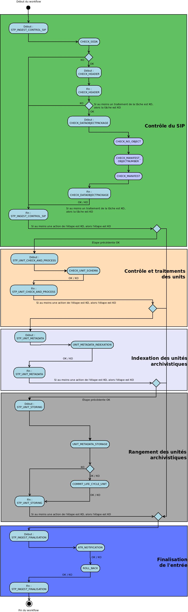

Workflow d'import d'un arbre de positionnement
##############################################

Introduction
============

Cette section décrit le processus  permettant d'importer un arbre de positionnement dans la solution logicielle Vitam. La structure d'un arbre de positionnement diffère de celle d'un SIP en plusieurs points.

Un arbre ne doit pas avoir d'objet, ni de service producteur, ni de contrat. Il s'agit plus simplement d'une arborescence représentée par des unités archivistiques. Ce processus partage donc certaines étapes avec celui du transfert d'un SIP classique, en ignore certaines et rajoute des tâches additionnelles.

Processus d'import d'un arbre (HOLDINGSCHEME - vision métier)
=============================================================

Le processus d'import d'un arbre est identique au workflow d'entrée d'un SIP. Il débute lors du lancement du téléchargement de l'arbre dans la solution logicielle Vitam. Par ailleurs, toutes les étapes, tâches et traitements sont journalisés dans le journal des opérations.

La fin du processus peut prendre plusieurs statuts :

* **Statuts** :

  + OK : l'arbre de positionnement a été importé (HOLDINGSCHEME.OK = Succès de l'import de l'arbre de positionnement)

  + KO : l'arbre de positionnement n'a pas été importé (HOLDINGSCHEME.KO = Échec de l'import de l'arbre de positionnement)

  + FATAL : une erreur fatale est survenue lors de l'import de l'arbre de positionnement (HOLDINGSCHEME.FATAL = Erreur fatale lors de l'import de l'arbre de positionnement)

  Les étapes et tâches associées ci-dessous décrivent ce processus d'import (clé et description de la clé associée dans le journal des opérations), non encore abordées dans la description de l'entrée d'un SIP.

Traitement additionnel dans la tâche CHECK_DATAOBJECTPACKAGE (CheckDataObjectPackageActionHandler.java)
-------------------------------------------------------------------------------------------------------

* Vérification de la non existence d'objets CHECK_NO_OBJECT (CheckDataObjectPackageActionHandler)
*************************************************************************************************

+ **Règle** : Vérification qu'il n'y a pas d'objet numérique dans le bordereau de transfert de l'arbre de positionnement.

+ **Statuts** :

    - OK : aucun objet numérique n'est présent dans le bordereau de transfert (CHECK_DATAOBJECTPACKAGE.CHECK_NO_OBJECT.OK=Succès de la vérification de l'absence d'objet)

    - KO : des objets numériques sont présent dans le bordereau de transfert (CHECK_DATAOBJECTPACKAGE.CHECK_NO_OBJECT.KO=Échec de la vérification de l'absence d'objet : objet(s) trouvé(s))

    - FATAL : une erreur fatale est survenue lors de la vérification de la non existence d'objet numérique (CHECK_DATAOBJECTPACKAGE.CHECK_NO_OBJECT.FATAL=Erreur fatale lors de la vérification de l'absence d'objet)

Structure du Workflow
=====================

Le workflow mis en place dans la solution logicielle Vitam est défini dans le fichier "DefaultHoldingSchemeWorkflow.json". Ce fichier est disponible à sources/processing/processing-management/src/main/resources/workflows.

