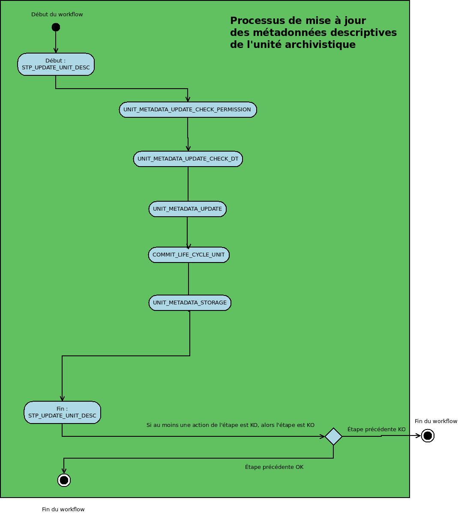
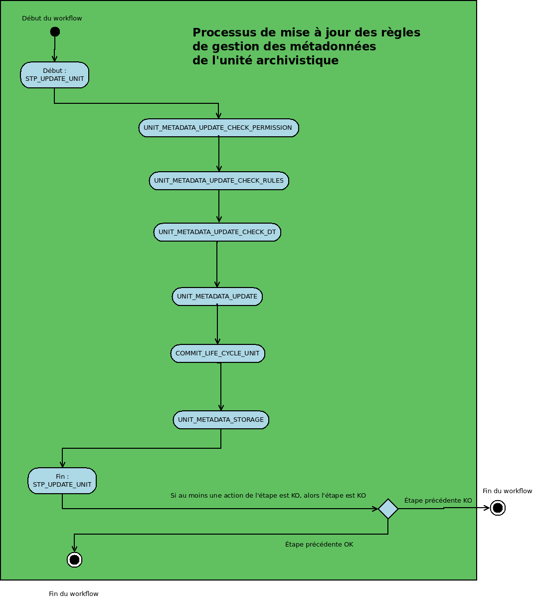

Workflow de mise à jour unitaire des unités archivistiques
###########################################################

Introduction
============

Cette section décrit le processus permettant la mise à jour unitaire des unités archivistiques.

Processus de mise à jour des unités archivistiques (vision métier)
===================================================================

Le processus de mise à jour unitaire des unités archivistiques est lancé lors d'une mise à jour de n'importe quelle métadonnée d'une unité archivistique. On distingue cependant deux cas de modifications, liés à des droits, gérés via les contrats d'accès :
Soit les utilisateurs disposent d'un droit de modification sur métadonnées descriptives seulement, soit ils disposent des droits pour modifier les métadonnées descriptives et les règles de gestion.

Un certain nombre d'étapes et actions sont journalisées dans le journal des opérations.
Les étapes et actions associées ci-dessous décrivent ce processus de mise à jour (clé et description de la clé associée dans le journal des opérations).

Mise à jour unitaire des métadonnées descriptives des unités archivistiques
============================================================================

Vérification des droits de mise à jour des métadonnées descriptives des unités archivistiques  UNIT_METADATA_UPDATE_CHECK_PERMISSION
-------------------------------------------------------------------------------------------------------------------------------------

+ **Règle** : cette étape permet d'effectuer les contrôles sur le champ présent dans le contrat d'accès, qui autorise ou non la modification de métadonnées descriptives seulement ou bien des métadonnées descriptives et de gestion.

+ **Type** : bloquant

* **Statuts** :

  + OK : Succès de la vérification des droits de mise à jour des métadonnées de l'unité archivistique ((UNIT_METADATA_UPDATE_CHECK_PERMISSION OK = Succès de la vérification des droits de mise à jour des métadonnées de l'unité archivistique)

  + KO : la mise à jour de l'unité archivistique n'a pas été effectuée en raison d'une erreur (STP_UPDATE_UNIT.KO = Échec de la vérification des droits de mise à jour des métadonnées de l'unité archivistique)

  + FATAL : une erreur technique est survenue lors de la mise à jour de l'unité archivistique (STP_UPDATE_UNIT.FATAL = Erreur technique lors de la vérification des droits de mise à jour des métadonnées de l'unité archivistique)

Vérification de l'association à un profil d'unité archivistique UNIT_METADATA_UPDATE_CHECK_DT
-----------------------------------------------------------------------------------------------

+ **Règle** : cette tâche permet de vérifier la conformité des unités archivistiques mise à jour vis à vis de leurs profils d'unités archivistiques. Les identifiants de profils archivistiques renseignés dans les unités archivistique doivent exister dans le référentiel des profils. Les profils associés doivent être actif et leur schéma de contrôle ne doit pas être vide.

+ **Type** : bloquant

* **Statuts** :

  + OK : succès de la vérification de la conformité au profil unités archivistiques (document type) ((UNIT_METADATA_UPDATE_CHECK_DT.OK = Succès de la vérification de l'association à un profil unité archivistique)

  + KO : la mise à jour de l'unité archivistique n'a pas été effectuée en raison de la non conformité vis à vis du profil d'unité archivistique (document type) (UNIT_METADATA_UPDATE_CHECK_DT.KO = Échec de la vérification de l'association à un profil unité archivistique)

  + FATAL : une erreur technique est survenue lors de la vérification de la conformité aux profils d'unités archivistiques (UNIT_METADATA_UPDATE_CHECK_DT.FATAL = Erreur technique lors de la vérification de l'association à un profil unité archivistique)

Indexation des métadonnées UNIT_METADATA_UPDATE (ArchiveUnitUpdateUtils.java)
-----------------------------------------------------------------------------

  + **Règle** : Indexation des métadonnées des unités archivistiques dans les bases internes de la solution logicielle Vitam, c'est à dire le titre des unités, leurs descriptions, leurs dates extrêmes, etc. C'est également dans cette tâche que le journal du cycle de vie est enregistré dans la base de données. Si la modification touche une métadonnée à historiser, alors un historique est créé. 

  + **Type** : bloquant

  + **Statuts** :

    - OK : Succès de la vérification des droits de mise à jour des métadonnées des unités archivistiques (UNIT_METADATA_UPDATE_CHECK_PERMISSION.OK = Succès de la vérification des droits de mise à jour des métadonnées des unités archivistiques)

    - KO : Échec de la vérification des droits de mise à jour des métadonnées des unités archivistiques (UNIT_METADATA_UPDATE_CHECK_PERMISSION.KO = Échec de la vérification des droits de mise à jour des métadonnées des unités archivistiques)

    - STARTED : Début de la vérification des droits de mise à jour des métadonnées des unités archivistiques (UNIT_METADATA_UPDATE_CHECK_PERMISSION.STARTED = Début de la vérification des droits de mise à jour des métadonnées des unités archivistiques)

    - FATAL : Erreur technique lors de la vérification des droits de mise à jour des métadonnées des unités archivistiques (UNIT_METADATA_UPDATE_CHECK_PERMISSION.FATAL = Erreur technique lors de la vérification des droits de mise à jour des métadonnées des unités archivistiques)

    - WARNING : Avertissement lors de la vérification des droits de mise à jour des métadonnées des unités archivistiques (UNIT_METADATA_UPDATE_CHECK_PERMISSION.WARNING = Avertissement lors de la vérification des droits de mise à jour des métadonnées des unités archivistiques)

**A propos de l'historique des données** : Il existe un fichier permettant de configurer les métadonnées à historiser dans :

vitam/sources/metadata/metadata-core/src/main/resources/history-triggers.json

Ce fichier contient deux variables par objet :
  - FieldPathTriggeredForHistory : champ dont la modification déclenche une historisation
  - ObjectPathForHistory : champ à historiser

Quand ce champ correspondant à FieldPathTriggeredForHistory est modifié, alors le champ contenu dans "ObjectPathForHistory" est enregistré dans un bloc nommé "history" dans le modèle de données.

Par défaut dans Vitam, la configuration de history-triggers.json est :

.. code-block:: JSON

  [
   {
     "FieldPathTriggeredForHistory": "_mgt.ClassificationRule.ClassificationLevel",
     "ObjectPathForHistory": "_mgt.ClassificationRule"
   }
  ]

Ainsi lorsqu'un niveau de classification est modifié, alors l'intégralité de la catégorie de règle de classification est enregistré dans le bloc _history de l'unité archivistique.

Enregistrement du journal du cycle de vie des unités archivistiques COMMIT_LIFE_CYCLE_UNIT
-------------------------------------------------------------------------------------------

 + **Règle** : Sécurisation en base des journaux du cycle de vie des unités archivistiques (avant cette étape, les journaux du cycle de vie des unités archivistiques sont dans une collection temporaire afin de garder une cohérence entre les métadonnées indexées et les journaux lors d'une entrée en succès ou en échec).

Cette action n'est pas journalisée.

  + **Type** : bloquant

  + **Statuts** :

    - OK : Succès de l'enregistrement des journaux du cycle de vie des unités archivistiques (COMMIT_LIFE_CYCLE_UNIT.OK = Succès de l'enregistrement des journaux du cycle de vie des unités archivistiques)

    - FATAL : Échec de l'enregistrement des journaux du cycle de vie des unités archivistiques (COMMIT_LIFE_CYCLE_UNIT.FATAL = Erreur technique lors de de l'enregistrement des journaux du cycle de vie des unités archivistiques)

Écriture des métadonnées de l'unité archivistique sur l'offre de stockage UNIT_METADATA_STORAGE (AccessInternalModuleImpl.java)
-------------------------------------------------------------------------------------------------------------------------------

  + **Règle** : Sauvegarde des métadonnées des unités archivistiques sur les offres de stockage en fonction de la stratégie de stockage.(Pas d'évènements stockés dans le journal de cycle de vie)

  + **Type** : bloquant

  + **Statuts** :

    - OK : la sécurisation des journaux du cycle de vie s'est correctement déroulée (UNIT_METADATA_UPDATE.OK = Succès de l'enregistrement des journaux du cycle de vie des unités archivistiques)

    - FATAL : une erreur technique est survenue lors de la sécurisation du journal du cycle de vie (UNIT_METADATA_UPDATE.FATAL = Erreur technique lors de l'enregistrement des journaux du cycle de vie des unités archivistiques)

Selon le type de modifications, une des deux étapes peut être déclenchée:

Processus de mise à jour des métadonnées descriptives de l'unité archivistique STP_UPDATE_UNIT_DESC (AccessInternalModuleImpl.java)
-------------------------------------------------------------------------------------------------------------------------------------

La fin du processus peut prendre plusieurs statuts :

* **Statuts** :

  + OK : la mise à jour de l'unité archivistique a bien été effectuée (STP_UPDATE_UNIT_DESC.OK = Succès du processus de mise à jour des métadonnées de l'unité archivistique)

  + KO : la mise à jour de l'unité archivistique n'a pas été effectuée en raison d'une erreur (STP_UPDATE_UNIT_DESC.KO = Échec du processus de mise à jour des métadonnées de l'unité archivistique)

  + FATAL : une erreur technique est survenue lors de la mise à jour de l'unité archivistique (STP_UPDATE_UNIT_DESC.FATAL = Erreur technique lors du processus de mise à jour des métadonnées de l'unité archivistique)

Structue de workflow mise à jour des métadonnées descriptives
=============================================================

Mise à jour unitaire des règles de gestion des unités archivistiques
======================================================================

Vérification des droits de mise à jour des métadonnées descriptives des unités archivistiques  UNIT_METADATA_UPDATE_CHECK_PERMISSION
-------------------------------------------------------------------------------------------------------------------------------------

+ **Règle** : cette étape permet d'effectuer les contrôles sur le champ présent dans le contrat d'accès, qui autorise ou non la modification de métadonnées descriptives seulement ou bien des métadonnées descriptives et de gestion.

+ **Type** : bloquant

* **Statuts** :

  + OK : Succès de la vérification des droits de mise à jour des métadonnées de l'unité archivistique ((UNIT_METADATA_UPDATE_CHECK_PERMISSION OK = Succès de la vérification des droits de mise à jour des métadonnées de l'unité archivistique)

  + KO : la mise à jour de l'unité archivistique n'a pas été effectuée en raison d'une erreur (STP_UPDATE_UNIT.KO = Échec de la vérification des droits de mise à jour des métadonnées de l'unité archivistique)

  + FATAL : une erreur technique est survenue lors de la mise à jour de l'unité archivistique (STP_UPDATE_UNIT.FATAL = Erreur technique lors de la vérification des droits de mise à jour des métadonnées de l'unité archivistique)

Vérification des règles de gestion UNIT_METADATA_UPDATE_CHECK_RULES (AccessInternalModuleImpl.java)
---------------------------------------------------------------------------------------------------

+ **Règle** : vérification des règles de gestion

+ **Type** : bloquant

+ **Statuts** :

    - OK : le rapport est généré (UNIT_METADATA_UPDATE_CHECK_RULES.OK = Succès de la génération du rapport d'analyse du rérentiel des règles de gestion)

    - KO : pas de cas KO

    - FATAL : une erreur technique est survenue lors de la création du rapport (UNIT_METADATA_UPDATE_CHECK_RULES.FATAL = Erreur technique lors de la génération du rapport d'analyse du référentiel des règles de gestion)

Vérification de l'association à un profil d'unité archivistique UNIT_METADATA_UPDATE_CHECK_DT
-----------------------------------------------------------------------------------------------

+ **Règle** : cette tâche permet de vérifier la conformité des unités archivistiques mise à jour vis à vis de leurs profils d'unités archivistiques. Les identifiants de profils archivistiques renseignés dans les unités archivistique doivent exister dans le référentiel des profils. Les profils associés doivent être actif et leur schéma de contrôle ne doit pas être vide.

+ **Type** : bloquant

* **Statuts** :

  + OK : succès de la vérification de la conformité au profil unités archivistiques (document type) ((UNIT_METADATA_UPDATE_CHECK_DT.OK = Succès de la vérification de l'association à un profil unité archivistique)

  + KO : la mise à jour de l'unité archivistique n'a pas été effectuée en raison de la non conformité vis à vis du profil d'unité archivistique (document type) (UNIT_METADATA_UPDATE_CHECK_DT.KO = Échec de la vérification de l'association à un profil unité archivistique)

  + FATAL : une erreur technique est survenue lors de la vérification de la conformité aux profils d'unités archivistiques (UNIT_METADATA_UPDATE_CHECK_DT.FATAL = Erreur technique lors de la vérification de l'association à un profil unité archivistique)

Indexation des métadonnées UNIT_METADATA_UPDATE (ArchiveUnitUpdateUtils.java)
-----------------------------------------------------------------------------

  + **Règle** : Indexation des métadonnées des unités archivistiques dans les bases internes de la solution logicielle Vitam, c'est à dire le titre des unités, leurs descriptions, leurs dates extrêmes, etc. C'est également dans cette tâche que le journal du cycle de vie est enregistré dans la base de données. Si la modification touche une métadonnée à historiser, alors un historique est créé. 

  + **Type** : bloquant

  + **Statuts** :

    - OK : Succès de la vérification des droits de mise à jour des métadonnées des unités archivistiques (UNIT_METADATA_UPDATE_CHECK_PERMISSION.OK = Succès de la vérification des droits de mise à jour des métadonnées des unités archivistiques)

    - KO : Échec de la vérification des droits de mise à jour des métadonnées des unités archivistiques (UNIT_METADATA_UPDATE_CHECK_PERMISSION.KO = Échec de la vérification des droits de mise à jour des métadonnées des unités archivistiques)

    - STARTED : Début de la vérification des droits de mise à jour des métadonnées des unités archivistiques (UNIT_METADATA_UPDATE_CHECK_PERMISSION.STARTED = Début de la vérification des droits de mise à jour des métadonnées des unités archivistiques)

    - FATAL : Erreur technique lors de la vérification des droits de mise à jour des métadonnées des unités archivistiques (UNIT_METADATA_UPDATE_CHECK_PERMISSION.FATAL = Erreur technique lors de la vérification des droits de mise à jour des métadonnées des unités archivistiques)

    - WARNING : Avertissement lors de la vérification des droits de mise à jour des métadonnées des unités archivistiques (UNIT_METADATA_UPDATE_CHECK_PERMISSION.WARNING = Avertissement lors de la vérification des droits de mise à jour des métadonnées des unités archivistiques)

**A propos de l'historique des données** : Il existe un fichier permettant de configurer les métadonnées à historiser dans :

vitam/sources/metadata/metadata-core/src/main/resources/history-triggers.json

Ce fichier contient deux variables par objet :
  - FieldPathTriggeredForHistory : champ dont la modification déclenche une historisation
  - ObjectPathForHistory : champ à historiser

Quand ce champ correspondant à FieldPathTriggeredForHistory est modifié, alors le champ contenu dans "ObjectPathForHistory" est enregistré dans un bloc nommé "history" dans le modèle de données.

Par défaut dans Vitam, la configuration de history-triggers.json est :

.. code-block:: JSON

  [
   {
     "FieldPathTriggeredForHistory": "_mgt.ClassificationRule.ClassificationLevel",
     "ObjectPathForHistory": "_mgt.ClassificationRule"
   }
  ]

Ainsi lorsqu'un niveau de classification est modifié, alors l'intégralité de la catégorie de règle de classification est enregistré dans le bloc _history de l'unité archivistique.

Enregistrement du journal du cycle de vie des unités archivistiques COMMIT_LIFE_CYCLE_UNIT
-------------------------------------------------------------------------------------------

 + **Règle** : Sécurisation en base des journaux du cycle de vie des unités archivistiques (avant cette étape, les journaux du cycle de vie des unités archivistiques sont dans une collection temporaire afin de garder une cohérence entre les métadonnées indexées et les journaux lors d'une entrée en succès ou en échec). Cette action n'est pas journalisée.

  + **Type** : bloquant

  + **Statuts** :

    - OK : Succès de l'enregistrement des journaux du cycle de vie des unités archivistiques (COMMIT_LIFE_CYCLE_UNIT.OK = Succès de l'enregistrement des journaux du cycle de vie des unités archivistiques)

    - FATAL : Échec de l'enregistrement des journaux du cycle de vie des unités archivistiques (COMMIT_LIFE_CYCLE_UNIT.FATAL = Erreur technique lors de de l'enregistrement des journaux du cycle de vie des unités archivistiques)

Écriture des métadonnées de l'unité archivistique sur l'offre de stockage UNIT_METADATA_STORAGE (AccessInternalModuleImpl.java)
-------------------------------------------------------------------------------------------------------------------------------

  + **Règle** : Sauvegarde des métadonnées des unités archivistiques sur les offres de stockage en fonction de la stratégie de stockage.(Pas d'évènements stockés dans le journal de cycle de vie)

  + **Type** : bloquant

  + **Statuts** :

    - OK : la sécurisation des journaux du cycle de vie s'est correctement déroulée (UNIT_METADATA_UPDATE.OK = Succès de l'enregistrement des journaux du cycle de vie des unités archivistiques)

    - FATAL : une erreur technique est survenue lors de la sécurisation du journal du cycle de vie (UNIT_METADATA_UPDATE.FATAL = Erreur technique lors de l'enregistrement des journaux du cycle de vie des unités archivistiques)

Processus de mise à jour de règle de gestion des métadonnées de l'unité archivistique STP_UPDATE_UNIT (AccessInternalModuleImpl.java)
--------------------------------------------------------------------------------------------------------------------------------------------

 + **Règle** : Mise à jour de règle de gestion des métadonnées de l'unité archivistique.

 + **Type** : bloquant

 + **Statuts** :

    - OK : la mise à jour de l'unité archivistique a bien été effectuée. (STP_UPDATE_UNIT.OK = Succès du processus de mise à jour des métadonnées de l'unité archivistique)

    - KO : la mise à jour de l'unité archivistique n'a pas été effectuée en raison d'une erreur (STP_UPDATE_UNIT.KO = Échec du processus de mise à jour des métadonnées de l'unité archivistique)

    - FATAL : une erreur technique est survenue lors de la mise à jour de l'unité archivistique (STP_UPDATE_UNIT.FATAL = Erreur technique lors du processus de mise à jour des métadonnées de l'unité archivistique)

Structue de workflow mise à jour des règles de gestions de l'unité archivistique
=================================================================================

