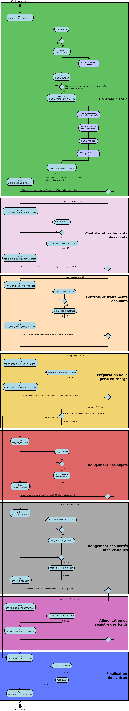
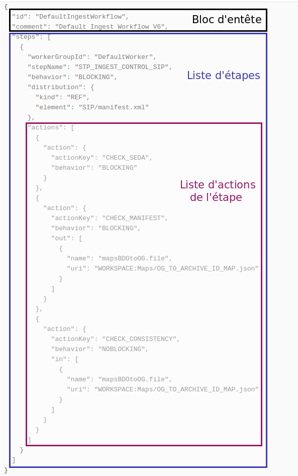

INGEST : Workflow d'entrée
##########################

Introduction
============

Ce document décrit le processus (workflow) d'entrée interne et externe ("ingest interne" et "ingest externe") mis en place dans Vitam. Ce document est rattaché à la version de Vitam avec lequel il est livré.

Processus d'entrée (vision métier)
==================================

Un workflow est un processus composé d’étapes (macro-workflow), elles-mêmes composées d’une liste d’actions à exécuter de manière séquentielle, une seule fois ou répétées sur une liste d’éléments (micro-workflow).

Chaque étape, chaque action peuvent avoir les statuts suivants :

- OK : le traitement associé s'est passé correctement. Le workflow continue.
- Warning : le traitement associé a généré un avertissement (Par exemple le format de l'objet est mal déclaré dans le bordereau de versement). Le workflow continue.
- KO : le traitement associé a généré une erreur métier. Le workflow s'arrête si le modèle d'execution est bloquant (cf. ci-dessous).
- FATAL : le traitement associé a généré une erreur technique. Le workflow s'arrête.

Chaque action peut avoir les modèles d'éxécutions suivants (toutes les étapes sont par défaut bloquantes) :

- Bloquant

    * Si une action est identifiée en erreur, l'étape en cours est alors arrêtée et le workflow passe à la derniere étape de finalisation de l'entrée. Une notification de l'échec de l'entrée est généré et le statut du processus d’entrée passe à « erreur ».

- Non bloquant

    * Si une action est identifiée en erreur, le reste des actions de l'étape est exécuté avant que le statut de l'étape passe à « erreur ». L'étape en cours est alors arrêtée et le workflow passe à la dernière étape de finalisation de l'entrée. Une notification de l'échec de l'entrée est généré et le statut du processus d’entrée passe à « erreur ».

Le processus d'entrée débute lors du lancement du chargement d'un Submission Information Package (SIP) dans la solution Vitam. De plus, toutes les étapes et actions sont journalisées dans le journal des opérations.
Les étapes et actions associées ci-dessous décrivent le processus d'entrée (clé et description de la clé associée dans le journal des opérations) tel qu'implémenté dans la version actuelle de la solution logicielle :

Le processus d'entrée externe comprend deux étapes : STP_SANITY_CHECK_SIP et CHECK_CONTAINER (voir ci dessous). Les autres étapes font parties du processus d'entrée interne.

Le cas du processus d'entrée "test à blanc"
===========================================

Il est possible de procéder à un versement "à blanc", pour tester la conformité du bordereau sans pour autant archiver le SIP et stocker les objets. Dans ce cas, le processus d'entrée à blanc diffère du processus d'entrée "classique" en ignorant un certains nombres d'étapes.

Les étapes non exécutées dans le processus d'entrée à blanc sont les suivantes :

- Rangement des objets (STP_OG_STORING)
- Rangement des unites archivistiques (STP_UNIT_STORING)
- Registre des fonds (STP_ACCESSION_REGISTRATION)

Les tâches relatives à toutes ces étapes sont donc également ignorées.

Contrôles préalables à l'entrée (STP_SANITY_CHECK_SIP)
======================================================

Contrôle sanitaire (SANITY_CHECK_SIP)
~~~~~~~~~~~~~~~~~~~~~~~~~~~~~~~~~~~~~

+ **Règle** : vérification de l'absence de virus dans le SIP.

+ **Type** : bloquant.

+ **Statuts** :

  - OK : aucun virus n'est détecté dans le SIP (SANITY_CHECK_SIP.OK=Succès du contrôle sanitaire : aucun virus détecté)

  - KO : un ou plusieurs virus ont été detectés dans le SIP (SANITY_CHECK_SIP.KO=Échec du contrôle sanitaire du SIP : fichier détecté comme infecté)

  - FATAL : la vérification de la présence de virus dans le SIP n'a pas pu être faite suite à une erreur technique (SANITY_CHECK_SIP.FATAL=Erreur fatale lors du contrôle sanitaire du SIP)

Contrôle du format du conteneur du SIP (CHECK_CONTAINER)
~~~~~~~~~~~~~~~~~~~~~~~~~~~~~~~~~~~~~~~~~~~~~~~~~~~~~~~~

+ **Règle** : Vitam vérifie le format du SIP via un outil d'identification de format, qui lui même se base sur un référientiel des formats qu'il embarque

+ **Formats acceptés** : .zip, .tar, .tar.gz, .tar.bz2

+ **Type** : bloquant.

+ **Statuts** :

  - OK : le conteneur du SIP est au bon format (CHECK_CONTAINER.OK=Succès du contrôle de format du conteneur du SIP)

  - KO : le conteneur du SIP n'est pas au bon format (CHECK_CONTAINER.KO=Échec du contrôle de format du conteneur du SIP)

  - FATAL : la vérification du format du conteneur du SIP n'a pas pu être faite suite à une erreur technique liée à l'outil d'identification des formats (CHECK_CONTAINER.FATAL=Erreur fatale lors du processus du contrôle de format du conteneur du SIP)

Réception dans vitam (STP_UPLOAD_SIP) : Etape de réception du SIP dans Vitam
============================================================================

* **Règle** : Vitam vérifie la bonne réception du SIP qu'on lui envoie

* **Type** : bloquant.

* **Statuts** :

  + OK : le SIP a été reçu dans Vitam (STP_UPLOAD_SIP.OK=Succès du processus de téléchargement du SIP)

  + KO : le SIP n'a pas été reçu dans Vitam (STP_UPLOAD_SIP.KO=Échec du processus de téléchargement du SIP)

  + FATAL : la réception du SIP dans Vitam n'a pas été possible suite à une erreur technique, par exemple si le serveur est indisponible (STP_UPLOAD_SIP.FATAL=Erreur Fatale lors du processus de téléchargement du SIP)

Contrôle du SIP (STP_INGEST_CONTROL_SIP)
========================================

Vérification globale du SIP (CHECK_SEDA) : Vérification de la cohérence physique du SIP
~~~~~~~~~~~~~~~~~~~~~~~~~~~~~~~~~~~~~~~~~~~~~~~~~~~~~~~~~~~~~~~~~~~~~~~~~~~~~~~~~~~~~~~

+ **Type de manifeste accepté** : le manifeste est obligatoire dans le SIP, doit être nommé manifest.xml, doit être conforme au schéma xsd par défaut fourni avec le standard SEDA v. 2.0 et doit satisfaire les exigences du document de spécification des SIP pour Vitam

+ **Type** : bloquant.

+ **Statuts** :

  - OK : le SIP est présent, nommé manifest.xml et conforme au schéma xsd par défaut fourni avec le standard SEDA v.2.0. (CHECK_SEDA.OK=Succès de la vérification globale du SIP)
  - KO : le manifeste est introuvable dans le SIP ou n'a pas d'extension .xml (CHECK_SEDA.NO_FILE.KO=Échec de la vérification globale du SIP : le manifeste est introuvable dans le SIP)
  - KO : le manifeste n'est pas au format XML (CHECK_SEDA.NOT_XML_FILE.KO=Échec de la vérification globale du SIP : le manifeste de versement au mauvais format)
  - KO : le manifeste ne respecte pas le schéma par défaut fourni avec le standard SEDA 2.0 (CHECK_SEDA.NOT_XSD_VALID.KO=Échec de la vérification globale du SIP : manifeste non conforme au schéma SEDA 2.0)
  - KO : le SIP contient plus d'un seul dossier "Content" (CHECK_SEDA.CONTAINER_FORMAT.DIRECTORY.KO=Le SIP contient plus d'un dossier ou un dossier dont le nommage est invalide)
  - KO : le SIP contient plus d'un seul fichier à la racine (CHECK_SEDA.CONTAINER_FORMAT.FILE.KO=Le SIP contient plus d'un fichier à sa racine)
  - FATAL : le manifeste n'a pas pu être contrôlé suite à une erreur technique (CHECK_SEDA.FATAL=Erreur fatale lors de la vérification globale du SIP)

Vérification de l'en-tête du bordereau (CHECK_HEADER)
~~~~~~~~~~~~~~~~~~~~~~~~~~~~~~~~~~~~~~~~~~~~~~~~~

+ **Règles** : les informations générales du manifest.xml (nommées "header") doivent être correctes. L'existence du service producteur (OriginatingAgencyIdentifier) est vérifiée dans cette tâche

+ **Type** : bloquant.

+ **Statuts** :

  - OK : le service producteur est déclaré. (CHECK_HEADER.OK=Succès de la vérification générale du bordereau)

  - KO : le service producteur n'est pas déclaré (CHECK_HEADER.KO=Échec de la vérification générale du bordereau)

  - FATAL : une erreur technique est survenue lors des contrôles sur les informations générales du bordereau (CHECK_HEADER.FATAL=Erreur fatale lors de la vérification générale du bordereau)

La tâche contient les traitements suivants
******************************************

* Vérification de la présence et contrôle du contrat d'entrée (CHECK_CONTRACT_INGEST)

    + **Règle** : vérifier le contrat d'entrée déclaré dans le SIP par rapport au référentiel des contrats d'entrée importé dans le système.

    + **Statuts** :

      - OK : S'il y a un contrat déclaré dans le SIP et que ce contrat est trouvé dans le référentiel de contrat avec un statut actif (ACTIVE)

      - KO : si le contrat déclaré est invalide (contrat non trouvé dans la référentiel de contrat OU contrat trouvé mais en statut inactif (INACTIVE)

      - FATAL : une erreur technique est survenue lors de la vérification de la présence et contrôle du contrat d'entrée

Vérification du contenu du bordereau (CHECK_DATAOBJECTPACKAGE)
~~~~~~~~~~~~~~~~~~~~~~~~~~~~~~~~~~~~~~~~~~~~~~~~~~~~~~~~~~~~~~

  + **Type** : bloquant.

Cette tâche contient plusieurs traitements, chacun ayant un contrôle et des points de sorties spécifique

* Vérification des usages des groupes d'objets (CHECK_MANIFEST_DATAOBJECT_VERSION)

    + **Règle** : tous les objets décrits dans le manifeste du SIP doivent déclarer un usage conforme à la liste des usages acceptés dans la solution logicielle

    + **Types d'usages acceptés**: original papier (PhysicalMaster), original numérique (BinaryMaster), diffusion (Dissemination), vignette (Thumbnail), contenu brut (TextContent)

    + **Statuts** :

      - OK : les objets contenus dans le SIP déclarent tous dans le manifeste un usage cohérent avec ceux acceptés, et optionnellement un numéro de version respectant la norme de ce champ usage, par exemple "BinaryMaster_2" (CHECK_MANIFEST_DATAOBJECT_VERSION.OK=Succès de la vérification des usages des groupes d'objets)

      - KO : un ou plusieurs objets contenus dans le SIP déclarent dans le manifeste un usage incohérent avec ceux acceptés (CHECK_MANIFEST_DATAOBJECT_VERSION.KO=Échec de la vérification des usages des groupes d'objets)

      - FATAL : les usages déclarés dans le manifeste pour les objets contenus dans le SIP n'ont pas pu être contrôlés suite à une erreur technique (CHECK_MANIFEST_DATAOBJECT_VERSION.FATAL=Erreur fatale lors de la vérification des usages des groupes d'objets)

* Vérification du nombre d'objets (CHECK_MANIFEST_OBJECTNUMBER)

    + **Règle** : le nombre d'objets binaires reçus dans la solution logicielle doit être strictement égal au nombre d'objets binaires déclaré dans le manifeste du SIP

    + **Statuts** :

      - OK : le nombre d'objets reçus dans la solution logicielle est strictement égal au nombre d'objets déclaré dans le manifeste du SIP (CHECK_MANIFEST_OBJECTNUMBER.OK=Succès de la vérification du nombre d'objets)

      - KO : le nombre d'objets reçus dans la solution logicielle est inférieur ou supérieur au nombre d'objets déclaré dans le manifeste du SIP (CHECK_MANIFEST_OBJECTNUMBER.KO=Échec de la vérification du nombre d'objets)

      - FATAL : une erreur technique est survenue lors de la vérification du nombre d'objets (CHECK_DATAOBJECTPACKAGE.CHECK_MANIFEST_OBJECTNUMBER.FATAL=Erreur fatale lors de la vérification du nombre dobjets)

* Vérification de la cohérence du bordereau (CHECK_MANIFEST)

    + **Règle** : cette action permet la création des journaux de cycle de vie des unités archivistiques (ArchiveUnit) et des groupes d'objets (ObjectGroup), la vérification de la présence de cycles de vie dans les arborescences des ArchiveUnits, la création de l'arbre d'ordre d'indexation et l'extraction des métadonnées contenues dans la balise ManagementMetadata du manifeste pour le calcul des règles de gestion.

    + **Statuts** :

      - OK : les journaux de cycles de vie des ArchiveUnits et des ObjectGroups ont été créés avec succès, aucune récursivité n'a été detectée dans l'arborescence des ArchiveUnits (CHECK_MANIFEST.OK=Contrôle du bordereau réalisé avec succès)

      - KO : Une récursivité a été détectée dans l'arborescence des ArchiveUnits (CHECK_MANIFEST.KO=Échec de contrôle du bordereau)

      - FATAL : la vérification de la cohérence du bordereau n'a pas pu être réalisée suite à une erreur système, e.g. les journaux de cycle de vie n'ont pas pu être créés (CHECK_MANIFEST.FATAL=Erreur fatale lors de contrôle du bordereau)

* Vérification de la cohérence entre objets, groupes d'objets et unités archivistiques (CHECK_CONSISTENCY)

    + **Règle** : Chaque objet ou groupe d'objets doit être référencé par un ArchiveUnit, les objets sans groupe d'objets mais référencés par un ArchiveUnit sont rattachés chacun à un groupe d'objets.

    + **Statuts** :

      - OK : Aucun objet ou groupe d'objet n'est orphelin (i.e. non référencé par une ArchiveUnit) et tous les objets sont rattachés à un groupe d'objets (CHECK_CONSISTENCY.OK=Succès de la vérification de la cohérence entre objets, groupes d'objets et unités archivistiques)

      - KO : Au moins un objet ou groupe d'objet est orphelin (i.e. non référencé par une ArchiveUnit) (CHECK_CONSISTENCY.KO=Échec de la vérification de la cohérence entre objets, groupes d'objets et unités archivistiques)

      - FATAL : la vérification de la cohérence entre objets, groupes d'objets et unités archivistiques n'a pas pu être réalisée suite à une erreur système (CHECK_CONSISTENCY.FATAL=Erreur fatale lors de la vérification de la cohérence entre objets, groupes d'objets et unités archivistiques)

Contrôle et traitements des objets (STP_OG_CHECK_AND_TRANSFORME)
================================================================

Vérification de l'intégrité des objets (CHECK_DIGEST)
~~~~~~~~~~~~~~~~~~~~~~~~~~~~~~~~~~~~~~~~~~~~~~~~~~~~~

+ **Règle** : vérification de la cohérence entre l'empreinte de l'objet binaire calculée par la solution logicielle Vitam et celle déclarée dans le manifeste. Si l'empreinte déclarée dans le manifeste n'a pas été calculée avec l'algorithme SHA-512, alors le système recalcule une empreinte avec cet algorithme. C'est celle-ci qui sera enregistrée dans le système.

+ **Algorithmes autorisés en entrée** : MD5, SHA-1, SHA-256, SHA-512

+ **Type** : bloquant.

+ **Statuts** :

  - OK : tous les objets binaires reçus sont identiques aux objets binaires attendus. Tous les objets binaires disposent désormais d'une empreinte calculée avec l'algorithme SHA-512 (CHECK_DIGEST.OK=Succès de la vérification de l'intégrité des objets binaires)

  - KO : au moins un objet reçu n'est pas identique aux objets attendus (CHECK_DIGEST.KO=Échec de la vérification de l'intégrité des objets binaires)

  - FATAL : la vérification de l'intégrité des objets binaires n'a pas pu être réalisée suite à une erreur système, par exemple lorsque l'algorithme inconnu (CHECK_DIGEST.FATAL=Erreur fatale lors de la vérification des objets)

  - WARNING : tous les objets binaires reçus sont identiques aux objets binaires attendus, mais au moins un objet a une empreinte déclarée dans le manifeste non calculée par l'algorithme SHA-512 (CHECK_DIGEST.WARNING=Avertissement lors de la vérification de l'empreinte)

Identification des formats (OG_OBJECTS_FORMAT_CHECK)
~~~~~~~~~~~~~~~~~~~~~~~~~~~~~~~~~~~~~~~~~~~~~~~~~~~~

+ **Règle** :  Vitam identifie les formats de chaque objet binaire présent dans le SIP, afin de garantir une information homogène et objective. Cette action met en œuvre un outil d'identification prenant l'objet en entrée et fournissant des informations de format en sortie. Ces informations sont comparées avec les formats identifiés dans le référentiel des formats interne au système et avec celles déclarées dans le manifeste. En cas d'incohérence entre la déclaration de l'application versante et le format identifié par le système, le SIP sera tout de même accepté, générant un warning. Vitam se servira alors des informations qu'il a lui même identifiées et non de celles de l'application versante.

+ **Type** : bloquant.

+ **Statuts** :

  - OK : l'identification s'est bien passée, les formats identifiés sont référencés dans le référentiel interne et les informations sont cohérentes avec celles déclarées dans le manifeste (OG_OBJECTS_FORMAT_CHECK.OK=Succès de la vérification des formats)

  - KO : le format identifié n'est pas référencé dans le référentiel interne, ou aucun format n'a été trouvé pour un objet (OG_OBJECTS_FORMAT_CHECK.KO=Échec de la vérification des formats)

  - FATAL : l'identification des formats n'a pas été réalisée suite à une erreur technique (OG_OBJECTS_FORMAT_CHECK.FATAL=Erreur fatale lors de la vérification des formats)

  - WARNING : l'identification s'est bien passée, les formats identifiés sont référencés dans le référentiel interne mais les informations ne sont pas cohérentes avec celles déclarées dans le manifeste (OG_OBJECTS_FORMAT_CHECK.WARNING=Avertissement lors de la vérification des formats)

Contrôle et traitements des unités archivistiques (STP_UNIT_CHECK_AND_TRANSFORME)
=================================================================================

Vérification globale de l'unité archivistique (CHECK_UNIT_SCHEMA)
~~~~~~~~~~~~~~~~~~~~~~~~~~~~~~~~~~~~~~~~~~~~~~~~~~~~~~~~~~~~~~~~~

+ **Règle** :  Contrôle de la cohérence intellectuelle des informations des unités archivistiques du bordereau.

+ **Type** : bloquant.

+ **Statuts** :

  - OK : tous les champs de l'unité archivistique sont valides (CHECK_UNIT_SCHEMA.OK=Succès de la vérification globale de l''unité archivistique).

  - KO : au moins un champ de l'unité archivistique n'est pas valide (titre vide, date incorrecte...) (CHECK_UNIT_SCHEMA.KO=Échec lors de la vérification globale de l''unité archivistique).

  - FATAL : la vérification de l'unité archivistique n'a pu être effectuée suite à une erreur système (CHECK_UNIT_SCHEMA.FATAL=Erreur fatale de la vérification globale de l''unité archivistique).

Application des règles de gestion et calcul des dates d'échéances (UNITS_RULES_COMPUTE)
~~~~~~~~~~~~~~~~~~~~~~~~~~~~~~~~~~~~~~~~~~~~~~~~~~~~~~~~~~~~~~~~~~~~~~~~~~~~~~~~~~~~~~~

+ **Règle** : Vitam calcule les dates d'échéances des unités archivistiques du SIP. Pour les unités racines, il utilise pour cela les règles de gestions incluses dans la balise Management de chacune d'entre elles ainsi que celles présentes dans la balise ManagementMetadata. Vitam effectue également ce calcul pour les autres unités archivistiques du SIP possédant des règles de gestions déclarées dans leurs balises Management, sans prendre en compte le ManagementMetadata. Le référentiel utilisé pour ces calculs est le référentiel des règles de gestion.

+ **Type** : bloquant.

+ **Statuts** :

  - OK : les règles de gestion sont référencées dans le référentiel interne et ont été appliquées avec succès (UNITS_RULES_COMPUTE.OK=Succès du calcul des dates d'échéance)

  - KO : au moins une règle de gestion déclarée dans le manifeste n'est pas référencée dans le référentiel interne (UNITS_RULES_COMPUTE.KO=Échec du calcul des dates d'échéance)

  - FATAL : une erreur technique est survenue lors du calcul des dates d'échéances (UNITS_RULES_COMPUTE.FATAL=Erreur fatale lors du calcul des dates d'échéance)

Préparation de la prise en charge (STP_STORAGE_AVAILABILITY_CHECK)
==================================================================

Vérification de la disponibilité de l'offre de stockage (STORAGE_AVAILABILITY_CHECK)
~~~~~~~~~~~~~~~~~~~~~~~~~~~~~~~~~~~~~~~~~~~~~~~~~~~~~~~~~~~~~~~~~~~~~~~~~~~~~~~~~~~~

+ **Règle** :  Vérification de la disponibilité de l'offre de stockage et de l'espace disponible pour y stocker le contenu du SIP

+ **Type** : bloquant.

+ **Statuts** :

  - OK : l'offre de stockage est accessible et dispose d'assez d'espace pour stocker le contenu du SIP (STORAGE_AVAILABILITY_CHECK.OK=Succès de la vérification de la disponibilité de l'offre de stockage)

  - KO : l'offre de stockage n'est pas disponible ou ne dispose pas d'assez d'espace pour stocker le contenu du SIP (STORAGE_AVAILABILITY_CHECK.KO=Échec de la vérification de la disponibilité de l'offre de stockage)

  - FATAL : la vérification de la disponibilité de l'offre de stockage n'a pas pu être réalisée suite à une erreur système (STORAGE_AVAILABILITY_CHECK.FATAL=Erreur fatale lors de la vérification de la disponibilité de l'offre de stockage)

Rangement des objets (STP_OG_STORING)
=====================================

Enregistrement des objets binaires sur l'offre de stockage (OG_STORAGE)
~~~~~~~~~~~~~~~~~~~~~~~~~~~~~~~~~~~~~~~~~~~~~~~~~~~~~~~~~~~~~~~~~~~~~~~

+ **Règle** :  Action de stockage du contenu du SIP sur les offres de stockage

+ **Type** : Bloquant.

+ **Statuts** :

  - OK : tous les objets binaires contenus dans le SIP ont été stockés dans l'offre de stockage (OG_STORAGE.OK=Succès du rangement des objets et groupes d'objets)

  - KO : au moins un des objets binaires contenus dans le SIP n'a pas pu être stocké dans l'offre de stockage (OG_STORAGE.KO=Échec du rangement des objets et groupes d'objets)

  - WARNING : le SIP ne contient pas d'objet (OBJECTS_LIST_EMPTY.WARNING=Avertissement : le SIP ne contient pas dobjet)

  - FATAL : l'enregistrement des objets binaires sur l'offre de stockage n'a pas pu être réalisé suite à une erreur technique (OG_STORAGE.FATAL=Erreur fatale lors du rangement des objets et groupes d'objets)

Indexation des métadonnées des groupes d'objets (OG_METADATA_INDEXATION)
~~~~~~~~~~~~~~~~~~~~~~~~~~~~~~~~~~~~~~~~~~~~~~~~~~~~~~~~~~~~~~~~~~~~~~~~

+ **Règle** : les métadonnées liées aux groupes d'objets sont indexées, c'est à dire la taille des objets, l'empreinte des objets, les métadonnées liées aux formats (Type MIME, PUID, etc.)

+ **Type** : bloquant.

+ **Statuts** :

  - OK : les métadonnées des groupes d'objets ont été indexées avec succès (OG_METADATA_INDEXATION.OK=Succès de l'indexation des métadonnées des objets et groupes d'objets)

  - KO : les métadonnées des groupes d'objets n'ont pas pu être indexées (OG_METADATA_INDEXATION.KO=Échec de l'indexation des métadonnées des objets et groupes d'objets)

  - FATAL : l'indexation des métadonnées des groupes d'objets n'a pas pu être réalisée suite à une erreur technique (OG_METADATA_INDEXATION.FATAL=Erreur fatale lors de l'indexation des métadonnées des objets et groupes d'objets)

Sécurisation des métadonnées des groupes d'objets (OG_METADATA_STORAGE)
~~~~~~~~~~~~~~~~~~~~~~~~~~~~~~~~~~~~~~~~~~~~~~~~~~~~~~~~~~~~~~~~~~~~~~~

+ **Règle** : les métadonnées liées aux groupes d'objets sont stockées dans l'offre de stockage afin de les sécuriser

+ **Type** : bloquant.

+ **Statuts** :

  - OK : les métadonnées des groupes d'objets ont été sécurisées avec succès (OG_METADATA_STORAGE.OK=Succès de l'enregistrement des métadonnées des groupes d''objets)

  - KO : les métadonnées des groupes d'objets n'ont pas pu être sécurisées (OG_METADATA_STORAGE.KO=Échec de l'enregistrement des métadonnées des objets et groupes d'objets)

Sécurisation du journal des cycles de vie des groupes d'objets (COMMIT_LIFE_CYCLE_OBJECT_GROUP)
~~~~~~~~~~~~~~~~~~~~~~~~~~~~~~~~~~~~~~~~~~~~~~~~~~~~~~~~~~~~~~~~~~~~~~~~~~~~~~~~~~~~~~~~~~~~~~~~~~~~~~~~~~~

+ **Règle** : Suite à l'indexation des métadonnées liées aux groupes d'objets, les journaux de cycle de vie des groupes d'objets sont sécurisés en base (avant cette étape, les journaux de cycle de vie des groupes d'objets sont dans une collection temporaire afin de garder une cohérence entre les métadonnées indexées et les JCV lors d'une entrée en succès ou en échec)

+ **Type** : bloquant.

+ **Statuts** :

  - OK : La sécurisation s'est correctement déroulée (COMMIT_LIFE_CYCLE_OBJECT_GROUP.OK=Succès de la sécurisation du journal du cycle de vie des groupes d'objets)

  - FATAL : La sécurisation du journal du cycle de vie n'a pas pu être réalisée suite à une erreur technique (COMMIT_LIFE_CYCLE_OBJECT_GROUP.FATAL=Erreur fatale lors de la sécurisation du journal du cycle de vie des groupes d'objets)

Rangement des unites archivistiques (STP_UNIT_STORING)
======================================================

Indexation des métadonnées des unités archivistiques (UNIT_METADATA_INDEXATION)
~~~~~~~~~~~~~~~~~~~~~~~~~~~~~~~~~~~~~~~~~~~~~~~~~~~~~~~~~~~~~~~~~~~~~~~~~~~~~~~

+ **Type** : bloquant.

+ **Statuts** :

  - OK : les métadonnées des unités archivistiques ont été indexées avec succès (UNIT_METADATA_INDEXATION.OK=Succès de l'indexation des métadonnées des unités archivistiques)

  - KO : les métadonnées des unités archivistiques n'ont pas pu être indexées (UNIT_METADATA_INDEXATION.KO=Échec de l'indexation des métadonnées des unités archivistiques)

  - FATAL : l'indexation des métadonnées des unités archivistiques n'a pas pu être réalisée suite à une erreur technique (UNIT_METADATA_INDEXATION.FATAL=Erreur fatale lors de l'indexation des métadonnées des unités archivistiques)

Sécurisation des métadonnées des unités archivistiques (UNIT_METADATA_STORAGE)
~~~~~~~~~~~~~~~~~~~~~~~~~~~~~~~~~~~~~~~~~~~~~~~~~~~~~~~~~~~~~~~~~~~~~~~~~~~~~~

+ **Type** : bloquant.

+ **Statuts** :

  - OK : les métadonnées des unités archivistiques ont été stockées avec succès (UNIT_METADATA_STORAGE.OK=Succès de l'enregistrement des métadonnées des unités archivistiques)

  - KO : les métadonnées des unités archivistiques n'ont pas pu être stockées (UNIT_METADATA_STORAGE.KO=Échec de l'enregistrement des métadonnées des unités archivistiques)

Sécurisation du journal des cycles de vie des unités archivistiques (COMMIT_LIFE_CYCLE_UNIT)
~~~~~~~~~~~~~~~~~~~~~~~~~~~~~~~~~~~~~~~~~~~~~~~~~~~~~~~~~~~~~~~~~~~~~~~~~~~~~~~~~~~~~~~~~~~~

+ **Règle** : Suite à l'indexation des métadonnées liées aux unités archivistiques, les journaux de cycle de vie des unités archivistiques sont sécurisés en base (avant cette étape, les journaux de cycle de vie des unités archivistiques sont dans une collection temporaire afin de garder une cohérence entre les métadonnées indexées et les JCV lors d'une entrée en succès ou en échec)

+ **Type** : bloquant.

+ **Statuts** :

  - OK : La sécurisation s'est correctement déroulée (COMMIT_LIFE_CYCLE_UNIT.OK=Succès de la sécurisation du journal du cycle de vie des unités archivistiques)

  - FATAL : La sécurisation du journal du cycle de vie n'a pas pu être réalisée suite à une erreur système (COMMIT_LIFE_CYCLE_UNIT.FATAL=Erreur fatale lors de la sécurisation du journal du cycle de vie des unités archivistiques)

Registre des fonds (STP_ACCESSION_REGISTRATION)
===============================================

Alimentation du registre des fonds (ACCESSION_REGISTRATION)
~~~~~~~~~~~~~~~~~~~~~~~~~~~~~~~~~~~~~~~~~~~~~~~~~~~~~~~~~~~

+ **Règle** : le registre des fonds est alimenté par service producteur. Les informations concernant la nouvelle entrée (nombre d'objets, volumétrie) vient s'ajouter aux informations existantes pour un même producteur.

+ **Type** : bloquant.

+ **Statuts** :

  - OK : le registre des fonds est correctement alimenté (ACCESSION_REGISTRATION.OK=Succès de l'alimentation du registre des fonds)

  - KO : le registre des fonds n'a pas pu être alimenté (ACCESSION_REGISTRATION.KO=Échec de l'alimentation du registre des fonds)

  - FATAL : l'alimentation du registre des fonds n'a pas pu être réalisée suite à une erreur système (ACCESSION_REGISTRATION.FATAL=Erreur fatale lors de l'alimentation du registre des fonds)

Finalisation de l'entrée (STP_INGEST_FINALISATION)
==================================================

Notification de la fin de l'opération d'entrée (ATR_NOTIFICATION)
~~~~~~~~~~~~~~~~~~~~~~~~~~~~~~~~~~~~~~~~~~~~~~~~~~~~~~~~~~~~~~~~~

+ **Règle** : une fois toutes les étapes passées avec succès ou lorsqu'une étape est en échec, cette étape est lancée. Elle génère une notification de réponse (ArchiveTransferReply ou ATR), le stocke dans l'offre de stockage et l'envoie au service versant.

+ **Type** : non bloquant.

+ **Statuts** :

  - OK : Le message de réponse a été correctement généré, stocké dans l'offre de stockage et envoyé au service versant (ATR_NOTIFICATION.OK=Succès de la notification à l'opérateur de versement)

  - KO : Le message de réponse n'a pas été correctement généré, stocké dans l'offre de stockage ou reçu par le service versant (ATR_NOTIFICATION.KO=Échec de la notification à l'opérateur de versement)

  - FATAL : la notification de la fin de l'opération n'a pas pu être réalisée suite à une erreur technique (ATR_NOTIFICATION.FATAL=Erreur fatale lors de la notification à l'opérateur de versement)

Mise en cohérence des journaux de cycle de vie (ROLL_BACK) (post Bêta)
~~~~~~~~~~~~~~~~~~~~~~~~~~~~~~~~~~~~~~~~~~~~~~~~~~~~~~~~~~~~~~~~~~~~~~

+ **Règle** : une fois toutes les étapes passées avec succès ou lorsqu'une étape est en échec, cette étape est lancée suite à la notification de la fin d'opération d'entrée afin de purger les collections temporaire des journaux de cycle de vie.

+ **Type** : bloquant.

+ **Statuts** :

  - OK : La purge s'est correctement déroulée (ROLL_BACK.OK=Succès de la mise en cohérence des journaux de cycle de vie)

  - FATAL : la purge n'a pas pu être réalisée suite à une erreur technique (ROLL_BACK.FATAL=Erreur fatale lors la mise en cohérence des journaux de cycle de vie)

Structure du Workflow
=====================

Le workflow actuel mis en place dans la solution logicielle est défini dans l'unique fichier "DefaultIngestWorkflow.json".
Il décrit le processus d'entrée (hors Ingest externe) pour entrer un SIP, indexer les métadonnées et stocker les objets contenues dans le SIP.

D'une façon synthétique, le workflow est décrit de cette façon :

    Diagramme d'état / transitions du workflow d'ingest

- **Step 1** - STP_INGEST_CONTROL_SIP : Check SIP  / distribution sur REF GUID/SIP/manifest.xml

  * CHECK_SEDA (CheckSedaActionHandler.java) :

    + Test de l'existence du manifest.xml,

    + Test de l'existence d'un fichier unique à la racine du SIP

    + Test de l'existence d'un dossier unique à la racine, nommé "Content" (insensible à la casse)

    +  Validation XSD du manifeste,

    + Validation de la structure du manifeste par rapport au schema par défaut fourni avec le standard SEDA v. 2.0.

  * CHECK_HEADER (CheckHeaderActionHandler.java)

    + Test de l'existence du service producteur dans le bordereau

    + Contient CHECK_CONTRACT_INGEST (CheckIngestContractActionHandler.java) :

      - Recherche le nom de contrat d'entrée dans le SIP,

      - Vérification de la validité de contrat par rapport la référentiel de contrats importée dans le système

  * CHECK_DATAOBJECTPACKAGE (CheckDataObjectPackageActionHandler.java)

    + Contient CHECK_MANIFEST_DATAOBJECT_VERSION (CheckVersionActionHandler.java) :

      - Vérification des usages des objets.

    + Contient CHECK_MANIFEST_OBJECTNUMBER (CheckObjectsNumberActionHandler.java) :

      - Comptage des objets (BinaryDataObject) dans le manifest.xml en s'assurant de l'absence de doublon, que le nombre d'objets reçus est strictement égal au nombre d'objets attendus

      - Création de la liste des objets dans le workspace GUID/SIP/content/,

      - Comparaison du nombre et des URI des objets contenus dans le SIP avec ceux définis dans le manifeste.

    * Contient CHECK_MANIFEST (ExtractSedaActionHandler.java) :

      - Extraction des ArchiveUnits, des BinaryDataObject, des PhysicalDataObject,

      - Création des journaux de cycle de vie des ArchiveUnits et des ObjectGroup,

      - Vérification de la présence de cycles dans les arboresences des Units,

      - Création de l'arbre d'ordre d'indexation,

      - Extraction des métadonnées contenues dans le bloc ManagementMetadata du manifeste pour le calcul des règles de gestion.

    * Contient CHECK_CONSISTENCY (CheckObjectUnitConsistencyActionHandler.java) :

      - Extraction des BinaryDataObject et PhysicalDataObject du manifest.xml et création de la MAP (table de concordance) des Id BinaryDataObject ou PhysicalDataObject / Génération GUID (de ces mêmes BinaryDataObject),

      - Extraction des ArchiveUnit du manifest.xml et création de la MAP des id ArchiveUnit / Génération GUID (de ces mêmes ArchiveUnit),

      - Contrôle des références dans les ArchiveUnit des Id BinaryDataObject et PhysicalDataObject,

      - Vérification de la cohérence objet/unit,

      - Stockage dans le Workspace des BinaryDataObject, PhysicalDataObject et des ArchiveUnit.

- **Step 2** - STP_OG_CHECK_AND_TRANSFORME : Contrôle et traitements des objets / distribution sur LIST GUID/BinaryDataObject

  * CHECK_DIGEST (CheckConformityActionPlugin.java) :

    + Contrôle de l'objet binaire correspondant : la taille et l'empreinte du BinaryDataObject.

  * Calcul d'une empreinte avec l'algorithme SHA-512 si l'empreinte du manifeste n'a pas été calculée avec cet algorithme

  * OG_OBJECTS_FORMAT_CHECK (FormatIdentificationActionPlugin.java):

    + Identification du format des BinaryDataObject,

  * Vérification de l'existence du format identifié dans le référentiel des formats

    + Consolidation de l'information du format dans l'ObjectGroup correspondant si nécessaire.

- **Step 3** - STP_UNIT_CHECK_AND_PROCESS : Contrôle et traitements des units / distribution sur LIST GUID

  * UNITS_RULES_COMPUTE (UnitsRulesComputePlugin.java) :

    + vérification de l'existence de la règle dans le référentiel des règles de gestion

  * calcul des échéances associées à chaque ArchiveUnit.

- **Step 4** - STP_STORAGE_AVAILABILITY_CHECK : Préparation de la prise en charge / distribution REF GUID/SIP/manifest.xml

  * STORAGE_AVAILABILITY_CHECK (CheckStorageAvailabilityActionHandler.java) :

    + Calcul de la taille totale des objets à stocker,

    + Contrôle de la taille totale des objets à stocker par rapport à la capacité des offres de stockage pour une stratégie et un tenant donnés.

- **Step 5** - STP_OG_STORING : Rangement des objets

  * OG_STORAGE (StoreObjectGroupActionPlugin.java) :

    + Écriture des objets sur l’offre de stockage des BinaryDataObject des ObjectGroup.

  * OG_METADATA_INDEXATION (IndexObjectGroupActionPlugin.java) :

    + Enregistrement en base des métadonnées des ObjectGroup.

- **Step 6** - STP_UNIT_STORING : Rangement des unités archivistique / distribution sur LIST GUID/Units

  * UNIT_METADATA_INDEXATION (IndexUnitActionPlugin.java) :

    + Transformation sous la forme Json des ArchiveUnits et intégration du GUID Unit et du GUID ObjectGroup,

    + Enregistrement en base des métadonnées des ArchiveUnits.

- **Step 7** - STP_ACCESSION_REGISTRATION : Alimentation du registre des fonds

  * ACCESSION_REGISTRATION (AccessionRegisterActionHandler.java) :

    + Création/Mise à jour et enregistrement des collections AccessionRegisterDetail et AccessionRegisterSummary concernant les archives prises en compte, par service producteur.

- **Step 8 et finale** - STP_INGEST_FINALISATION : Finalisation de l'entrée. Cette étape est obligatoire et sera toujours exécutée, en dernière position.

  * ATR_NOTIFICATION (TransferNotificationActionHandler.java) :

    + Génération de l'ArchiveTransferReply.xml (peu importe le statut du processus d'entrée, l'ArchiveTransferReply est obligatoirement généré),

    + Stockage de l'ArchiveTransferReply dans les offres de stockage.

Structure du fichier Properties du Worflow
==========================================

Le fichier Properties permet de définir la structure du Workflow pour les étapes et actions réalisées dans le module d'Ingest Interne, en excluant les étapes et actions réalisées dans le module d'Ingest externe.

La structure du fichier est la suivante :

.. figure:: images/workflow.jpg
  :align: center

  Structure du fichier de définition du workflow

Un Workflow est défini en JSON avec la structure suivante :

- un bloc en-tête contenant :

    + ``ID`` : identifiant unique du workflow,

    + ``Comment`` : description du workflow ou toutes autres informations utiles concernant le workflow

- une liste d'étapes dont la structure est la suivante :

    + ``workerGroupId`` : identifiant de famille de Workers,

    + ``stepName`` : nom de l'étape, servant de clé pour identifier l'étape,

    + ``Behavior`` : modèle d'exécution pouvant avoir les types suivants :

      - BLOCKING : le traitement est bloqué en cas d'erreur, il est nécessaire de recommencer le workflow. Les étapes FINALLY (voir plus bas) sont tout de même exécutées

      - NOBLOCKING : le traitement peut continuer malgrée les erreurs ou avertissements,

      - FINALLY : le traitement correspondant est toujours exécuté, même si les étapes précédentes se sont terminées en échec

    + ``Distribution`` : modèle de distribution, décrit comme suit :

      - ``Kind`` : un type pouvant être REF (i.e. élément unique) ou LIST (i.e. liste d'éléments)

      - ``Element`` : l'élément de distribution indiquant l'élément unique sous forme d'URI (REF) ou la liste d'éléments en pointant vers un dossier (LIST).

    + une liste d'Actions :

      - ``ActionKey`` : nom de l'action

      - ``Behavior`` : modèle d'exécution pouvant avoir les types suivants :
        - BLOCKING : l'action est bloquante en cas d'erreur. Les actions suivantes (de la meme étape) ne seront pas éxécutées.
        - NOBLOCKING : l'action peut continuer malgrée les erreurs ou avertissements.

      - ``In`` : liste de paramètres d'entrées :
        - ``Name`` : nom utilisé pour référencer cet élément entre différents handlers d'une même étape,

        - ``URI`` : cible comportant un schema (WORKSPACE, MEMORY, VALUE) et un path où chaque handler peut accéder à ces valeurs via le handlerIO :
          - WORKSPACE : path indique le chemin relatif sur le workspace (implicitement un File),
          - MEMORY : path indique le nom de la clef de valeur (implicitement un objet mémoire déjà alloué par un Handler précédent),
          - VALUE : path indique la valeur statique en entrée (implicitement une valeur String).

      - ``Out`` : liste de paramètres de sorties :
        - ``Name`` : nom utilisé pour référencer cet élément entre différents handlers d'une même étape,

        - ``URI`` : cible comportant un schema (WORKSPACE, MEMORY) et un path où chaque handler peut stocker les valeurs finales via le handlerIO :
          - WORKSPACE : path indique le chemin relatif sur le workspace (implicitement un File local),
          - MEMORY : path indique le nom de la clef de valeur (implicitement un objet mémoire).

  Exemple partiel de workflow, avec les notions étapes et actions
