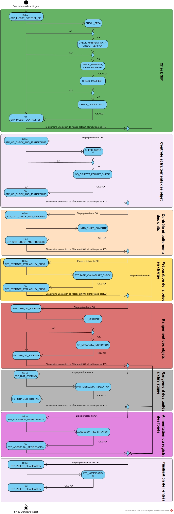

Workflow d'ingest/d'entrée
##########################

Introduction
============

Dans ce document, nous décrivons l'implémentation :

- du processus d'entrée (vision métier),
- la structure du workflow d'ingest interne/d'entrée dans la solution Vitam ainsi que l'implémentation mise en place pour celui-ci dans la version bêta de cette solution.

Processus d'entrée (vision métier)
==================================

Un workflow est un processus composé d’étapes (macro-workflow), qui sont elles-mêmes composées d’une liste d’actions à exécuter de manière séquentielle, une seule fois ou répétée sur une liste d’éléments (micro-workflow).

Chaque étape, chaque action peuvent avoir les statuts suivants :

- OK : le traitement associé s'est passé correctement. Le Workflow continue.
- Warning : le traitement associé a généré un avertissement (e.g. le format de l'objet est mal déclaré dans le bordereau de versement). Le Workflow continue.
- KO : le traitement associé a généré une erreur métier. Le Workflow s'arrête si le modèle d'execution est bloquant (cf. ci-dessous).
- FATAL : Le traitement associé a généré une erreur technique. Le Workflow s'arrête.

Chaque action peut avoir les modèles d'éxécutions suivants (Toutes les étapes sont par défaut bloquantes) :

- Bloquant

    * Si une action est identifiée en erreur, l'étape en cours est alors arrêtée et le workflow passe à la derniere étape de finalisation de l'entrée, un accusé de reception est généré et le statut du processus d’entrée passent à « erreur ».

- Non bloquant

    * Si une action est identifiée en erreur, le reste des actions est exécuté et le statut de l'étape correspondant passe à « erreur ». l'étape en cours est alors arrêtée et le workflow passe à la derniere étape de finalisation de l'entrée, un accusé de reception est généré et le statut du processus d’entrée passent à « erreur ».

Le processus d'entrée débute dès lors que le SIP est en cours de téléchargement vers Vitam. De plus, toutes les étapes et actions sont journalisées dans le journal des opérations.
Les étapes et actions associées ci-dessous décrivent le processus d'entrée (clé et description de la clé associée dans le journal des opérations) :

Contrôles préalables à l'entrée (STP_SANITY_CHECK_SIP)
------------------------------------------------------

  * Contrôle sanitaire (SANITY_CHECK_SIP)

    + **Règle** : Vérification de l'absence de virus dans le SIP.

    + **Type** : Bloquant.

    + **Statuts** :

      - OK : Aucun virus n'est détecté dans le SIP (SANITY_CHECK_SIP.OK=Succès du contrôle sanitaire : aucun virus détecté)

      - KO : Un ou plusieurs virus ont été detecté dans le SIP (SANITY_CHECK_SIP.KO=Échec du contrôle sanitaire du SIP : fichier détecté comme infecté)

      - FATAL : La vérification de la présence de virus dans le SIP n'a pas pu être faite suite à un problème technique (SANITY_CHECK_SIP.FATAL=Erreur fatale lors du contrôle sanitaire du SIP)

  * Contrôle du format du conteneur du SIP (CHECK_CONTAINER)

    + **Règle** : Vitam vérifie le format du SIP via un outil d'identification de format

    + **Formats acceptés** : .zip, .tar, .tar.gz, .tar.bz2

    + **Type** : Bloquant.

    + **Statuts** :

      - OK : Le SIP est au bon format (CHECK_CONTAINER.OK=Succès du contrôle de format du conteneur du SIP)

      - KO : Le SIP n'est pas au bon format (CHECK_CONTAINER.KO=Échec du contrôle de format du conteneur du SIP)

      - FATAL : Erreur système lié à l'outil d'identification des formats (CHECK_CONTAINER.FATAL=Erreur fatale lors du processus du contrôle de format du conteneur du SIP)

Réception dans vitam (STP_UPLOAD_SIP) : Etape du téléversement du SIP vers Vitam
--------------------------------------------------------------------------------

  * **Type** : Bloquant.

  * **Statuts** :

    + OK : Téléversement réalisé avec succès (STP_UPLOAD_SIP.OK=Succès du processus de téléchargement du SIP)

    + KO : Téléversement en échec (STP_UPLOAD_SIP.KO=Échec du processus de téléchargement du SIP)

    + FATAL : Erreur système, e.g. serveur indisponible (STP_UPLOAD_SIP.FATAL=Erreur Fatale lors du processus de téléchargement du SIP)

Contrôle du SIP (STP_INGEST_CONTROL_SIP)
----------------------------------------

  * Vérification globale du SIP (CHECK_SEDA) : Vérification de la cohérence physique du SIP

    + **Type de manifeste accepté** : Le manifeste est obligatoire dans le SIP, il doit être au format XML respectant le schéma SEDA 2.0 et doit être nommé manifest.xml.

    + **Type** : Bloquant.

    + **Statuts** :

      - OK : Le SIP est constitué correctement (CHECK_SEDA.OK=Succès de la vérification globale du SIP)

      - KO : Le manifeste est introuvable dans le SIP (CHECK_SEDA.NO_FILE.KO=Échec de la vérification globale du SIP : le manifeste est introuvable dans le SIP)

      - KO : Le manifeste n'est pas au format XML (CHECK_SEDA.NOT_XML_FILE.KO=Échec de la vérification globale du SIP : le manifeste de versement au mauvais format)

      - KO : Le manifeste ne respecte pas la norme SEDA 2.0 (CHECK_SEDA.NOT_XSD_VALID.KO=Échec de la vérification globale du SIP : manifeste non conforme au schéma SEDA 2.0)

      - FATAL : Autres erreurs techniques n'étant pas prises en compte fonctionnellement (CHECK_SEDA.FATAL=Erreur fatale lors de la vérification globale du SIP)

  * Vérification des usages des groupes d'objets (CHECK_MANIFEST_DATAOBJECT_VERSION)

    + **Types d'usages acceptés**: conservation papier (PhysicalMaster), conservation numérique (BinaryMaster), diffusion (Dissemination), Vignette (Thumbnail), Contenu brut (TextContent)

    + **Type** : Bloquant.

    + **Statuts** :

      - OK : Les objets contenus dans le manifest possède un usage cohérent avec ceux acceptés (CHECK_MANIFEST_DATAOBJECT_VERSION.OK=Succès de la vérification des usages des groupes d'objets)

      - KO : L'usage spécifié pour un ou plusieurs objets ne figure pas dans la liste (CHECK_MANIFEST_DATAOBJECT_VERSION.KO=Échec de la vérification des usages des groupes d'objets)

      - FATAL :  Autres erreurs techniques n'étant pas prises en compte fonctionnellement (CHECK_MANIFEST_DATAOBJECT_VERSION.FATAL=Erreur fatale lors de la vérification des usages des groupes d'objets)

  * Vérification du nombre d'objets (CHECK_MANIFEST_OBJECTNUMBER)

    + **Règle** : Le nombre d'objets déclaré dans le manifeste doit être égale au nombre d'objets contenus dans le SIP

    + **Type** : Bloquant.

    + **Statuts** :

      - OK : La règle est respectée (CHECK_MANIFEST_OBJECTNUMBER.OK=Succès de la vérification du nombre d'objets)

      - KO : La règle n'est pas respectée (CHECK_MANIFEST_OBJECTNUMBER.KO=Échec de la vérification du nombre d'objets)

  * Vérification de la cohérence du bordereau (CHECK_MANIFEST)

    + **Règle** : Cette étape permet la création des journaux de cycle de vie des Units et des ObjectGroup, la vérification de la présence de cycle dans les arboresences des Units, la création de l'arbre d'ordre d'indexation et l'extraction des métadonnées contenues dans la balise Management du manifeste pour le calcul des règles de gestion.

    + **Type** : Bloquant.

    + **Statuts** :

      - OK : Les journaux de cycles de vie des Units et des ObjectGroup ont été créés avec succès, aucune récursivité n'a été detecté dans l'arborescence des units (CHECK_MANIFEST.OK=Contrôle du bordereau réalisé avec succès)

      - KO : Une récursivité a été détecté dans l'arborescence des units (CHECK_MANIFEST.KO=Échec de contrôle du bordereau)

      - FATAL : Erreur technique, e.g. les journaux de cycles de vie n'ont pas pu être créés (CHECK_MANIFEST.FATAL=Erreur fatale lors de contrôle du bordereau)

  * Vérification de la cohérence entre objets, groupes d'objets et unités archivistiques (CHECK_CONSISTENCY)

    + **Règle** : Chaque objet ou groupe d'objet doit être référencé par un unit, les objets sans groupe d'objet mais référencés par un unit entrainent la création d'un groupe d'objet pour chacun d'entre eux. Ceux-ci seront déclarés par l'unit.

    + **Type** : Bloquant.

    + **Statuts** :

      - OK : La règle est respectée (CHECK_CONSISTENCY.OK=Succès de la vérification de la cohérence entre objets, groupes d'objets et unités archivistiques)

      - KO : La règle n'est pas respectée (CHECK_CONSISTENCY.KO=Échec de la vérification de la cohérence entre objets, groupes d'objets et unités archivistiques)

      - FATAL : Erreur technique (CHECK_CONSISTENCY.FATAL=Erreur fatale lors de la vérification de la cohérence entre objets, groupes d'objets et unités archivistiques)

Contrôle et traitements des objets (STP_OG_CHECK_AND_TRANSFORME)
----------------------------------------------------------------

  * Vérification de l'intégrité des objets (CHECK_DIGEST)

    + **Règle** : Vérification de la cohérence de l'empreinte de l'objet calculé par rapport à l'empreinte contenue dans le manifeste. Si l'empreinte contenue n'est pas calculée en SHA-512, alors le système lève un avertissement puis la recalcule via l'algorithme SHA-512. C'est celle-ci qui sera utilisée.

    + **Algorithmes autorisés** : MD5, SHA-1, SHA-256, SHA-512

    + **Type** : Bloquant.

    + **Statuts** :

      - OK : La règle est respectée. De plus, l'empreinte contenue dans le manifeste est calculé par l'algorithme SHA-512 (CHECK_DIGEST.OK=Succès de la vérification de lintégrité des objets)

      - KO : Les empreintes sont invalides (CHECK_DIGEST.KO=Échec de la vérification de lintégrité des objets)

      - FATAL : Erreur technique, e.g. algorithme inconnu (CHECK_DIGEST.FATAL=Erreur fatale lors de la vérification des objets)

      - WARNING : La règle est respectée, mais l'empreinte contenue dans le manifeste n'est pas calculée par l'algorithme SHA-512 (CHECK_DIGEST.WARNING=Avertissement lors de la vérification de lempreinte)

  * Identification des formats (OG_OBJECTS_FORMAT_CHECK)

    + **Règle** :  Vitam  identifie les formats de chaque document présent dans un SIP lors d'un versement, afin de garantir une information homogène et objective. Cette étape met en œuvre un outil d'identification prenant le fichier en entrée et fournissant des informations de format en sortie. Ces informations sont comparées avec celles déclarées dans le bordereau de versement. En cas d'incohérence entre la déclaration de l'application versante et l'identification par Vitam, le SIP sera tout de même accepté, générant un warning. Vitam se servira alors des informations qu'il a lui même identifiées et non celles de l'application versante.

    + **Type** : Bloquant.

    + **Statuts** :

      - OK : l'identification c'est bien passée et les formats ont été trouvés (OG_OBJECTS_FORMAT_CHECK.OK=Succès de la vérification des formats)

      - WARNING : l'outil est passé et Vitam a écrasé ou complété des méta données du bordereau (OG_OBJECTS_FORMAT_CHECK.WARNING=Avertissement lors de la vérification des formats)

      - KO : le format trouvé ne correspond pas à un format connu du référentiel, ou aucun format n'a été trouvé pour un objet (OG_OBJECTS_FORMAT_CHECK.KO=Échec de la vérification des formats)

      - FATAL : problème technique relatif au passage de l'outil (OG_OBJECTS_FORMAT_CHECK.FATAL=Erreur fatale lors de la vérification des formats)

Contrôle et traitements des unités archivistiques (STP_OG_CHECK_AND_TRANSFORME)
-------------------------------------------------------------------------------

  * Application des règles de gestion et calcul des dates d'échéances (UNITS_RULES_COMPUTE)

    + **Règle** :  Calcul des dates d'échéance des units racines si elles existent dans le manifeste (Si elles n'existent pas, elles sont récupérées depuis la balise ManagementMetadata du manifeste). Calcul des dates d'échéance des units filles si elles existent dans le manifeste. Le référentiel utilisé pour ce calcul est le référentiel des règles de gestion.

    + **Type** : Bloquant.

    + **Statuts** :

      - OK : Les règles de gestion sont connues du référentiel des règles de gestion et ont été appliquées avec succès (UNITS_RULES_COMPUTE.OK=Succès du calcul des dates d'échéance)

      - KO : La règle de gestion n'est pas présente dans le référentiel des règles de gestion (UNITS_RULES_COMPUTE.KO=Échec du calcul des dates d'échéance)

Préparation de la prise en charge (STP_STORAGE_AVAILABILITY_CHECK)
------------------------------------------------------------------

  * Vérification de la disponibilité de l'offre de stockage (STORAGE_AVAILABILITY_CHECK)

    + **Type** : Bloquant.

    + **Statuts** :

      - OK : L'offre de stockage est accessible et offre assez d'espace (STORAGE_AVAILABILITY_CHECK.OK=Succès de la vérification de la disponibilité de l'offre de stockage)

      - KO : L'offre de stockage n'est pas disponible (STORAGE_AVAILABILITY_CHECK.KO=Échec de la vérification de la disponibilité de l'offre de stockage)

      - FATAL : Erreur technique sur l'offre de stockage (STORAGE_AVAILABILITY_CHECK.FATAL=Erreur fatale lors de la vérification de la disponibilité de l'offre de stockage)

Rangement des objets (STP_OG_STORING)
-------------------------------------

  * Enregistrement des objets sur l'offre de stockage (OG_STORAGE)

    + **Type** : Bloquant.

    + **Statuts** :

      - OK : Tous les objets contenus dans le SIP ont été stocké dans l'offre de stockage (OG_STORAGE.OK=Succès du rangement des objets et groupes d'objets)

      - KO : Tous les objets n'ont pas pu être stocké dans l'offre de stockage (OG_STORAGE.KO=Échec du rangement des objets et groupes d'objets)

      - FATAL : Erreur technique (OG_STORAGE.FATAL=Erreur fatale lors du rangement des objets et groupes d'objets)

  * Indexation des métadonnées des groupes d'objets (OG_METADATA_INDEXATION)

    + **Règle** : Les métadonnées liées aux groupes d'objets sont indexées, e.g. la taille de l'objet, l'empreinte de l'objet, les métadonnées liées aux formats (Type MIME, PUID, etc.)

    + **Type** : Bloquant.

    + **Statuts** :

      - OK : Les métadonnées des groupes d'objets ont été indexé avec succès (OG_METADATA_INDEXATION.OK=Succès de l'indexation des métadonnées des objets et groupes d'objets)

      - KO : Les métadonnées des groupes d'objets n'ont pas pu être indexé (OG_METADATA_INDEXATION.KO=Échec de l'indexation des métadonnées des objets et groupes d'objets)

      - FATAL : Erreur technique (OG_METADATA_INDEXATION.FATAL=Erreur fatale lors de l'indexation des métadonnées des objets et groupes d'objets)

Rangement des unites archivistiques (STP_UNIT_STORING)
------------------------------------------------------

  * Indexation des métadonnées des unités archivistiques (UNIT_METADATA_INDEXATION)

    + **Type** : Bloquant.

    + **Statuts** :

      - OK : Les métadonnées des unités archivistiques ont été indexé avec succès (UNIT_METADATA_INDEXATION.OK=Succès de l'indexation des métadonnées des unités archivistiques)

      - KO : Les métadonnées des unités archivistiques n'ont pas pu être indexé (UNIT_METADATA_INDEXATION.KO=Échec de l'indexation des métadonnées des unités archivistiques)

      - FATAL : Erreur technique (UNIT_METADATA_INDEXATION.FATAL=Erreur fatale lors de l'indexation des métadonnées des unités archivistiques)

Registre des fonds (STP_ACCESSION_REGISTRATION)
-----------------------------------------------

  * Alimentation du registre des fonds (ACCESSION_REGISTRATION)

    + **Règle** : Le registre des fonds est alimenté par service producteur.

    + **Type** : Bloquant.

    + **Statuts** :

      - OK : Le registre des fonds est correctement alimenté (ACCESSION_REGISTRATION.OK=Succès de l'alimentation du registre des fonds)

      - KO : Le registre des fonds n'a pas pu être alimenté(ACCESSION_REGISTRATION.KO=Échec de l'alimentation du registre des fonds)

      - FATAL : Erreur technique (ACCESSION_REGISTRATION.FATAL=Erreur fatale lors de l'alimentation du registre des fonds)

Finalisation de l'entrée (STP_INGEST_FINALISATION)
--------------------------------------------------

  * Notification de la fin de l'opération d'entrée (ATR_NOTIFICATION)

    + **Règle** : Une fois toutes les étapes passées avec succès ou lorsqu'une étape est en échec, cette étape est lancée. Elle gènere un accusé de réception (ArchiveTransferReply ou ATR), le stocke dans l'offre de stockage et l'envoie au service versant.

    + **Type** : Bloquant.

    + **Statuts** :

      - OK : L'ATR a été correctement généré, stocké dans l'offre de stockage et envoyé au service versant (ATR_NOTIFICATION.OK=Succès de la notification à l'opérateur de versement)

      - KO : Le service versant n'a pas reçu l'ATR (ATR_NOTIFICATION.KO=Échec de la notification à l'opérateur de versement)

      - FATALE : Erreur technique (ATR_NOTIFICATION.FATAL=Erreur fatale lors de la notification à l'opérateur de versement)

Structure du Workflow (Bêta)
============================

Le workflow actuel mis en place dans la solution Vitam est défini dans l'unique fichier "DefaultIngestWorkflow.json".
Il décrit le processus d'entrée (hors Ingest externe) pour entrer un SIP, indexer les métadonnées et stocker les objets contenues dans le SIP.

.. code-block:: json

   {
     "id": "DefaultIngestWorkflow",
     "comment": "Default Ingest Workflow V6",
     "steps": [
       {
         "workerGroupId": "DefaultWorker",
         "stepName": "STP_INGEST_CONTROL_SIP",
         "behavior": "BLOCKING",
         "distribution": {
           "kind": "REF",
           "element": "SIP/manifest.xml"
         },
         "actions": [
           {
             "action": {
               "actionKey": "CHECK_SEDA",
               "behavior": "BLOCKING"
             }
           },
           {
             "action": {
               "actionKey": "CHECK_MANIFEST_DATAOBJECT_VERSION",
               "behavior": "BLOCKING"
             }
           },
           {
             "action": {
               "actionKey": "CHECK_MANIFEST_OBJECTNUMBER",
               "behavior": "NOBLOCKING"
             }
           },
           {
             "action": {
               "actionKey": "CHECK_MANIFEST",
               "behavior": "BLOCKING",
               "out": [
                 {
                   "name": "unitsLevel.file",
                   "uri": "WORKSPACE:UnitsLevel/ingestLevelStack.json"
                 },
                 {
                   "name": "mapsBDOtoOG.file",
                   "uri": "WORKSPACE:Maps/BDO_TO_OBJECT_GROUP_ID_MAP.json"
                 },
                 {
                   "name": "mapsBDO.file",
                   "uri": "WORKSPACE:Maps/BINARY_DATA_OBJECT_ID_TO_GUID_MAP.json"
                 },
                 {
                   "name": "mapsObjectGroup.file",
                   "uri": "WORKSPACE:Maps/OBJECT_GROUP_ID_TO_GUID_MAP.json"
                 },
                 {
                   "name": "mapsObjectGroup.file",
                   "uri": "WORKSPACE:Maps/OG_TO_ARCHIVE_ID_MAP.json"
                 },
                 {
                   "name": "mapsBDOtoVersionBDO.file",
                   "uri": "WORKSPACE:Maps/BDO_TO_VERSION_BDO_MAP.json"
                 },
                 {
                   "name": "mapsUnits.file",
                   "uri": "WORKSPACE:Maps/ARCHIVE_ID_TO_GUID_MAP.json"
                 },
                 {
                   "name": "globalSEDAParameters.file",
                   "uri": "WORKSPACE:ATR/globalSEDAParameters.json"
                 }
               ]
             }
           },
           {
             "action": {
               "actionKey": "CHECK_CONSISTENCY",
               "behavior": "NOBLOCKING",
               "in": [
                 {
                   "name": "mapsBDOtoOG.file",
                   "uri": "WORKSPACE:Maps/OG_TO_ARCHIVE_ID_MAP.json"
                 },
                 {
                   "name": "mapsBDOtoOG.file",
                   "uri": "WORKSPACE:Maps/OBJECT_GROUP_ID_TO_GUID_MAP.json"
                 }
               ]
             }
           }
         ]
       },
       {
         "workerGroupId": "DefaultWorker",
         "stepName": "STP_OG_CHECK_AND_TRANSFORME",
         "behavior": "BLOCKING",
         "distribution": {
           "kind": "LIST",
           "element": "ObjectGroup"
         },
         "actions": [
            {
             "action": {
               "actionKey": "CHECK_DIGEST",
               "behavior": "BLOCKING",
               "in": [
                 {
                   "name": "algo",
                   "uri": "VALUE:SHA-512"
                 }
               ]
             }
           },
           {
             "action": {
               "actionKey": "OG_OBJECTS_FORMAT_CHECK",
               "behavior": "BLOCKING"
             }
           }
         ]
       },
       {
         "workerGroupId": "DefaultWorker",
         "stepName": "STP_UNIT_CHECK_AND_PROCESS",
         "behavior": "BLOCKING",
         "distribution": {
           "kind": "LIST",
           "element": "Units"
         },
         "actions": [
           {
             "action": {
               "actionKey": "UNITS_RULES_COMPUTE",
               "behavior": "BLOCKING"
             }
           }
         ]
       },
       {
         "workerGroupId": "DefaultWorker",
         "stepName": "STP_STORAGE_AVAILABILITY_CHECK",
         "behavior": "BLOCKING",
         "distribution": {
           "kind": "REF",
           "element": "SIP/manifest.xml"
         },
         "actions": [
           {
             "action": {
               "actionKey": "STORAGE_AVAILABILITY_CHECK",
               "behavior": "BLOCKING"
             }
           }
         ]
       },
       {
         "workerGroupId": "DefaultWorker",
         "stepName": "STP_OG_STORING",
         "behavior": "BLOCKING",
         "distribution": {
           "kind": "LIST",
           "element": "ObjectGroup"
         },
         "actions": [
           {
             "action": {
               "actionKey": "OG_STORAGE",
               "behavior": "BLOCKING"
             }
           },
           {
             "action": {
               "actionKey": "OG_METADATA_INDEXATION",
               "behavior": "BLOCKING"
             }
           }
         ]
       },
       {
         "workerGroupId": "DefaultWorker",
         "stepName": "STP_UNIT_STORING",
         "behavior": "BLOCKING",
         "distribution": {
           "kind": "LIST",
           "element": "Units"
         },
         "actions": [
           {
             "action": {
               "actionKey": "UNIT_METADATA_INDEXATION",
               "behavior": "BLOCKING"
             }
           }
         ]
       },
       {
         "workerGroupId": "DefaultWorker",
         "stepName": "STP_ACCESSION_REGISTRATION",
         "behavior": "BLOCKING",
         "distribution": {
           "kind": "REF",
           "element": "SIP/manifest.xml"
         },
         "actions": [
           {
             "action": {
               "actionKey": "ACCESSION_REGISTRATION",
               "behavior": "BLOCKING",
               "in": [
                 {
                   "name": "mapsUnits.file",
                   "uri": "WORKSPACE:Maps/ARCHIVE_ID_TO_GUID_MAP.json"
                 },
                 {
                   "name": "mapsBDO.file",
                   "uri": "WORKSPACE:Maps/OBJECT_GROUP_ID_TO_GUID_MAP.json"
                 },
                 {
                   "name": "mapsBDO.file",
                   "uri": "WORKSPACE:Maps/BDO_TO_BDO_INFO_MAP.json"
                 },
                 {
                   "name": "globalSEDAParameters.file",
                   "uri": "WORKSPACE:ATR/globalSEDAParameters.json"
                 }
               ]
             }
           }
         ]
       },
       {
         "workerGroupId": "DefaultWorker",
         "stepName": "STP_INGEST_FINALISATION",
         "behavior": "FINALLY",
         "distribution": {
           "kind": "REF",
           "element": "SIP/manifest.xml"
         },
         "actions": [
           {
             "action": {
               "actionKey": "ATR_NOTIFICATION",
               "behavior": "BLOCKING",
               "in": [
                 {
                   "name": "mapsUnits.file",
                   "uri": "WORKSPACE:Maps/ARCHIVE_ID_TO_GUID_MAP.json",
                   "optional": "true"
                 },
                 {
                   "name": "mapsBDO.file",
                   "uri": "WORKSPACE:Maps/BINARY_DATA_OBJECT_ID_TO_GUID_MAP.json",
                   "optional": "true"
                 },
                 {
                   "name": "mapsBDOtoOG.file",
                   "uri": "WORKSPACE:Maps/BDO_TO_OBJECT_GROUP_ID_MAP.json",
                   "optional": "true"
                 },
                 {
                   "name": "mapsBDOtoVersionBDO.file",
                   "uri": "WORKSPACE:Maps/BDO_TO_VERSION_BDO_MAP.json",
                   "optional": "true"
                 },
                 {
                   "name": "globalSEDAParameters.file",
                   "uri": "WORKSPACE:ATR/globalSEDAParameters.json",
                   "optional": "true"
                 }
               ],
               "out": [
                 {
                   "name": "atr.file",
                   "uri": "WORKSPACE:ATR/responseReply.xml"
                 }
               ]
             }
           }
         ]
       }
     ]
   }

D'une façon synthétique, le workflow est décrit de cette façon :

  Diagramme d'état / transitions du workflow d'ingest

- **Step 1** - STP_INGEST_CONTROL_SIP : Check SIP  / distribution sur REF GUID/SIP/manifest.xml

  * CHECK_SEDA (CheckSedaActionHandler.java) :

    + Test de l'existence du manifest.xml,

    + Validation XSD du manifeste,

    + Validation de la structure du manifeste par rapport au schema SEDA v. 2.0.

  * CHECK_MANIFEST_DATAOBJECT_VERSION (CheckVersionActionHandler.java) :

    + Vérification des usages des objets.

  * CHECK_MANIFEST_OBJECTNUMBER (CheckObjectsNumberActionHandler.java) :

    + Comptage des objets (BinaryDataObject) dans le manifest.xml en s'assurant de l'absence de doublon, que le nombre d'objets reçus est strictement égal au nombre d'objets attendus

    + Création de la liste des objets dans le workspace GUID/SIP/content/,

    + Comparaison du nombre et des URI des objets contenus dans le SIP avec celui défini dans le manifeste.

  * CHECK_MANIFEST (ExtractSedaActionHandler.java) :

    + Extraction des Units, des BinaryDataObject,

    + Création des journaux de cycle de vie des Units et des ObjectGroup,

    + Vérification de la présence de cycle dans les arboresences des Units,

    + Création de l'arbre d'ordre d'indexation,

    + Extraction des métadonnées contenues dans le Management du manifeste pour le calcul des règles de gestion.

  * CHECK_CONSISTENCY (CheckObjectUnitConsistencyActionHandler.java) :

    + Extraction des BinaryDataObject du manifest.xml et création de la MAP (table de concordance) des Id BinaryDataObject / Génération GUID (de ces mêmes BinaryDataObject),

    + Extraction des ArchiveUnit du manifest.xml et création de la MAP des id ArchiveUnit / Génération GUID (de ces mêmes ArchiveUnit),

    + Contrôle des références dans les ArchiveUnit des Id BinaryDataObject,

    + Vérification de la cohérence objet/unit,

    + Stockage dans le Workspace des BinaryDataObject et des ArchiveUnit.

- **Step 2** - STP_OG_CHECK_AND_TRANSFORME : Contrôle et traitements des objets / distribution sur LIST GUID/BinaryDataObject

  * CHECK_DIGEST (CheckConformityActionHandler.java) :

    + Contrôle de l'objet binaire correspondant : la taille et l'empreinte du BinaryDataObject.

  * Calcul d'une empreinte avec l'algorithme SHA-512 si l'empreinte du manifeste n'a pas été calculée avec cet algorithme

  * OG_OBJECTS_FORMAT_CHECK (FormatIdentificationActionHandler.java):

    + Identification du format des BinaryDataObject,

  * Vérification de l'existence du format identifié dans le référentiel des formats

    + Consolidation de l'information du format dans l'ObjectGroup correspondant si nécessaire.

- **Step 3** - STP_UNIT_CHECK_AND_PROCESS : Contrôle et traitements des units / distribution sur LIST GUID

  * UNITS_RULES_COMPUTE (UnitsRulesComputeHandler.java) :

    + vérification de l'existence de la règle dans le référentiel des règles de gestion

  * calcul des échéances associées à chaque ArchiveUnit.

- **Step 4** - STP_STORAGE_AVAILABILITY_CHECK : Préparation de la prise en charge / distribution REF GUID/SIP/manifest.xml

  * STORAGE_AVAILABILITY_CHECK (CheckStorageAvailabilityActionHandler.java) :

    + Calcul de la taille totale des objets à stocker,

    + Contrôle de la taille totale des objets à stocker par rapport à la capacité des offres de stockage pour une stratégie et un tenant donnés.

- **Step 5** - STP_OG_STORING : Rangement des objets

  * OG_STORAGE (StoreObjectGroupActionHandler.java) :

    + Écriture des objets sur l’offre de stockage des BinaryDataObject des ObjectGroup.

  * OG_METADATA_INDEXATION (IndexObjectGroupActionHandler.java) :

    + Enregistrement en base des ObjectGroup.

- **Step 6** - STP_UNIT_STORING : Rangement des unités archivistique / distribution sur LIST GUID/Units

  * UNIT_METADATA_INDEXATION (IndexUnitActionHandler.java) :

    + Transformation sous la forme Json des Units et intégration du GUID Unit et du GUID ObjectGroup,

    + Enregistrement en base des Units.

- **Step 7** - STP_ACCESSION_REGISTRATION : Alimentation du registre des fonds

  * ACCESSION_REGISTRATION (AccessionRegisterActionHandler.java) :

    + Création/Mise à jour et enregistrement des collections AccessionRegisterDetail et AccessionRegisterSummary concernant les archives prises en compte, par service producteur.

- **Step 8 et finale** - STP_INGEST_FINALISATION : Finalisation de l'entrée. Cette étape est obligatoire et sera toujours exécutée, en dernière position.

  * ATR_NOTIFICATION (TransferNotificationActionHandler.java) :

    + Génération de l'ArchiveTransferReply.xml (peu importe le statut du processus d'ingest, l'ATR est obligatoirement généré),

    + Stockage de l'ArchiveTransferReply dans les offres de stockage.

Structure du fichier Properties du Worflow
==========================================

Le fichier Properties permet de définir la structure du Workflow (depuis l'Ingest Interne) n'incluant pas les étapes en dehors de l'entrée (Ingest externe).

La structure du fichier est la suivante :

.. figure:: images/workflow.jpg
  :align: center

  Structure du fichier de définition du workflow

Un Workflow est défini en JSON avec la structure suivante :

- un bloc en-tête contenant :

    + ``ID`` : identifiant unique du workflow,

    + ``Comment`` : description du workflow ou toutes autres informations utiles concernant le workflow

- une liste d'étapes dont la structure est la suivante :

    + ``workerGroupId`` : identifiant de famille de Workers,

    + ``stepName`` : nom de l'étape, servant de clé pour identifier l'étape,

    + ``Behavior`` : modèle d'exécution pouvant avoir les types suivants :

      - BLOCKING : le traitement est bloqué en cas d'erreur, il est nécessaire de recommencer le workflow,

      - NOBLOCKING : le traitement peut continuer malgrée les erreurs ou avertissements,

      - FINALLY : le traitement correspondant est toujours exécuté

    + ``Distribution`` : modèle de distribution, décrit comme suit :

      - ``Kind`` : un type pouvant être REF (i.e. élément unique) ou LIST (i.e. liste d'éléments)

      - ``Element`` : l'élément de distribution indiquant l'élément unique sous forme d'URI (REF) ou la liste d'éléments en pointant vers un dossier (LIST).

    + une liste d'Actions :

      - ``ActionKey`` : nom de l'action

      - ``Behavior`` : modèle d'exécution pouvant avoir les types suivants :
        - BLOCKING : l'action est bloquante en cas d'erreur. Les actions suivantes (de la meme étape) ne seront pas éxécutées.
        - NOBLOCKING : l'action peut continuer malgrée les erreurs ou avertissements.

      - ``In`` : liste de paramètres d'entrées :
        - ``Name`` : Nom utilisé pour référencer cet élément entre différents handlers d'une même étape,

        - ``URI`` : Cible comportant un schema (WORKSPACE, MEMORY, VALUE) et un path où chaque handler peut accéder à ces valeurs via le handlerIO :
          - WORKSPACE : path indique le chemin relatif sur le workspace (implicitement un File),
          - MEMORY : path indique le nom de la clef de valeur (implicitement un objet mémoire déjà alloué par un Handler précédent),
          - VALUE : path indique la valeur statique en entrée (implicitement une valeur String).

      - ``Out`` : liste de paramètres de sorties :
        - ``Name`` : nom utilisé pour référencer cet élément entre différents handlers d'une même étape,

        - ``URI`` : cible comportant un schema (WORKSPACE, MEMORY) et un path où chaque handler peut stocker les valeurs finales via le handlerIO :
          - WORKSPACE : path indique le chemin relatif sur le workspace (implicitement un File local),
          - MEMORY : path indique le nom de la clef de valeur (implicitement un objet mémoire).

Le code ci-dessous, à titre informatif, donne un exemple partiel de workflow, avec les notions étapes et actions.

.. code-block:: json

  {
    "id": "DefaultIngestWorkflow",
    "comment": "Default Ingest Workflow V6",
    "steps": [
      {
        "workerGroupId": "DefaultWorker",
        "stepName": "STP_INGEST_CONTROL_SIP",
        "behavior": "BLOCKING",
        "distribution": {
          "kind": "REF",
          "element": "SIP/manifest.xml"
        },
        "actions": [
          {
            "action": {
              "actionKey": "CHECK_SEDA",
              "behavior": "BLOCKING"
            }
          },
          {
            "action": {
              "actionKey": "CHECK_MANIFEST",
              "behavior": "BLOCKING",
              "out": [
                {
                  "name": "mapsBDOtoOG.file",
                  "uri": "WORKSPACE:Maps/OG_TO_ARCHIVE_ID_MAP.json"
                }
              ]
            }
          },
          {
            "action": {
              "actionKey": "CHECK_CONSISTENCY",
              "behavior": "NOBLOCKING",
              "in": [
                {
                  "name": "mapsBDOtoOG.file",
                  "uri": "WORKSPACE:Maps/OG_TO_ARCHIVE_ID_MAP.json"
                }
              ]
            }
          }
        ]
      }
    ]
  }
