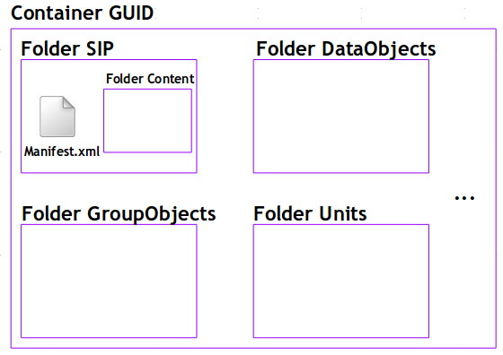

Workspace
############

Arborescence
**************************

- ** example d'arborescence d'un container dans le workspace ** :

- ** détails ** : TODO

Pour chaque stream SIP

Container GUID 

Folder GUID/SIP   :   stream SIP dézipé (manifest.xml et  content)

Folder GUID/DataObjects   : Physical/Binary DataObject
 
Folder GUID/ObjectGroups  : hypothèse  à ce stade un BinaryDataObject = un ObjectGroup

Folder GUID/Units   : ArchiveUnit
