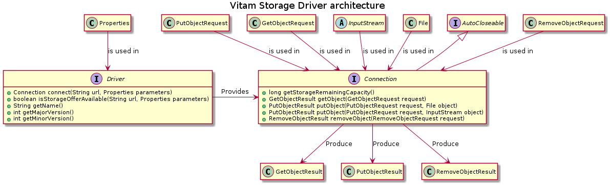

Storage Driver
**************

Présentation
------------

|  *Parent package:* **fr.gouv.vitam.storage**
|  *Package proposition:* **fr.gouv.vitam.storage.driver**

Ce module définit l'API "Driver" que doivent implémenter les fournisseurs d'offres de stockage. Un driver peut être
assimilé à un module "client" qui permet de dialoguer avec une offre de stockage distante et qui satisfait un contrat
de service défini dans l'interface.

Architecture
------------

Pour permettre au moteur d'exécution de dialoguer avec un service d'offre de stockage, deux interfaces doivent être
implémentées par le fournisseur d'offre :

- **Driver**
    Objet technique responsable d'établir une connexion avec le service de stockage en fonction des
    paramètres qui lui sont fournis. C'est aussi lui qui est responsable de déterminer si le service est disponible ou
    non.
- **Connection**
    L'établissement d'une connexion au service distant via le driver produit un object **Connection**
    qui est lié à un contexte d'exécution précis.

    En effet, les paramètres initiaux utilisés pour l'établissement de la connexion, et donc l'instanciation d'un
    objet **Connection**, ne peuvent être modifiés sur l'objet **Connection**.

    Par exemple, l'URL de base du service ne peut être modifiée. S'il y a besoin d'une connexion vers un autre
    serveur, ou en tant qu'utilisateur différent, il faut créer une nouvelle connexion en réutilisant le driver.

Le diagramme suivant décrit les relations entre ces 2 interfaces et les objets connexes utilisés dans le cadre de
requêtes :

Pour aller plus loin
--------------------

Certaines notions seront implémentées plus tard telles que :

- **Thread pool :**
    Mettre en place un mécanisme de limitation du nombre de thread concurents utilisant des drivers.

- **Connection pool :**
    Bien que proche du premier point, celui-ci est à mettre en place au niveau Driver dirctement.
    En effet, le principe est de permettre la configuration (et donc la limitation) du nombre de connexions
    concurrentes faites par un même Driver pour une offre donnée.

- **Extension des services :**
    L'interface driver (et l'interface **Connection** associée) a pour vocation de définir les services minimums que
    doit assurer l'offre de stockage distante. L'interface driver pourra donc évoluer pour augmenter la finesse ou le
    nombre de services que l'offre doit assurer pour être compatible avec Vitam.
