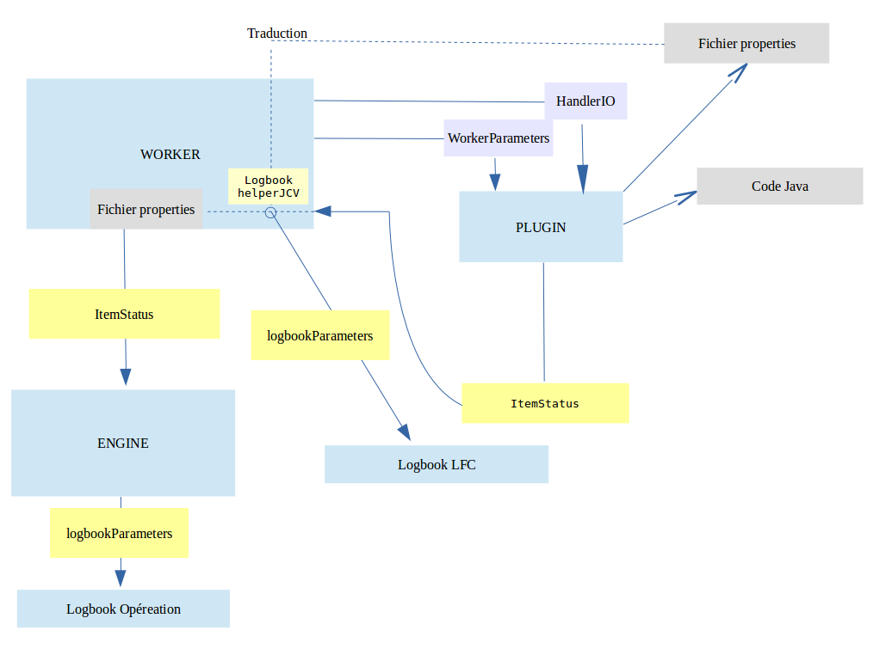

Plugin Worker
##############

But de cette documentation
===========================

L'objectif de cette documentation est d'expliquer l'architecture technique des plugins de worker.

Introduction
=============

Le plugin worker est une classe java qui réaslise des actions dans le workflow comme les Handler. 
Dans le workflow, si l'action traite une action qui a besoin un enregistrement JCV, le plugin sera remplacé 
le Handler.

Le plugin prends en entrée une interface HandlerIO pour charger les fichier de vitam, les paramètres du worker
En sortie, il retourne les status des traitements et chaque status contient un code de traitement 
(définit dans le fichier properties du plugin, si ce n’est pas définit on utilise le code par défaut)

D'une façon synthétique, le plugin worker est décrit de cette façon :

Appel du plugin
==================

Au démarrage du service, le serveur `worker` charge tous les  `plugins` et leurs fichier de propriétés. 
Les référentiels de `plugin` sont déclarés dans un fichier de configuration : 

.. sourcecode:: json

  {
     "NOM_DE_PLUGIN_1": {
       "className": "package.plugin.class_1",
       "propertyFile": "le_fichier_de_properties_1"
    },
    "NOM_DE_PLUGIN_2": {
      "className": "package.plugin.class_2",
      "propertyFile": "le_fichier_de_properties_2"
    }
  }

Au démarrage de chaque `worker`, la liste des plugins va être analysé. Puis le serveur va tenter d'instancier chaque plugin de la liste.
Si un des plugins ne se lance pas pour une raison quelconque (nom de classe incorrect, impossible d'instancier la classe, ...), alors le serveur ne démarrera pas.

Les plugins ne sont pas pour l'instant thread safe dans Vitam, ce qui signifie que un plugin est réinstancié pour chaque appel au serveur worker.

Résultat du plugin
====================

Après ses traitements, Plugin doit retourner au Worker un ItemStatus. Quand le Worker reçoit le résultat : 

- Il doit le traduire en utilisant par défaut le fichier de properties VITAM (vitam-logbook-messages_fr.properties) 

si les clés ne sont pas définies dans ce fichier, alors il va chercher la valeur du label dans le fichier properties 
du `plugin` puis envoie à `Engine` pour écrire dans les journaux des opération. 

- Construire et écrire LogbookLifeCycle.

Implémentation 
====================

Worker
-------

- **getActionHandler**: pour chaque action, le worker vérifie si l’action est dans la liste des plugins, il va le charger, si non on utilise les handlers prédéfinis dans Vitam
- **writeLogbookLifeCycle** : traduire le code d’action d’un ItemStatus du Plugin en LogbookLifeCycleParameters puis en fonction du type d’élément dans la distribution (Unit ou ObjectGroup), il écrit dans la base de données correspondante

Exemple: Le plugin CHECK_DIGEST fait un traitement CALC_CHECK qui donne un status OK. 

Le résultat retourné du plugin contiendra :

.. sourcecode:: text

   {
    "globalStatus" : OK ,
    "itemsStatus" : [ {"CALC_CHECK" :  { "globalStatus" : OK  }}] 
   }

Alors le worker va écrire ces événements ci-dessous dans :term:`LFC`.

.. sourcecode:: text

   {
    {
      "evType" : "LFC.CHECK_DIGEST ",
      "outcome" : "OK",
      "outDetail" : "LFC.CHECK_DIGEST..OK",
    },
    {
      "evType" : "LFC.CHECK_DIGEST.CALC_CHECK ",
      "outcome" : "OK",
      "outDetail" : "LFC.CHECK_DIGEST.CALC_CHECK.OK",
    }
   }

L’écriture des journaux des opérations garde son implémentation.

PluginPropertiesLoader 
-----------------------

c'est un service pour charger les définitions du code dans le fichier de properties du plugin

Intégration
-------------

Cela définit comment Worker appelle les plugins.

``java -cp "/vitam/lib/${unix.name}/*" fr.gouv.vitam.worker.server.rest.WorkerApplication``
au lieu de 
``java -jar "/vitam/lib/${unix.name}/${project.build.finalName}.jar"``

Donc les JAR du plugin doit être placé dans ``/vitam/lib/worker/``.

