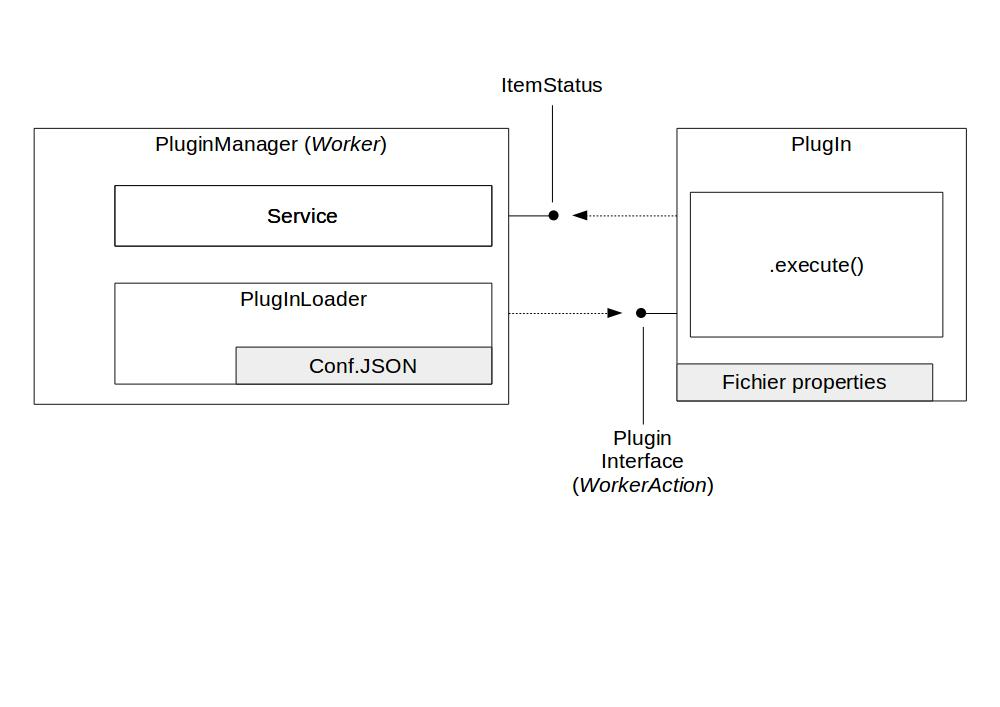

Worker Plugin
#############

Présentation
===============

Un plugin est un programme informatique conçu pour ajouter des fonctionnalités à un autre logiciel (appelé logiciel hôte). 
En français, on utilise également les termes équivalents de "module d'extension" ou de "greffon".
Dans le cadre de VITAM, un plugin pourra être ajouté dans un ou plusieurs Workflow(s) spécifique(s) pour effectuer de nouvelles fonctionnalités sur un type d'objet prédéfini (archive unit, manifest, ...) 

Présentation de l'architecture VITAM
----------------------------------------

Dans VITAM, on appelle Workflow une liste d'étapes (steps) devant être exécutées sur un objet particulier.

 - Un workflow est défini dans un fichier json. Ce fichier répertorie les différentes étapes et détaille également la liste des différentes actions à effectuer.
 - Le moteur d'exécution de Workflow (processing-engine) de VITAM va donc à partir de ce fichier json, pouvoir fournir à un Worker une étape particulière à exécuter.
 - Le Worker est responsable de l'exécution d'une étape, il devra retourner le résultat de son exécution à l'engine. Il est également responsable de lancer les différentes actions à exécuter décrites dans le fichier json. 
 - Une action exécutée par un Worker se fait via l'exécution d'un plugin spécifique.
 - La liste des plugins disponibles pour le Worker est inscrite dans un fichier de configuration json. Dans ce fichier, on pourra trouver la déclaration des différentes actions (une action = un plugin). Un plugin est identifié par un nom de classe ainsi qu'un fichier de configuration. Au démarrage de l'application, le Worker va charger cette liste de plugins, afin d'être capable par la suite d'exécuter le code adéquat.
 
 Le plugin doit respecter un contrat afin qu'il puisse :

  - recevoir du worker une liste de paramètre d'entrée contenant le nécessaire pour exécuter les actions que le plugin est censée prendre en charge.
  - retourner au worker un statut d'exécution complet utilisable.
  
D'une façon synthétique, voici la place du plugin dans l'architecture Vitam :

Définition du plugin VITAM
------------------------------

Un plugin au sens VITAM propose une liste d'action(s) à réaliser sur un ou plusieurs objets de même type.
A l'heure actuelle, un plugin ne peut être ajouté qu'à froid. Un redémarrage de la plateforme est nécessaire pour prendre en considération l'ajout d'un nouveau plugin à un workflow existant.
Au démarrage, le serveur worker charge tous les  plugins ainsi que leurs fichiers de properties.
La liste des plugins à charger est déclarée dans un fichier de configuration du Worker : 

.. literalinclude:: includes/pluginsList.json
   :language: javascript
   :linenos:

Le plugin doit implémenter la classe ActionHandler et doit surcharger soit la méthode ``execute()`` pour un traitement unitaire, soit la méthode ``executeAll()`` pour un traitemement de masse.
Un plugin prend en paramètres :
- WorkerParameters : objet contenant une liste de paramètres permettant d'exécuter des actions variées. Voici une liste non exhaustive des paramètres : url du service workspace, nom de l'étape en cours, container sur lequel l'action est exécutée, identifiant du process, url du service metadata, l'id de l'objet sur lequel on veut effectuer un traitement, etc... 
- HandlerIO qui a pour charge d'assurer la liaison avec le Workspace et la mémoire entre les différents traitements. Il permet de passer une liste d'input permettant le traitement du plugin.
 
La méthode doit retourner un objet de type ItemStatus, qui sera détaillé plus en détail dans un paragraphe dédié.

De manière synthétique, voici le fonctionnement du plugin VITAM.

.. figure:: images/plugin.png
   :align: center  

Gestion des entrants du plugin
=================================

WorkerParameters
--------------------

Les paramètres WorkerParameters sont des paramètres permettant aux différents plugins d'exécuter leurs différentes actions.

Actuellement 5 paramètres sont obligatoires pour tous les workers :
- urlMetadata afin d'intialiser le client metadata
- urlWorkspace afin d'initialiser le client workspace
- objectName le nom de l'object lorsque l'on boucle sur une liste
- currentStep le nom de l'étape
- containerName l'identifiant du container
 
Les autres paramètres sont les suivants : 
- processId : id du process en cours d'exécution. Le pattern du processId est de la forme : {CONTAINER_NAME}_{WORKFLOW_ID}_{STEP_RANK_IN_THE_WORKFLOW}_{STEP_NAME}
- stepUniqId : id de l'étape en cours d'exécution
- objectId : id de l'objet sur lequel l'action va s'exécuter une action
- workerGUID : id du worker ayant lancé l'action
- metadataRequest : indique si l'action doit utiliser le module metadata
- workflowStatusKo : si le worklow en cours a un statut KO ou FATAL, il contient son statut.
 
Pour récupérer un paramètre, il suffit d'appliquer : 

.. sourcecode:: java
   
  @Override
  public ItemStatus execute(WorkerParameters params, HandlerIO actionDefinition) {
    
    // on récupère le nom de l'objet sur lequel l'action va être effectuée
    final String objectName = params.getObjectName();
    // on récupère le nom de l'étape en cours
    final String currentStep = params.getCurrentStep();
    // il est possible de récupérer la même information différemment :
    final String currentStepBis = params.getParameterValue(WorkerParameterName.currentStep);
    // TODO : maintenant, réalisons l'action 
    // on retourne un ItemStatus      
    return new ItemStatus();                   
  }

HandlerIO
-------------

Le HandlerIO a pour charge d'assurer la liaison avec le Workspace et la mémoire entre les différentes actions d'un step, exécutées dans différents plugins.
Dans un workflow, est spécifiée une liste d'objets (de fichiers, de valeurs, etc...) qui en complément des WorkerParameters peuvent être transmis à travers le HandlerIO.
Il revient au HandlerIO d'assurer la livraison de ces différents objets.

Dans un workflow, nous avons donc des listes d'inputs et d'outputs. Ces listes sont configurées dans un fichier json de configuration
Les inputs peuvent être utilisés par les différents plugins (selon la spécification dans la configuration du workflow.

Voici un json d'exemple de configuration de workflow : 

.. literalinclude:: includes/DefaultIngestWorkflow.json
   :language: json
   :linenos:

Voici un exemple, de ce que l'on pourrait trouver au seun d'une action en terme d'input et d'output :

.. sourcecode:: text

   "action": {
    "actionKey": "CHECK_CONSISTENCY",
    "behavior": "NOBLOCKING",
    "in": [
      {
        "name": "mapsDOtoOG.file",
        "uri": "MEMORY:MapsMemory/OG_TO_ARCHIVE_ID_MAP.json"
      },
      {
        "name": "mapsObjectGroup.file",
        "uri": "MEMORY:MapsMemory/OBJECT_GROUP_ID_TO_GUID_MAP.json"
      }, 
      {
        "name": "algo",
        "uri": "VALUE:SHA-512"
      }
    ],
    "out": [
      {
        "name": "atr.file",
        "uri": "WORKSPACE:ATR/responseReply.xml"
      }
    ]
   }

On peut noter qu'il existe plusieurs types d'inputs qui sont identifiés par :  

- un nom (name) utilisé pour référencer cet élément entre différents handlers d'une même étape
- une cible (uri) comportant un schema (WORKSPACE, MEMORY, VALUE) et un path :

   - WORKSPACE:path  -> indique le chemin relatif sur le workspace
   - MEMORY:path -> indique le nom de la clef de valeur
   - VALUE:path -> indique la valeur statique en entrée

On peut noter qu'il existe plusieurs types d'outputs qui sont identifiés par :      

Il existe plusieurs manières de récupérer les différents objets dans les plugins, faisons un tour d'horizon.

- un nom (name) utilisé pour référencer cet élément entre différents handlers d'une même étape
- une cible (uri) comportant un schema (WORKSPACE, MEMORY) et un path :

    - WORKSPACE:path indique le chemin relatif sur le workspace
    - MEMORY:path indique le nom de la clef de valeur

Chaque plugin peut donc accéder aux différents inputs ou peut stocker différents outputs dès lors qu'ils sont bien déclarés dans la configuration.

 
Récupérer un Json sur le workspace
^^^^^^^^^^^^^^^^^^^^^^^^^^^^^^^^^^^^^^^^

.. sourcecode:: java

   // récupérons sur le workspace un json répresenant un objet sur lequel l'action est en cours
   final JsonNode jsonOG = handlerIO.getJsonFromWorkspace(
                    IngestWorkflowConstants.OBJECT_GROUP_FOLDER + "/" + params.getObjectName());

Transférer un fichier sur le Workspace
^^^^^^^^^^^^^^^^^^^^^^^^^^^^^^^^^^^^^^^^^^^^
.. code-block:: java

   // transférons sur le workspace un inputstream
   InputStreamFromOutputStream<String> isos = new InputStreamFromOutputStream<String>();   
   handlerIO.transferInputStreamToWorkspace(
                            IngestWorkflowConstants.OBJECT_GROUP_FOLDER + "/" + params.getObjectName(),
                            isos);                      
   // transfer json to workspace
   JsonNode jsonNode;
   // TODO : construction du jsonNode
   handlerIO.transferJsonToWorkspace(StorageCollectionType.OBJECTGROUPS.getCollectionName(),
            params.getObjectName(),
            jsonNode, true);                            

Récupérer un objet spécifique déterminé dans le workflow
^^^^^^^^^^^^^^^^^^^^^^^^^^^^^^^^^^^^^^^^^^^^^^^^^^^^^^^^^^^^^^

Soit la déclaration d'inputs : 

.. sourcecode:: javascript

   "in": [
    {
      "name": "testValue",
      "uri": "VALUE:SHA-512"
    },
    {
      "name": "testFile.file",
      "uri": "WORKSPACE:Maps/testFile.json"
    }, 
    {[...]}
   ]

Si l'on souhaite réaliser les différentes opérations : 

- Récupérer un objet "VALUE" : 

.. sourcecode:: java

  // récupérons le fichier défini de rang 0 , en tant que VALUE dans le workflow
  final DigestType digestTypeInput = DigestType.fromValue((String) handlerIO.getInput(0));

 - Récupérer un objet "WORKSPACE", autrement dit, récupérer un FILE sur le workspace : 

.. code-block:: java

   // récupérons le fichier défini de rang 1 , en tant que WORKSPACE dans le workflow
   File file = handlerIO.getInput(1);

 
- Récupérer un objet "MEMORY", autrement dit, récupérer un object en mémoire :

.. sourcecode:: java

   // récupérons l'objet défini en rang 2, en mémoire
   Object object = handlerIO.getInput(2);

                                                     
Travailler sur le Workspace sur un fichier temporaire
^^^^^^^^^^^^^^^^^^^^^^^^^^^^^^^^^^^^^^^^^^^^^^^^^^^^^^^^^^^
S'il est nécessaire de travailler sur un fichier temporaire sur le workspace, il est possible de faire : 

.. code-block:: java

   // créons un fichier temporaire sur le workspace
   File temporaryFile = handlerIO.getNewLocalFile("MyTempFile" + objectName);

Enregistrer un `output`
^^^^^^^^^^^^^^^^^^^^^^^^^^^

Soit la déclaration d'outputs : 

.. code-block:: text

   "out": [
    {
      "name": "test.file",
      "uri": "WORKSPACE:test.txt"
    },
    {
      "name": "test.memory",
      "uri": "MEMORY:test.memory"
    }
   ]

Si l'on souhaite réaliser les différentes opérations : 
 
 - Stocker sur le workspace un fichier : 

.. code-block:: java

  // To get the filename as specified by the workflow
  ProcessingUri uri = handlerIO.getOutput(0);
  String filename = uri.getPath();
  // Write your own file
  File newFile = handlerIO.getNewLocalFile(filename);
  // write it
  ...
  // add it to the handler IO
  handlerIO.addOuputResult(0, newFile);

 
 - Stocker en mémoire un objet : 
   
.. code-block:: java

  // Create your own Object
  Map myMap = new HashMap();
  // ... add some values in the map
  // Now give it back to handlerIO as ouput result
  handlerIO.addOuputResult(1, myMap);   

Gestion des statuts du plugin : ItemStatus
============================================

Le plugin dans sa méthode execute, doit forcément retourner un objet de type ItemStatus.

Il doit être instancié avec un identifiant tehnique précisant l'action exécutée.
Cette instanciation est nécessaire pour pouvoir appliquer une liste de messages humains qui seront calculés en fonction du statut de l'action (cf paragraphe 3.1).

.. code-block:: java

  final ItemStatus itemStatus = new ItemStatus("MON_ACTION_PLUGIN_1"); 

Le plugin est ensuite libre d'exécuter le code qu'il souhaire ensuite. 
La mise à jour du statut de l'exécution du plugin se fait en appelant la méthode increment sur l'objet ItemStatus créé.

.. code-block:: java

  // mon exécution a fonctionné, le statut est OK :
  itemStatus.increment(StatusCode.OK);
  // mon exécution n'a pas fonctionné, je n'obtiens pas ce que je devais avoir, le statut est KO :
  itemStatus.increment(StatusCode.KO); 
   
**Cas particulier du traitement de plusieurs objets dans un même plugin.**
Si l'on se trouve dans un plugin devant traiter une liste d'objets (ex : groupes d'objets pour une vérification de format) alors il sera possible d'ajouter des statuts sur les sous-tâches.

.. code-block:: java

  for (final Object monObjet : maListedOBjetsDansLeGroupeDobjets) {
    // j'exécute ma sous tache
    Result result = monObjet.doSomething();      
    itemStatus.increment(result.getStatus());      
    itemStatus.setSubTaskStatus(monObjet.getObjectId(), itemStatus);
  }

En fin de ``execute()``, le plugin doit donc retourner l'objet ItemStatus instancié.

.. code-block:: java

  return new ItemStatus(CHECK_RULES_TASK_ID).setItemsStatus(CHECK_RULES_TASK_ID, itemStatus);

Journalisation : opération et cycle de vie
----------------------------------------------

Le worker, lorsqu'il récupérera le statut du plugin, devra traduire les différentes clés (ID_PLUGIN + STATUT) en messages humains en utilisant par défaut le fichier de properties VITAM (vitam-logbook-messages_fr.properties).
Si les clés ne sont pas définies dans le fichier de properties VITAM, alors le worker utilisera les labels définis dans le fichier de properties du plugin. 

Si l'on souhaite gérer les différents messages qui seront enregistrés dans les journaux d'opération, il faudra dans le plugin, ajouter un fichier de properties intégrant les différentes clés (identifiant du plugin + statut final éventuellement).

.. code-block:: properties

  PLUGIN.MON_PLUGIN=Exécution de mon plugin
  PLUGIN.MON_PLUGIN.OK=Succès de l'exécution de mon plugin
  PLUGIN.MON_PLUGIN.KO=Échec lors de l'exécution de mon plugin
  PLUGIN.MON_PLUGIN.WARNING=Avertissement lors de l'exécution de mon plugin
  PLUGIN.MON_PLUGIN.FATAL=Erreur fatale lors de l'exécution de mon plugin
 
 
**Cas particulier du traitement des lifecycles.**
Lorsqu'un plugin s'exécute sur une liste d'objets (ex : "kind": "LIST_ORDERING_IN_FILE", "element": "ObjectGroup" ou "element": "Units" dans la configuration du Workflow) on va pouvoir ajouter des enregistrements dans la journalisation des cycles de vie (ObjectGroup ou Unit).

Prenons l'exemple de l'action CHECK_DIGEST dans le DefaultWorkflow qui est exécuté au sein d'une étape sur une liste d'ObjectGroups. Cette action va exécuter un plugin particulier (identifié via un fichier de configuration). 
Le journal de cycle de vie des objectgroups va donc être mis à jour en fonction de l'exécution du plugin sur chaque objet. 
Ce plugin exécute un traitement ayant pour identifiant CALC_CHECK.
En fonction du statut de chaque traitement on aura donc des messages différents dans les journaux de cycle de vie.

.. sourcecode:: json

  {
    "evType" : "LFC.CHECK_DIGEST",
    "outcome" : "OK",
    "outDetail" : "LFC.CHECK_DIGEST.OK",
  }
  {
    "evType" : "LFC.CHECK_DIGEST.CALC_CHECK",
    "outcome" : "OK",
    "outDetail" : "LFC.CHECK_DIGEST.CALC_CHECK.OK",
  }
  

Il convient donc d'avoir dans le fichier de properties VITAM (vitam-logbook-messages_fr.properties) ou bien dans le fichier de properties du plugin (si les clés ne sont pas définies dans le VITAM) : 

.. code-block:: properties

  LFC.CHECK_DIGEST=Vérification de l''intégrité des objets versés
  LFC.CHECK_DIGEST.OK=Succès de la vérification de l''intégrité des objets versés
  LFC.CHECK_DIGEST.WARNING=Empreinte de l''objet recalculée en enregistrées dans les métadonnées de l''objet
  LFC.CHECK_DIGEST.KO=Échec de la vérification de l''intégrité des objets versés   
  LFC.CHECK_DIGEST.FATAL= Vérification de l''intégrité de l''objet impossible
  LFC.CHECK_DIGEST.CALC_CHECK=Calcul d''une empreinte en SHA-512     
  LFC.CHECK_DIGEST.CALC_CHECK.OK=Succès du calcul d''une l''empreinte en SHA-512   
  LFC.CHECK_DIGEST.CALC_CHECK.KO=Échec du calcul d''une empreinte en SHA-512     
  LFC.CHECK_DIGEST.CALC_CHECK.FATAL=Erreur fatale lors calcul d''une empreinte en SHA-512
   
Tous les différents cas d'erreur doivent être traités.   

Intégration d'un nouveau plugin
=====================================

Afin d'ajouter un nouveau plugin dans l'architecture VITAM, il convient de réaliser plusieurs opérations.

Ajout de l'action dans le Workflow
--------------------------------------

Dans le bon Workflow, il s'agit d'ajouter une action dans l'étape adéquate. 

.. literalinclude:: includes/DefaultIngestWorkflow.json
   :language: javascript
   :linenos:

Par exemple, je souhaite ajouter une deuxième vérification, en plus de la vérification du manifest par rapport au XSD.
Je souhaite valider le manifest avec un XSD "maison". Cette vérification doit générer un fichier de report sur le Workspace, qui sera utilisé dans un futur proche.
Il suffit donc d'ajouter les informations dans le Workflow adéquat.

.. sourcecode:: javascript

   {
    "action": {
      "actionKey": "CHECK_SEDA",
      "behavior": "BLOCKING"
    }
   }, {
    "action": {
      "actionKey": "CHECK_MANIFEST_CUSTOM_XSD",
      "behavior": "NOBLOCKING",
      "out": [
        {
          "name": "report.file",
          "uri": "WORKSPACE:REPORT/report.txt"
        }
      ]
     }
   }

De cette manière, l'action de vérification du manifest par un XSD maison se déroulera dans l'étape "STP_INGEST_CONTROL_SIP" et ne bloquera pas le processus en cas d'erreur (pour que l'on puisse continuer le workflow en cas d'erreur).

Ajout du plugin dans la liste des plugins
---------------------------------------------

Une fois l'action déclarée dans le Workflow, il convient de préciser les informations au Worker pour qu'il puisse connaitre le code à exécuter pour ce type d'action.
Dans le fichier de configuration plugins.json de l'ansiblerie du Worker, il conviendra d'ajouter les lignes suivantes : 

.. code-block:: javascript

   "CHECK_MANIFEST_CUSTOM_XSD": {
         "className": "mon.package.plugin.CheckManifestCustomXSD",
         "propertiesFile": "check_manifest_custom_xsd_plugin.properties"
   }

Pour information, le fichier de configuration plugins.json se trouve dans le répertoire /vitam/conf/worker/ du Worker.

Création du plugin
----------------------

Maintenant le plugin déclaré, il convient enfin de coder le plugin à proprement parler. 
Pour ceci, il faut donc créer une classe CheckManifestCustomXSD.java qui doit implémenter la classe ActionHandler et notamment surcharger la méthode ``execute()`` pour un plugin unitaire
ou la méthode ``executeAll()`` pour un traitemement de masse.

Le choix de faire un plugin unitaire ou traitement de masse dépend de l'action à réaliser par le plugin. Si cette action comporte des modifications massives en base de données
(par exmeple mise à jour d'unité archivistique), alors le traitement de masse est à envisager pour profiter au mieux des performances de la base de données.

A contrario, si le traitement est par exemple une transformation de fichier, alors le plugin unitaire est plus adapté.

Il faut, à minima l'arborescence suivante : 

/src/main/java/mon/package/plugin/CheckManifestCustomXSD.java
/src/main/resources/check_manifest_custom_xsd_plugin.properties

On arrivera à quelque chose dans ce style : 

.. code-block:: java

  package mon.package.plugin;
  public class CheckManifestCustomXSD extends ActionHandler {
    // lets decide that the name of this task would be CHECK_TEST_MANIFEST
    private static final String CHECK_TEST_MANIFEST = "CHECK_TEST_MANIFEST";
    @Override
    public ItemStatus execute(WorkerParameters param, HandlerIO handler)
       throws ProcessingException, ContentAddressableStorageServerException {      
       final ItemStatus itemStatus = new ItemStatus(CHECK_TEST_MANIFEST);
       // lets get the manifest that is passed as an input
       InputStream manifest = null;
       try {
           manifest = handler.getInputStreamFromWorkspace(
               IngestWorkflowConstants.SEDA_FOLDER + "/" + IngestWorkflowConstants.SEDA_FILE);
       } catch (Exception e) {
           // error but status code is KO
           itemStatus.increment(StatusCode.KO);
           System.out.println("Manifest not found or technical problem");
           throw new ProcessingException("Manifest not found or technical problem", e);
       }
       // lets validate with XSD
       File reportFile;
       try {
           reportFile = CustomValidator.validateCustomXSD(manifest, itemStatus);
           // in the validateCustomXSD if the validate is ok               
           // we ll have in the code : itemStatus.increment(StatusCode.OK);
           // if it's not : itemStatus.increment(StatusCode.WARNING);               
       } catch (Exception e) {
           // error but status code is KO
           System.out.println("technical problem");
           itemStatus.increment(StatusCode.KO);
       }
       handler.addOuputResult(0, reportFile, true);
       // lets return the status
       return new ItemStatus(CHECK_TEST_MANIFEST).setItemsStatus(CHECK_TEST_MANIFEST, itemStatus);
    }
    @Override
    public void checkMandatoryIOParameter(HandlerIO handler) throws ProcessingException {
       // Nothing to do here - it s not neccessary to check handlerIO at this moment
    }

  }

 
De plus, il faudra créer le fichier de properties (check_manifest_custom_xsd_plugin.properties) associé : 

.. code-block:: properties

   PLUGIN.CHECK_TEST_MANIFEST=Vérification de la cohérence du manifest avec le CUSTOM XSD
   PLUGIN.CHECK_TEST_MANIFEST.OK=Manifest conforme au CUSTOM XSD
   PLUGIN.CHECK_TEST_MANIFEST.KO=Échec lors de la vérification de la cohérence du manifest avec le CUSTOM XSD
   PLUGIN.CHECK_TEST_MANIFEST.WARNING=Manifest non conforme au CUSTOM XSD

Installation du plugin
--------------------------

Le plugin devra être fourni sous forme de jar (s'il provient d'une source externe à VITAM) et devra être installé dans le Worker, dans ``/vitam/lib/worker/``
